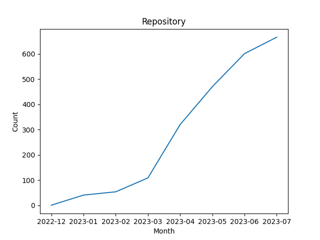

# AIGC Progress 🚀

You can follow the timeline to see the latest developments and easily find new models, datasets, tools, applications, and more related to AIGC through the tags.

您可以通过时间线看到最新进展，也可以通过Tag方便地找到AIGC相关的新模型、新数据集、新工具、新应用等。

## Tag Introduction（Tag介绍）:

| Group            | Tag                   | Introduction                                                 | 介绍                                                         |
| ---------------- | --------------------- | ------------------------------------------------------------ | ------------------------------------------------------------ |
| Modal 模态       | [🔠](tags/🔠.md)     | Input or Output is Txt                                       | 输入或输出存在文本                                           |
|                  | [🖼️](tags/🖼️.md)     | Input or Output is Img                                       | 输入或输出存在图像                                           |
|                  | [🎵](tags/🎵.md)     | Input or Output is Voice                                     | 输入或输出存在语音                                           |
|                  | [🎥](tags/🎥.md)     | Input or Output is Video                                     | 输入或输出存在视频                                           |
|                  | [🧊](tags/🧊.md)     | Input or Output is 3D                                     | 输入或输出存在3D                                           |
| Resource 资源    | [⛽](tags/⛽.md)     | Provide data                                                 | 提供了数据                                                   |
|                  | [🚌](tags/🚌.md) | Provide general model                                        | 提供了通用模型                                               |
|                  | [🚕](tags/🚕.md) | Provide custom model, include domain-specific models such as legal and medical models, as well as models for code generation and SQL generation. | 提供了定制模型，包含法律、医学等垂类模型以及代码生成、SQL生成等模型 |
|                  | [📝](tags/📝.md)     | Provide tutorial or collections                              | 教程、集锦等                                                 |
| Code 代码        | [1️⃣](tags/1️⃣.md)   | Provide pre-training code                                    | 提供预训练代码                                               |
|                  | [2️⃣](tags/2️⃣.md)     | Provide training/fine-tuning code                            | 提供训练/微调代码                                            |
|                  | [3️⃣](tags/3️⃣.md)     | Provide RLHF-like  code                                      | 提供人类反馈强化学习相关代码                                 |
|                  | [✂️](tags/✂️.md)     | Model compression, such as pruning and quantization.         | 提供剪枝、量化等模型压缩代码                                 |
|                  | [💡](tags/💡.md)     | Perform inference on mobile, embeded, IoT and other devices. | 提供端侧推理代码                                             |
| Application 应用 | [🔨](tags/🔨.md)     | Provide a better tool (interface or API) to use the model    | 提供更好的工具（界面或者API）去使用模型                      |
|                  | [🔌](tags/🔌.md)     | Provide model plugin                                         | 提供了相关插件                                               |
|                  | [📱](tags/📱.md)     | Utilizes the model to accomplish some task                   | 使用模型去完成某件任务，例如AutoGPT、头像生成器等            |
|                  | [❓ ](tags/❓.md)    | Other uncategorized items                                    | 其它不好分类的                                               |
| Other 其它       | [💰](tags/💰.md)   | Commercial friendly                                          | 商业友好                                                     |
|                  | [🀄](tags/🀄.md)    | The model or dataset is Chinese                              | 中文模型或中文数据集                                         |

` ` means the feature is under development. For example, 🚌 means the model has been provided, `🚌` means the model will be provided in the future.

` `表示该功能正在实现中，例如🚌表示已提供模型，`🚌`则表示将来会提供模型。

You can click the above tag icons to the corresponding markdown document or open [xlsx file](repo.xlsx) to filter or sort the repositories by your own.

点击上面的Tag图标可以跳转到相应的markdown文档，或者打开[xlsx文件](repo.xlsx)自行筛选或排序。

## Repositories

| Date | Repository | Stars | tags |  Description  |
|------------|---------|-------|-------------|-------------|
| 2023-08-10 | [MiuLab/Taiwan-LLaMa](https://github.com/MiuLab/Taiwan-LLaMa) | 205 | 🔠⛽🚌🀄 | Traditional Mandarin LLMs for Taiwan|
| 2023-08-10 | [modelscope/facechain](https://github.com/modelscope/facechain) | 302 | 🖼️📱 | FaceChain is a deep-learning toolchain for generating your Digital-Twin.|
| 2023-08-09 | [lllyasviel/Fooocus](https://github.com/lllyasviel/Fooocus) | 805 | 🖼️🔌 | Focus on prompting and generating|
| 2023-08-09 | [mshumer/gpt-llm-trainer](https://github.com/mshumer/gpt-llm-trainer) | 647 | 🔠2️⃣ | |
| 2023-08-07 | [mhss1/AIStudyAssistant](https://github.com/mhss1/AIStudyAssistant) | 25 | 🔠📱 | AI chatbot, Lecture Summarizer, Essay Writer and Questions Generator.|
| 2023-08-06 | [xverse-ai/XVERSE-13B](https://github.com/xverse-ai/XVERSE-13B) | 358 | 🔠🚌💰🀄 | XVERSE-13B: A multilingual large language model developed by XVERSE Technology Inc.|
| 2023-08-05 | [bkitano/llama-from-scratch](https://github.com/bkitano/llama-from-scratch) | 170 | 🔠📝 | provide some tips from my experience implementing a paper.|
| 2023-08-04 | [haoheliu/AudioLDM2](https://github.com/haoheliu/AudioLDM2) | 749 | 🔠🎵🚕 | Text-to-Audio/Music Generation|
| 2023-08-04 | [jmaczan/gdansk-ai](https://github.com/jmaczan/gdansk-ai) | 136 | 🔠🔨 | 🦭 Full stack AI voice chatbot (speech-to-text, LLM, text-to-speech) with integrations to Auth0, OpenAI, Google Cloud and Stripe - Web App, Web API and AI API|
| 2023-08-04 | [lukechilds/humanscript](https://github.com/lukechilds/humanscript) | 172 | 🔠📱 | A truly natural scripting language|
| 2023-08-03 | [OpenGVLab/all-seeing](https://github.com/OpenGVLab/all-seeing) | 191 | 🔠🖼️`🚌` | This is the official implementation of the paper "The All-Seeing Project: Towards Panoptic Visual Recognition and Understanding of the Open World"|
| 2023-08-03 | [QwenLM/Qwen-7B](https://github.com/QwenLM/Qwen-7B) | 3024 | 🔠🚌 | The official repo of Qwen-7B (通义千问-7B) chat & pretrained large language model proposed by Alibaba Cloud.|
| 2023-08-02 | [simonmesmith/agentflow](https://github.com/simonmesmith/agentflow) | 180 | 🔠📱 | Complex LLM Workflows from Simple JSON.|
| 2023-08-01 | [HIT-SCIR-SC/QiaoBan](https://github.com/HIT-SCIR-SC/QiaoBan) | 52 | 🔠⛽🚕2️⃣ | 这是一个巧板大模型的仓库，旨在构建一个面向儿童情感陪伴的大模型|
| 2023-08-01 | [diStyApps/VisionCrafter](https://github.com/diStyApps/VisionCrafter) | 81 | 🎥🔨 | Craft your visions|
| 2023-08-01 | [dvlab-research/LISA](https://github.com/dvlab-research/LISA) | 692 | 🔠🖼️⛽🚌 | Project Page for "LISA: Reasoning Segmentation via Large Language Model"|
| 2023-07-31 | [LinkSoul-AI/LLaSM](https://github.com/LinkSoul-AI/LLaSM) | 110 | 🔠🎵🚌💰🀄 | 第一个支持中英文双语语音-文本多模态对话的开源可商用对话模型。便捷的语音输入将大幅改善以文本为输入的大模型的使用体验，同时避免了基于 ASR 解决方案的繁琐流程以及可能引入的错误。|
| 2023-07-31 | [modal-labs/devlooper](https://github.com/modal-labs/devlooper) | 279 | 🔠📱 | A program synthesis agent that autonomously fixes its output by running tests!|
| 2023-07-31 | [theodo-group/LLPhant](https://github.com/theodo-group/LLPhant) | 131 | 🔠🔨 | LLPhant - A comprehensive PHP Generative AI Framework using OpenAI GPT 4. Inspired by Langchain and LLamaIndex|
| 2023-07-30 | [LinkSoul-AI/Chinese-LLaVA](https://github.com/LinkSoul-AI/Chinese-LLaVA) | 116 | 🔠🖼️🔨💰🀄 | 支持中英文双语视觉-文本对话的开源可商用多模态模型。|
| 2023-07-30 | [OpenLLMAI/OpenLLaMA2](https://github.com/OpenLLMAI/OpenLLaMA2) | 37 | 🔠2️⃣3️⃣ | LLaMA2 SFT/RLHF training framework|
| 2023-07-30 | [rai-llc/LanguageModels.jl](https://github.com/rai-llc/LanguageModels.jl) | 45 | 🔠💡 | Load nanoGPT-style transformers in Julia. Code ported from @karpathy's llama2.c|
| 2023-07-29 | [Preemo-Inc/text-generation-inference](https://github.com/Preemo-Inc/text-generation-inference) | 104 | 🔠🔨 | A Rust, Python and gRPC server for text generation inference.|
| 2023-07-29 | [RahulSChand/llama2.c-for-dummies](https://github.com/RahulSChand/llama2.c-for-dummies) | 133 | 🔠💡📝 | Step by step explanation/tutorial of llama2.c|
| 2023-07-29 | [e2b-dev/chatgpt-plugin](https://github.com/e2b-dev/chatgpt-plugin) | 281 | 🔠🔌 | Code interpreter on steroids for ChatGPT. Run any language, any terminal process, use filesystem freely. All with access to the internet.|
| 2023-07-29 | [philschmid/easyllm](https://github.com/philschmid/easyllm) | 229 | 🔠🔨 | EasyLLM is an open source project that provides helpful tools and methods for working with large language models (LLMs), both open source and closed source. |
| 2023-07-28 | [SpenserCai/sd-webui-deoldify](https://github.com/SpenserCai/sd-webui-deoldify) | 219 | 🖼️🔌 | DeOldify for Stable Diffusion WebUI：This is an extension for StableDiffusion's AUTOMATIC1111 web-ui that allows colorize of old photos and old video. It is based on deoldify.|
| 2023-07-28 | [epfLLM/Megatron-LLM](https://github.com/epfLLM/Megatron-LLM) | 104 | 🔠2️⃣ | distributed trainer for LLMs|
| 2023-07-27 | [BerriAI/litellm](https://github.com/BerriAI/litellm) | 430 | 🔠🔨 | lightweight package to simplify LLM API calls - Azure, OpenAI, Cohere, Anthropic, Replicate. Manages input/output translation|
| 2023-07-27 | [llm-attacks/llm-attacks](https://github.com/llm-attacks/llm-attacks) | 1646 | 🔠❓ | Universal and Transferable Attacks on Aligned Language Models|
| 2023-07-26 | [Audio-AGI/WavJourney](https://github.com/Audio-AGI/WavJourney) | 226 | 🔠🎵📱 | WavJourney: Compositional Audio Creation with LLMs|
| 2023-07-26 | [IDEA-Research/DWPose](https://github.com/IDEA-Research/DWPose) | 645 | 🎥🚌2️⃣ | Official implementation of the paper "Effective Whole-body Pose Estimation with Two-stages Distillation"|
| 2023-07-26 | [cofactoryai/textbase](https://github.com/cofactoryai/textbase) | 283 | 🔠🔨 | ✨ Textbase is a simple framework for building AI chatbots. ✨|
| 2023-07-26 | [evanmiller/LLM-Reading-List](https://github.com/evanmiller/LLM-Reading-List) | 549 | 🔠📝 | LLM papers I'm reading, mostly on inference and model compression|
| 2023-07-26 | [rawchen/FeishuBot](https://github.com/rawchen/FeishuBot) | 108 | 🔠🔨 | 飞书群聊/私聊ChatGPT机器人|
| 2023-07-26 | [rynmurdock/inanimate](https://github.com/rynmurdock/inanimate) | 33 | 🖼️🔌 | Generate images from an initial frame and text|
| 2023-07-25 | [GAIR-NLP/factool](https://github.com/GAIR-NLP/factool) | 408 | 🔠🔌 | FacTool: Factuality Detection in Generative AI|
| 2023-07-25 | [JustAIGithub/AI-Code-Convert](https://github.com/JustAIGithub/AI-Code-Convert) | 203 | 🔠📱 | AI Code Translator，Generate Code or Natural Language To Programming Language|
| 2023-07-25 | [biobootloader/mentat](https://github.com/biobootloader/mentat) | 1358 | 🔠📱 | Mentat - The AI Coding Assistant |
| 2023-07-25 | [hyp1231/awesome-llm-powered-agent](https://github.com/hyp1231/awesome-llm-powered-agent) | 154 | 🔠📝 | Awesome things about LLM-powered agents. Papers / Repos / Blogs / ...|
| 2023-07-25 | [nikolaydubina/llama2.go](https://github.com/nikolaydubina/llama2.go) | 116 | 🔠💡 | LLaMA-2 in native Go|
| 2023-07-24 | [glucauze/sd-webui-faceswaplab](https://github.com/glucauze/sd-webui-faceswaplab) | 114 | 🖼️🔌 |  Extended faceswap extension for StableDiffusion web-ui with multiple faceswaps, inpainting, checkpoints, .... |
| 2023-07-24 | [langchain-ai/web-explorer](https://github.com/langchain-ai/web-explorer) | 153 | 🔠📱 | |
| 2023-07-24 | [web-arena-x/webarena](https://github.com/web-arena-x/webarena) | 258 | 🔠📱 | Code repo for "WebArena: A Realistic Web Environment for Building Autonomous Agents"|
| 2023-07-23 | [Gadersd/whisper-burn](https://github.com/Gadersd/whisper-burn) | 97 | 🎵💡 | A Rust implementation of OpenAI's Whisper model using the burn framework|
| 2023-07-23 | [GaryYufei/AlignLLMHumanSurvey](https://github.com/GaryYufei/AlignLLMHumanSurvey) | 299 | 🔠📝 | Aligning Large Language Models with Human: A Survey|
| 2023-07-23 | [all-in-aigc/claude-webapi](https://github.com/all-in-aigc/claude-webapi) | 71 | 🔠🔨 | claude webapi sdk, support claude2|
| 2023-07-23 | [joonspk-research/generative_agents](https://github.com/joonspk-research/generative_agents) | 7113 | 🔠📱 | Generative Agents: Interactive Simulacra of Human Behavior|
| 2023-07-23 | [karpathy/llama2.c](https://github.com/karpathy/llama2.c) | 10766 | 🔠💡 | Inference Llama 2 in one file of pure C|
| 2023-07-23 | [rowheat02/osm-gpt](https://github.com/rowheat02/osm-gpt) | 102 | 🔠📱 | |
| 2023-07-22 | [ModelTC/lightllm](https://github.com/ModelTC/lightllm) | 511 | 🔠💡 | LightLLM is a Python-based LLM (Large Language Model) inference and serving framework, notable for its lightweight design, easy scalability, and high-speed performance.|
| 2023-07-21 | [Alpha-VLLM/LLaMA2-Accessory](https://github.com/Alpha-VLLM/LLaMA2-Accessory) | 1240 | 🔠🖼️⛽1️⃣2️⃣📱 | An Open-source Toolkit for LLM Development|
| 2023-07-21 | [OPPO-Mente-Lab/Subject-Diffusion](https://github.com/OPPO-Mente-Lab/Subject-Diffusion) | 138 | 🖼️`⛽`🚌2️⃣ | Subject-Diffusion:Open Domain Personalized Text-to-Image Generation without Test-time Fine-tuning|
| 2023-07-21 | [peterw/llamav2-chat](https://github.com/peterw/llamav2-chat) | 65 | 🔠🔨 | This is a simple, interactive chat application powered by Streamlit and the Replicate LlamaV2 model.|
| 2023-07-21 | [segmind/distill-sd](https://github.com/segmind/distill-sd) | 260 | 🖼️🚌2️⃣ | Segmind Distilled diffusion|
| 2023-07-20 | [LinkSoul-AI/Chinese-Llama-2-7b](https://github.com/LinkSoul-AI/Chinese-Llama-2-7b) | 1534 | 🔠⛽🚌2️⃣💰🀄 | 开源社区第一个能下载、能运行的中文 LLaMA2 模型！|
| 2023-07-20 | [SeungyounShin/Llama2-Code-Interpreter](https://github.com/SeungyounShin/Llama2-Code-Interpreter) | 229 | 🔠📱 | Make Llama2 use Code Execution, Debug, Save Code, Reuse it, Access to Internet|
| 2023-07-20 | [ThisisBillhe/tiny-stable-diffusion](https://github.com/ThisisBillhe/tiny-stable-diffusion) | 91 | 🔠🖼️✂️ | Tiny optimized Stable-diffusion that can run on GPUs with just 1GB of VRAM. (Beta)|
| 2023-07-20 | [liltom-eth/llama2-webui](https://github.com/liltom-eth/llama2-webui) | 1360 | 🔠❓ | Run Llama 2 locally with gradio UI on GPU or CPU from anywhere (Linux/Windows/Mac). Supporting Llama-2-7B/13B/70B (16bit, 8bit), GPTQ(4bit), GGML. |
| 2023-07-20 | [omerbt/TokenFlow](https://github.com/omerbt/TokenFlow) | 557 | 🎥`2️⃣` | Official Pytorch Implementation for "TokenFlow: Consistent Diffusion Features for Consistent Video Editing" presenting "TokenFlow"|
| 2023-07-20 | [vastxie/Happy-ChatGPT](https://github.com/vastxie/Happy-ChatGPT) | 670 | 🔠🔨 | ChatGPT 国粹版，和 GPT 一起学习地道的中国话吧|
| 2023-07-19 | [FlagAlpha/Llama2-Chinese](https://github.com/FlagAlpha/Llama2-Chinese) | 3555 | 🔠⛽🚌2️⃣💰🀄 | Llama中文社区，最好的中文Llama大模型，完全开源可商用|
| 2023-07-19 | [SupritYoung/RLHF-Label-Tool](https://github.com/SupritYoung/RLHF-Label-Tool) | 111 | 🔠❓ | 用于大模型 RLHF 进行人工数据标注排序的工具。A tool for manual response data annotation sorting in RLHF stage.|
| 2023-07-19 | [ThousandBirdsInc/chidori](https://github.com/ThousandBirdsInc/chidori) | 989 | 🔠📱 | A reactive runtime for building durable AI agents|
| 2023-07-19 | [jxnl/fastllm](https://github.com/jxnl/fastllm) | 74 | 🔠🔨 | A collection of LLM services you can self host via docker or modal labs to support your applications development|
| 2023-07-19 | [michael-wzhu/Chinese-LlaMA2](https://github.com/michael-wzhu/Chinese-LlaMA2) | 667 | 🔠`🚌``🚕``1️⃣``2️⃣`💰🀄 | Repo for adapting Meta LlaMA2 in Chinese! META最新发布的LlaMA2的汉化版！ （完全开源可商用）|
| 2023-07-19 | [pathwaycom/llm-app](https://github.com/pathwaycom/llm-app) | 157 | 🔠🔨 | LLM-App is a library for creating responsive AI applications leveraging OpenAI/Hugging Face APIs to provide responses to user queries based on live data sources. Build your own LLM application in 30 lines of code, no vector database required.|
| 2023-07-19 | [soulteary/docker-llama2-chat](https://github.com/soulteary/docker-llama2-chat) | 328 | 🔠🔨 | Play LLaMA2 (official / 中文版 / INT4 / llama2.cpp) Together! ONLY 3 STEPS! ( non GPU / 5GB vRAM / 8~14GB vRAM)|
| 2023-07-19 | [weaigc/bingo](https://github.com/weaigc/bingo) | 108 | 🔠🔨 | Bingo，一个让你呼吸顺畅 New Bing。|
| 2023-07-19 | [yangjianxin1/Firefly-LLaMA2-Chinese](https://github.com/yangjianxin1/Firefly-LLaMA2-Chinese) | 96 | 🔠`🚌``🚕``1️⃣``2️⃣`🀄 | 中文LLaMA-2大模型，兼容对中文大模型进行增量预训练|
| 2023-07-18 | [continue-revolution/sd-webui-animatediff](https://github.com/continue-revolution/sd-webui-animatediff) | 360 | 🖼️🔌 | AnimateDiff for AUTOMATIC1111 Stable Diffusion WebUI|
| 2023-07-18 | [facebookresearch/LLM-QAT](https://github.com/facebookresearch/LLM-QAT) | 79 | 🔠✂️ | Code repo for the paper "LLM-QAT Data-Free Quantization Aware Training for Large Language Models"|
| 2023-07-18 | [longyuewangdcu/Chinese-Llama-2](https://github.com/longyuewangdcu/Chinese-Llama-2) | 254 | 🔠🚌`1️⃣`2️⃣ | Chinese-Llama-2 is a project that aims to expand the impressive capabilities of the Llama-2 language model to the Chinese language.|
| 2023-07-18 | [simonw/llm-replicate](https://github.com/simonw/llm-replicate) | 38 | 🔠❓ | LLM plugin for models hosted on Replicate|
| 2023-07-18 | [ymcui/Chinese-LLaMA-Alpaca-2](https://github.com/ymcui/Chinese-LLaMA-Alpaca-2) | 2091 | 🔠`🚌``1️⃣``2️⃣`💰🀄 | 中文 LLaMA-2 & Alpaca-2 大模型二期项目 + 本地CPU/GPU训练部署  (Chinese LLaMA-2 & Alpaca-2 LLMs)|
| 2023-07-17 | [DUOMO/TransGPT](https://github.com/DUOMO/TransGPT) | 409 | 🔠⛽🚕2️⃣💰🀄 | TransGPT是国内首款开源交通大模型，主要致力于在真实交通行业中发挥实际价值。|
| 2023-07-17 | [DjangoPeng/openai-quickstart](https://github.com/DjangoPeng/openai-quickstart) | 340 | 🔠📝 | A comprehensive guide to understanding and implementing large language models with hands-on examples using LangChain for AIGC applications.|
| 2023-07-17 | [Fictionarry/ER-NeRF](https://github.com/Fictionarry/ER-NeRF) | 108 | 🎥⛽🚌2️⃣ | [ICCV'23] Efficient Region-Aware Neural Radiance Fields for High-Fidelity Talking Portrait Synthesis|
| 2023-07-17 | [KevinWang676/ChatGLM2-Voice-Cloning](https://github.com/KevinWang676/ChatGLM2-Voice-Cloning) | 247 | 🔠🎵📱 | Chat with any character you like: ChatGLM2+SadTalker+Voice Cloning \| 和喜欢的角色沉浸式对话吧：ChatGLM2+声音克隆+视频对话|
| 2023-07-17 | [facebookresearch/llama-recipes](https://github.com/facebookresearch/llama-recipes) | 2824 | 🔠🚌2️⃣ | Examples and recipes for Llama 2 model|
| 2023-07-17 | [hwchase17/conversation-qa-gradio](https://github.com/hwchase17/conversation-qa-gradio) | 39 | 🔠📱 | This repo shows how to create a Chatbot over your documents using LangChain and Gradio.|
| 2023-07-17 | [microsoft/Llama-2-Onnx](https://github.com/microsoft/Llama-2-Onnx) | 498 | 🔠💡 | This is an optimized version of the Llama 2 model, available from Meta under the Llama Community License Agreement found on this repository.|
| 2023-07-17 | [zinedkaloc/aipage.dev](https://github.com/zinedkaloc/aipage.dev) | 132 | 🔠📱 | The AI Landing Page Generator is a powerful tool that allows you to quickly create stunning landing pages using artificial intelligence.|
| 2023-07-16 | [KoushikNavuluri/Claude-API](https://github.com/KoushikNavuluri/Claude-API) | 205 | 🔠🔨 | This project provides an unofficial API for Claude AI, allowing users to access and interact with Claude AI .|
| 2023-07-16 | [OpenGenerativeAI/GenossGPT](https://github.com/OpenGenerativeAI/GenossGPT) | 490 | 🔠🔨 | One API for all LLMs either Private or Public (Anthropic, Llama V2, GPT 3.5/4, Vertex, GPT4ALL, HuggingFace ...) 🌈🐂  Replace OpenAI GPT with any LLMs in your app with one line.|
| 2023-07-16 | [TommyZihao/ChatMarx](https://github.com/TommyZihao/ChatMarx) | 143 | 🔠📱 | 大学思政问答AI：近代史、思修、毛概、马原|
| 2023-07-16 | [Vanda688/Using-GPT4-image-recognition-on-NewBing](https://github.com/Vanda688/Using-GPT4-image-recognition-on-NewBing) | 82 | 🔠📝 | 如题，这是一个解锁NewBing的GPT4识图能力的简单教程。|
| 2023-07-16 | [caopulan/iKUNet](https://github.com/caopulan/iKUNet) | 137 | 🖼️📱 | 近年来，由于明星、企业频繁塌房，衍生出一个新的需求，即移除情节中的某个元素，如某个明星或某个赞助商，我们将这个任务命名为🎥元素移除。 |
| 2023-07-16 | [magic-research/bubogpt](https://github.com/magic-research/bubogpt) | 173 | 🔠🖼️⛽🚌 | BuboGPT: Enabling Visual Grounding in Multi-Modal LLMs|
| 2023-07-15 | [AILab-CVC/SEED](https://github.com/AILab-CVC/SEED) | 142 | 🖼️`🚌` | Empowers LLMs with the ability to see and draw.|
| 2023-07-15 | [CodeAlchemyAI/ViLT-GPT](https://github.com/CodeAlchemyAI/ViLT-GPT) | 113 | 🔠🖼️📱 | By integrating OpenAI's Language Models (LLM) and LangChain with Vision-and-Language models, this app can answer queries based on the content of images. |
| 2023-07-15 | [Maknee/minigpt4.cpp](https://github.com/Maknee/minigpt4.cpp) | 439 | 🔠💡 | Port of MiniGPT4 in C++ (4bit, 5bit, 6bit, 8bit, 16bit CPU inference with GGML)|
| 2023-07-15 | [RimoChan/emmmbedding](https://github.com/RimoChan/emmmbedding) | 135 | 🖼️📱 | 【emmmbedding】不用存储的图床！|
| 2023-07-15 | [a16z-infra/llama2-chatbot](https://github.com/a16z-infra/llama2-chatbot) | 1065 | 🔠📱 | LLaMA v2 Chatbot|
| 2023-07-15 | [hugofloresgarcia/unloop](https://github.com/hugofloresgarcia/unloop) | 236 | 🎵📱 | a co-creative looper that uses generative modeling to **not** repeat itself. |
| 2023-07-15 | [moreshk/alzebra](https://github.com/moreshk/alzebra) | 63 | 🔠📱 | Math Tutor for kids|
| 2023-07-15 | [utkusen/promptmap](https://github.com/utkusen/promptmap) | 152 | 🔠🔨 | automatically tests prompt injection attacks on ChatGPT instances|
| 2023-07-14 | [mshumer/anthropic_with_functions](https://github.com/mshumer/anthropic_with_functions) | 127 | 🔠🔨 | |
| 2023-07-14 | [vitoplantamura/OnnxStream](https://github.com/vitoplantamura/OnnxStream) | 698 | 🖼️💡 | Running Stable Diffusion on a RPI Zero 2 (or in 260MB of RAM)|
| 2023-07-13 | [Explosion-Scratch/claude-unofficial-api](https://github.com/Explosion-Scratch/claude-unofficial-api) | 617 | 🔠🔨 | Unofficial API for Claude-2 via Claude Web (Also CLI)|
| 2023-07-13 | [ThioJoe/Full-Stack-AI-Meme-Generator](https://github.com/ThioJoe/Full-Stack-AI-Meme-Generator) | 207 | 🔠🖼️📱 | Uses Various AI Service APIs to generate memes with text and images|
| 2023-07-13 | [X-PLUG/CValues](https://github.com/X-PLUG/CValues) | 235 | 🔠⛽🀄❓ | 面向中文大模型价值观的评估与对齐研究|
| 2023-07-13 | [bytedance/lynx-llm](https://github.com/bytedance/lynx-llm) | 148 | 🔠🖼️2️⃣❓ | paper: https://arxiv.org/abs/2307.02469 page: https://lynx-llm.github.io/|
| 2023-07-13 | [scaleapi/llm-engine](https://github.com/scaleapi/llm-engine) | 512 | 🔠2️⃣ | Scale LLM Engine public repository|
| 2023-07-12 | [SeargeDP/SeargeSDXL](https://github.com/SeargeDP/SeargeSDXL) | 203 | 🖼️🔨 | Custom nodes and workflows for SDXL in ComfyUI|
| 2023-07-12 | [automorphic-ai/trex](https://github.com/automorphic-ai/trex) | 143 | 🔠📱 | Intelligently transform unstructured to structured data|
| 2023-07-12 | [kuafuai/DevOpsGPT](https://github.com/kuafuai/DevOpsGPT) | 1241 | 🔠📱 | Multi agent system for AI-driven software development. Convert natural language requirements into working software. Supports any development language and extends the existing base code.|
| 2023-07-12 | [meistrari/prompts-royale](https://github.com/meistrari/prompts-royale) | 324 | 🔠🔨 | Automatically create prompts and make them fight each other to know which is the best|
| 2023-07-12 | [microsoft/azurechatgpt](https://github.com/microsoft/azurechatgpt) | 3307 | 🔠🔨 | 🤖 Azure ChatGPT: Private & secure ChatGPT for internal enterprise use 💼 |
| 2023-07-12 | [pinecone-io/pinecone-vercel-starter](https://github.com/pinecone-io/pinecone-vercel-starter) | 191 | 🔠📱 | In this example, we'll build a full-stack application that uses Retrieval Augmented Generation (RAG) powered by Pinecone to deliver accurate and contextually relevant responses in a chatbot.|
| 2023-07-12 | [psychic-api/rag-stack](https://github.com/psychic-api/rag-stack) | 928 | 🔠📱 | 🤖 Deploy a private ChatGPT alternative hosted within your VPC. 🔮 Connect it to your organization's knowledge base and use it as a corporate oracle. Supports open-source LLMs like Llama 2, Falcon, and GPT4All.|
| 2023-07-12 | [solderneer/obsidian-ai-tools](https://github.com/solderneer/obsidian-ai-tools) | 150 | 🔠📱 | Adding powerful semantic search, generative answers, and other AI tools to Obsidian, using Supabase + OpenAI.|
| 2023-07-12 | [yangyuke001/SD-inference](https://github.com/yangyuke001/SD-inference) | 172 | 🔠🖼️💡 | Stable Diffusion inference|
| 2023-07-12 | [yzfly/awesome-claude-prompts](https://github.com/yzfly/awesome-claude-prompts) | 132 | 🔠📝 | This repo includes Claude prompt curation to use Claude better.|
| 2023-07-11 | [baaivision/Emu](https://github.com/baaivision/Emu) | 473 | 🔠🖼️🚌 | Emu: An Open Multimodal Generalist|
| 2023-07-10 | [HillZhang1999/llm-hallucination-survey](https://github.com/HillZhang1999/llm-hallucination-survey) | 166 | 🔠📝 | Reading list of hallucination in LLMs.|
| 2023-07-10 | [Lakr233/RainbowFart](https://github.com/Lakr233/RainbowFart) | 70 | 🔠📱 | 全自动夸夸机，配备先进的注意力感知功能，人工智能且离线。|
| 2023-07-10 | [baichuan-inc/Baichuan-13B](https://github.com/baichuan-inc/Baichuan-13B) | 2257 | 🔠🚌✂️ | A 13B large language model developed by Baichuan Intelligent Technology|
| 2023-07-10 | [cgisky1980/ai00_rwkv_server](https://github.com/cgisky1980/ai00_rwkv_server) | 121 | 🔠💡 | A localized open-source AI server that is better than ChatGPT.|
| 2023-07-10 | [shroominic/codeinterpreter-api](https://github.com/shroominic/codeinterpreter-api) | 2401 | 🔠📱 | Open source implementation of the ChatGPT Code Interpreter 👾|
| 2023-07-10 | [sourcegraph/cody](https://github.com/sourcegraph/cody) | 248 | 🔠📱 | Code AI with codebase context|
| 2023-07-09 | [ChaseLean/gpt-prompts](https://github.com/ChaseLean/gpt-prompts) | 103 | 🔠📝 | A compilation of some Chat-GPT prompts I find useful.|
| 2023-07-09 | [JeremiahPetersen/RepoToText](https://github.com/JeremiahPetersen/RepoToText) | 67 | 🔠📱 | Turn an entire GitHub Repo into a single organized .txt file to use with Code Interpreter|
| 2023-07-09 | [hiyouga/FastEdit](https://github.com/hiyouga/FastEdit) | 741 | 🔠🔨 | 🩹Editing large language models within 10 seconds⚡|
| 2023-07-08 | [SkalskiP/awesome-chatgpt-code-interpreter-experiments](https://github.com/SkalskiP/awesome-chatgpt-code-interpreter-experiments) | 838 | 🔠📝 | Awesome things you can do with ChatGPT + Code Interpreter combo 🔥|
| 2023-07-08 | [Yujun-Shi/DragDiffusion](https://github.com/Yujun-Shi/DragDiffusion) | 547 | 🖼️🚌2️⃣ | Official code for DragDiffusion|
| 2023-07-08 | [xlang-ai/xlang-paper-reading](https://github.com/xlang-ai/xlang-paper-reading) | 151 | 🔠📝 | Paper collection on building and evaluating language model agents via executable language grounding|
| 2023-07-07 | [raghavan/PdfGptIndexer](https://github.com/raghavan/PdfGptIndexer) | 576 | 🔠📱 | An efficient tool for indexing and searching PDF text data using OpenAI API and FAISS (Facebook AI Similarity Search) index, designed for rapid information retrieval and superior search accuracy.|
| 2023-07-07 | [ringa-tech/asistente-virtual](https://github.com/ringa-tech/asistente-virtual) | 122 | 🔠🖼️🚕 | An attempt to extend PULSE to a biomedical multimodal conversational assistant.|
| 2023-07-06 | [CStanKonrad/long_llama](https://github.com/CStanKonrad/long_llama) | 923 | 🔠🚌 | LongLLaMA is a large language model capable of handling long contexts. It is based on OpenLLaMA and fine-tuned with the Focused Transformer (FoT) method.|
| 2023-07-06 | [InternLM/InternLM](https://github.com/InternLM/InternLM) | 2410 | 🔠🚌2️⃣ | InternLM has open-sourced a 7 billion parameter base model, a chat model tailored for practical scenarios and the training system.|
| 2023-07-06 | [YuanGongND/whisper-at](https://github.com/YuanGongND/whisper-at) | 125 | 🎵🚌 | Code and Pretrained Models for Interspeech 2023 Paper "Whisper-AT: Noise-Robust Automatic Speech Recognizers are Also Strong Audio Event Taggers"|
| 2023-07-06 | [camenduru/sdxl-colab](https://github.com/camenduru/sdxl-colab) | 202 | 🖼️🔨 | |
| 2023-07-06 | [jshilong/GPT4RoI](https://github.com/jshilong/GPT4RoI) | 292 | 🔠🖼️⛽`🚌`2️⃣ | GPT4RoI: Instruction Tuning Large Language Model on Region-of-Interest|
| 2023-07-06 | [kennethleungty/Llama-2-Open-Source-LLM-CPU-Inference](https://github.com/kennethleungty/Llama-2-Open-Source-LLM-CPU-Inference) | 684 | 🔠💡📱 | Running Llama 2 and other Open-Source LLMs on CPU Inference Locally for Document Q&A|
| 2023-07-06 | [mattzcarey/code-review-gpt](https://github.com/mattzcarey/code-review-gpt) | 691 | 🔠📱 | Your personal code reviewer powered by LLMs (OpenAI GPT-3.5/4, Llama, Falcon, Azure AI) & Embeddings ⚡️ Improve code quality and catch bugs before you break production 🚀|
| 2023-07-06 | [v7labs/benchllm](https://github.com/v7labs/benchllm) | 134 | 🔠❓ | Continuous Integration for LLM powered applications|
| 2023-07-05 | [Anil-matcha/Notion-to-Chatbot](https://github.com/Anil-matcha/Notion-to-Chatbot) | 59 | 🔠📱 | Chat with any Notion document.   Easily input the document content you'd like to chat with. Instant answers. Ask questions, extract information, and summarize documents with AI. Sources included.|
| 2023-07-05 | [Codium-ai/pr-agent](https://github.com/Codium-ai/pr-agent) | 1523 | 🔠📱 | CodiumAI pr-agent is an open-source tool aiming to help developers review PRs faster and more efficiently.|
| 2023-07-05 | [OpenLMLab/MOSS-RLHF](https://github.com/OpenLMLab/MOSS-RLHF) | 718 | 🔠🚌3️⃣🀄 | MOSS-RLHF|
| 2023-07-05 | [Sentdex/Falcon-LLM](https://github.com/Sentdex/Falcon-LLM) | 142 | 🔠❓ | Helper scripts and examples for exploring the Falcon LLM models|
| 2023-07-05 | [chapyter/chapyter](https://github.com/chapyter/chapyter) | 534 | 🔠📱 | Chapyter: ChatGPT Code Interpreter in Jupyter Notebooks|
| 2023-07-04 | [SpongebBob/Finetune-ChatGLM2-6B](https://github.com/SpongebBob/Finetune-ChatGLM2-6B) | 231 | 🔠⛽2️⃣✂️ | ChatGLM2-6B 全参数微调，支持多轮对话的高效微调。|
| 2023-07-04 | [mshumer/gpt-prompt-engineer](https://github.com/mshumer/gpt-prompt-engineer) | 4316 | 🔠🔨 | Simply input a description of your task and some test cases, and the system will generate, test, and rank a multitude of prompts to find the ones that perform the best.|
| 2023-07-04 | [sd-fabric/fabric](https://github.com/sd-fabric/fabric) | 243 | 🖼️🔨 | |
| 2023-07-04 | [text2cinemagraph/text2cinemagraph](https://github.com/text2cinemagraph/text2cinemagraph) | 215 | 🔠🎥🚌2️⃣ | Official Pytorch implementation of Text2Cinemagraph: Synthesizing Artistic Cinemagraphs from Text|
| 2023-07-04 | [zideliu/StyleDrop-PyTorch](https://github.com/zideliu/StyleDrop-PyTorch) | 424 | 🖼️⛽🚌2️⃣ | Unoffical implement for [StyleDrop](https://arxiv.org/abs/2306.00983)|
| 2023-07-02 | [Illyism/openai-whisper-api](https://github.com/Illyism/openai-whisper-api) | 37 | 🎵🔨 | OpenAI Whisper API based on Node.js / Bun.sh in a Docker Container + Google Cloud Run Example|
| 2023-07-02 | [MLGroupJLU/LLM-eval-survey](https://github.com/MLGroupJLU/LLM-eval-survey) | 700 | 🔠📝 | The official GitHub page for the survey paper "A Survey on Evaluation of Large Language Models".|
| 2023-07-02 | [antfu/sd-webui-qrcode-toolkit](https://github.com/antfu/sd-webui-qrcode-toolkit) | 448 | 🖼️🔌 | Anthony's QR Toolkit for Stable Diffusion WebUI|
| 2023-07-02 | [discus0434/minutes-maker](https://github.com/discus0434/minutes-maker) | 46 | 🔠🎵📱 | A web app that automatically generates transcripts and summaries of meetings or lectures.|
| 2023-07-02 | [magiklabs/magik-sdk](https://github.com/magiklabs/magik-sdk) | 117 | 🔠❓ | LLM Testing SDK that helps you write and run tests to monitor your LLM app in production|
| 2023-07-01 | [TonyLianLong/stable-diffusion-xl-demo](https://github.com/TonyLianLong/stable-diffusion-xl-demo) | 157 | 🔠🖼️🔨 | A gradio web UI demo for Stable Diffusion XL 1.0, with refiner and MultiGPU support|
| 2023-07-01 | [a1k0n/a1gpt](https://github.com/a1k0n/a1gpt) | 130 | 🔠💡 | throwaway GPT inference|
| 2023-07-01 | [abacaj/code-eval](https://github.com/abacaj/code-eval) | 172 | 🔠❓ | Run evaluation on LLMs using human-eval benchmark|
| 2023-06-30 | [OpenBMB/VisCPM](https://github.com/OpenBMB/VisCPM) | 752 | 🔠🖼️🚌`2️⃣`🀄 | Chinese and English Multimodal Large Model Series (Chat and Paint) \| 基于CPM基础模型的中英双语多模态大模型系列|
| 2023-06-30 | [austin2035/chatpdf](https://github.com/austin2035/chatpdf) | 274 | 🔠📱 | Chat with pdf.|
| 2023-06-30 | [geekan/MetaGPT](https://github.com/geekan/MetaGPT) | 19639 | 🔠📱 | 🌟 The Multi-Agent Framework: Given one line Requirement, return PRD, Design, Tasks, Repo|
| 2023-06-30 | [jtydhr88/sd-webui-3d-editor](https://github.com/jtydhr88/sd-webui-3d-editor) | 90 | 🖼️🔌 | A custom extension for sd-webui that with 3D modeling features (add/edit basic elements, load your custom model, modify scene and so on), then send screenshot to txt2img or img2img as your ControlNet's reference image, basing on ThreeJS editor|
| 2023-06-29 | [IMOSR/MediaGPT](https://github.com/IMOSR/MediaGPT) | 447 | 🔠⛽🚕2️⃣🀄 | 中文的自媒体大语言模型MediaGPT(曾用名Media LLaMA)|
| 2023-06-29 | [dabit3/openai-functions-god-app](https://github.com/dabit3/openai-functions-god-app) | 231 | 🔠🔨 | Instead of using separate interfaces for image generation, video generation, audio generation, and general text natural language processing, this app combines all of them together into a single prompt.|
| 2023-06-29 | [mckaywrigley/nba-cba-ai-chat](https://github.com/mckaywrigley/nba-cba-ai-chat) | 105 | 🔠📱 | Use AI to ask questions about the new 676-page NBA CBA.|
| 2023-06-28 | [gmltmd789/UnitSpeech](https://github.com/gmltmd789/UnitSpeech) | 77 | 🎵🚌2️⃣ | An official implementation of "UnitSpeech: Speaker-adaptive Speech Synthesis with Untranscribed Data"|
| 2023-06-28 | [jarvis2f/ais-ninja](https://github.com/jarvis2f/ais-ninja) | 279 | 🔠🔨 | A ChatGPT that supports plugins.             TG: https://t.me/+bIZncGryj_85MjYx|
| 2023-06-28 | [mayooear/private-chatbot-mpt30b-langchain](https://github.com/mayooear/private-chatbot-mpt30b-langchain) | 152 | 🔠📱 | Chat with your data privately using MPT-30b |
| 2023-06-28 | [replicate/cog-llama-template](https://github.com/replicate/cog-llama-template) | 230 | 🔠2️⃣❓ | LLaMA Cog template|
| 2023-06-27 | [AdaptiveMotorControlLab/AmadeusGPT](https://github.com/AdaptiveMotorControlLab/AmadeusGPT) | 106 | 🔠📱 | We turn natural language descriptions of behaviors into machine-executable code|
| 2023-06-27 | [AkshitIreddy/Interactive-LLM-Powered-NPCs](https://github.com/AkshitIreddy/Interactive-LLM-Powered-NPCs) | 148 | 🔠📱 | Interactive LLM Powered NPCs, is an open-source project that completely transforms your interaction with non-player characters (NPCs) in any game! 🎮🤖🚀 |
| 2023-06-27 | [RayVentura/ShortGPT](https://github.com/RayVentura/ShortGPT) | 3282 | 🔠🎥📱 | 🚀🎬 ShortGPT - Experimental AI framework for automated short/video content creation.|
| 2023-06-27 | [SALT-NLP/LLaVAR](https://github.com/SALT-NLP/LLaVAR) | 120 | 🔠🖼️⛽🚌2️⃣ | Code/Data for the paper: "LLaVAR: Enhanced Visual Instruction Tuning for Text-Rich Image Understanding"|
| 2023-06-27 | [easychen/deepgpt-dist](https://github.com/easychen/deepgpt-dist) | 197 | 🔠📱 | DeepGPT，类agentGPT/AutoGPT 工具，支持 api2d / 和自定义 openai key。此为静态网页独立部署版，部署方便|
| 2023-06-27 | [painebenjamin/app.enfugue.ai](https://github.com/painebenjamin/app.enfugue.ai) | 180 | 🖼️🔨 | ENFUGUE is a feature-rich self-hosted Stable Diffusion webapp|
| 2023-06-26 | [MoonKraken/rusty_llama](https://github.com/MoonKraken/rusty_llama) | 174 | 🔠❓ | A simple ChatGPT clone in Rust on both the frontend and backend. Uses open source language models and TailwindCSS.|
| 2023-06-26 | [Shaunwei/RealChar](https://github.com/Shaunwei/RealChar) | 4696 | 🔠🎵📱 | 🎙️🤖Create, Customize and Talk to your AI Character/Companion in Realtime (All in One Codebase!). Have a natural seamless conversation with AI everywhere (mobile, web and terminal) using LLM OpenAI GPT3.5/4, Anthropic Claude2, Chroma Vector DB, Whisper Speech2Text, ElevenLabs Text2Speech🎙️🤖|
| 2023-06-26 | [antfu/qrcode-toolkit](https://github.com/antfu/qrcode-toolkit) | 836 | 🖼️🔌 | Anthony's QR Code Toolkit for AI generated QR Codes|
| 2023-06-26 | [artyfacialintelagent/CloneCleaner](https://github.com/artyfacialintelagent/CloneCleaner) | 69 | 🖼️🔌 | An extension for Automatic1111 to work around Stable Diffusion's "clone problem". It automatically modifies your prompts with random names, nationalities, hair style and hair color to create more variations in generated people.|
| 2023-06-26 | [dzhng/zod-gpt](https://github.com/dzhng/zod-gpt) | 275 | 🔠🔨 | Get structured, fully typed, and validated JSON outputs from OpenAI and Anthropic models.|
| 2023-06-26 | [icalk-nlp/EduChat](https://github.com/icalk-nlp/EduChat) | 208 | 🔠⛽🚕 | An open-source educational chat model from ICALK, East China Normal University. 开源中英教育对话大模型。(通用基座模型，GPU部署，数据清理) 致敬: LLaMA, MOSS, BELLE, Ziya|
| 2023-06-26 | [jmorganca/ollama](https://github.com/jmorganca/ollama) | 5060 | 🔠🔨 | Get up and running with Llama 2 and other large language models locally|
| 2023-06-26 | [orgexyz/BlockAGI](https://github.com/orgexyz/BlockAGI) | 164 | 🔠📱 | Your Self-Hosted, Hackable Research Agent Inspired by AutoGPT|
| 2023-06-25 | [embedchain/embedchainjs](https://github.com/embedchain/embedchainjs) | 191 | 🔠📱 | Framework to easily create LLM powered bots over any dataset.|
| 2023-06-25 | [hegelai/prompttools](https://github.com/hegelai/prompttools) | 1352 | 🔠❓ | Open-source tools for prompt testing and experimentation, with support for both LLMs (e.g. OpenAI, LLaMA) and vector databases (e.g. Chroma, Weaviate).|
| 2023-06-25 | [steven-tey/chathn](https://github.com/steven-tey/chathn) | 842 | 🔠📱 | Chat with Hacker News using natural language. Built with OpenAI Functions and Vercel AI SDK.|
| 2023-06-24 | [0xpayne/gpt-migrate](https://github.com/0xpayne/gpt-migrate) | 6173 | 🔠📱 | Easily migrate your codebase from one framework or language to another.|
| 2023-06-24 | [EvilPsyCHo/train_custom_LLM](https://github.com/EvilPsyCHo/train_custom_LLM) | 151 | 🔠2️⃣ | Train your custom LLMs like Llama, baichuan-7b, GPT|
| 2023-06-24 | [JorisdeJong123/7-Days-of-LangChain](https://github.com/JorisdeJong123/7-Days-of-LangChain) | 157 | 🔠📝 | Code repo for 7 Days of LangChain|
| 2023-06-24 | [THUDM/ChatGLM2-6B](https://github.com/THUDM/ChatGLM2-6B) | 11255 | 🔠🚌✂️🀄 | ChatGLM2-6B: An Open Bilingual Chat LLM \| 开源双语对话语言模型|
| 2023-06-23 | [narenmanoharan/gpt-code-assistant](https://github.com/narenmanoharan/gpt-code-assistant) | 143 | 🔠📱 | gpt-code-assistant is an open-source coding assistant leveraging language models to search, retrieve, explore and understand any codebase.|
| 2023-06-23 | [rogeriochaves/langstream](https://github.com/rogeriochaves/langstream) | 228 | 🔠📱 | Build robust LLM applications with true composability 🔗|
| 2023-06-23 | [salesforce/xgen](https://github.com/salesforce/xgen) | 657 | 🔠🚌 | Salesforce open-source LLMs with 8k sequence length.|
| 2023-06-22 | [FireCubeStudios/Clippy](https://github.com/FireCubeStudios/Clippy) | 172 | 🔠📱 | Bring back Clippy on Windows 10/11!|
| 2023-06-22 | [Stability-AI/generative-models](https://github.com/Stability-AI/generative-models) | 8378 | 🖼️⛽🚌2️⃣ | Generative Models by Stability AI|
| 2023-06-22 | [a16z-infra/companion-app](https://github.com/a16z-infra/companion-app) | 5102 | 🔠📱 | AI companions with memory: a lightweight stack to create and host your own AI companions|
| 2023-06-22 | [eric-mitchell/direct-preference-optimization](https://github.com/eric-mitchell/direct-preference-optimization) | 363 | 🔠2️⃣3️⃣ | Reference implementation for DPO (Direct Preference Optimization)|
| 2023-06-22 | [lyleshaw/TweetAnalyzer](https://github.com/lyleshaw/TweetAnalyzer) | 127 | 🔠📱 | Grab tweets, call Claude or GPT3.5 for analysis and make comments on tweeters|
| 2023-06-22 | [phodal/aigc](https://github.com/phodal/aigc) | 752 | 🔠📝 | 《构筑大语言模型应用：应用开发与架构设计》一本关于 LLM 在真实世界应用的开源电子书，介绍了大语言模型的基础知识和应用，以及如何构建自己的模型。其中包括Prompt的编写、开发和管理，探索最好的大语言模型能带来什么，以及LLM应用开发的模式和架构设计。|
| 2023-06-21 | [JetP1ane/Callisto](https://github.com/JetP1ane/Callisto) | 171 | 🔠📱 | Callisto - An Intelligent Binary Vulnerability Analysis Tool|
| 2023-06-20 | [BerriAI/reliableGPT](https://github.com/BerriAI/reliableGPT) | 518 | 🔠📱 | Get 100% uptime, reliability from OpenAI. Handle Rate Limit, Timeout, API, Keys Errors|
| 2023-06-20 | [OpenMotionLab/MotionGPT](https://github.com/OpenMotionLab/MotionGPT) | 614 | 🔠🎥📝 | MotionGPT: Human Motion as a Foreign Language, a unified motion-language generation model using LLMs|
| 2023-06-20 | [chat2db/Chat2DB](https://github.com/chat2db/Chat2DB) | 6642 | 🔠📱 | 🔥 🔥 🔥 An intelligent and versatile general-purpose SQL client and reporting tool for databases which integrates ChatGPT capabilities.(智能的通用数据库SQL客户端和报表工具)|
| 2023-06-20 | [embedchain/embedchain](https://github.com/embedchain/embedchain) | 3855 | 🔠📱 | Framework to easily create LLM powered bots over any dataset.|
| 2023-06-20 | [emrgnt-cmplxty/automata](https://github.com/emrgnt-cmplxty/automata) | 264 | 🔠📱 | Automata: The Future is Self-Written|
| 2023-06-20 | [gorilla-llm/gorilla-cli](https://github.com/gorilla-llm/gorilla-cli) | 694 | 🔠🔨 | LLMs for your CLI|
| 2023-06-20 | [langchain4j/langchain4j](https://github.com/langchain4j/langchain4j) | 246 | 🔠📱 | Java version of LangChain|
| 2023-06-20 | [microsoft/TypeChat](https://github.com/microsoft/TypeChat) | 5960 | 🔠🔨 | TypeChat is a library that makes it easy to build natural language interfaces using types.|
| 2023-06-20 | [mshumer/gpt-author](https://github.com/mshumer/gpt-author) | 881 | 🔠📱 | This project utilizes a chain of GPT-4 and Stable Diffusion API calls to generate an original fantasy novel. Users can provide an initial prompt and enter how many chapters they'd like it to be, and the AI then generates an entire novel, outputting an EPUB file compatible with e-book readers.|
| 2023-06-20 | [souying/vercel-api-proxy](https://github.com/souying/vercel-api-proxy) | 174 | 🔠🔨 | vercel反向代理。完全免费，万能代理，可代理全网一切接口，包括openai、github、google、Telegram、全面代理ai项目一键安装|
| 2023-06-19 | [beyondguo/LLM-Tuning](https://github.com/beyondguo/LLM-Tuning) | 598 | 🔠2️⃣ | Tuning LLMs with no tears💦, sharing LLM-tools with love❤️.|
| 2023-06-19 | [blinq-dev/laravel-synth](https://github.com/blinq-dev/laravel-synth) | 245 | 🔠📱 | Generate Laravel code with ChatGPT|
| 2023-06-19 | [techleadhd/chatgpt-retrieval](https://github.com/techleadhd/chatgpt-retrieval) | 1079 | 🔠📱 | Simple script to use ChatGPT on your own files.|
| 2023-06-18 | [automorphic-ai/aegis](https://github.com/automorphic-ai/aegis) | 176 | 🔠🔨 | Self-hardening firewall for large language models|
| 2023-06-18 | [hougarry/Mr.Gee-Your-AI-Language-Bot](https://github.com/hougarry/Mr.Gee-Your-AI-Language-Bot) | 76 | 🔠📱 | Using Mr.Gee  to learn English or any other languages by yourself through Chat-GPT/Bing/Bard/Claude.“使用AI和ChatGPT学习英语”，“AI辅助英语学习”"ChatGPT作为AI英语学习工具"，"ChatGPT的英语学习技巧" "使用AIとChatGPTで英語を学ぶ", "ChatGPTをAI英語学習ツールとして使用する", "ChatGPT英語学習のテクニック""Chatgpt学托福，GRE, 雅思，托业"“use-chatgpt -learn english”|
| 2023-06-17 | [e-johnstonn/FableForge](https://github.com/e-johnstonn/FableForge) | 301 | 🔠🖼️🔨 | Generate a picture book from a single prompt using OpenAI function calling, replicate, and Deep Lake|
| 2023-06-17 | [guoyww/AnimateDiff](https://github.com/guoyww/AnimateDiff) | 2765 | 🔠🎥🚌 | Official implementation of AnimateDiff.|
| 2023-06-17 | [hylarucoder/ChatGPT-Nuxt](https://github.com/hylarucoder/ChatGPT-Nuxt) | 189 | 🔠🔨 | ChatGPT Web Nuxt 3  Vue 3 Version|
| 2023-06-17 | [linux-china/chatgpt-spring-boot-starter](https://github.com/linux-china/chatgpt-spring-boot-starter) | 421 | 🔠🔨 | Spring Boot ChatGPT Starter|
| 2023-06-17 | [mlabonne/llm-course](https://github.com/mlabonne/llm-course) | 527 | 🔠📝 | Course with a roadmap and notebooks to get into Large Language Models (LLMs).|
| 2023-06-17 | [s0md3v/sd-webui-roop](https://github.com/s0md3v/sd-webui-roop) | 2009 | 🖼️🔌 | roop extension for StableDiffusion web-ui|
| 2023-06-17 | [ykdojo/kaguya](https://github.com/ykdojo/kaguya) | 1144 | 🔠🔌 | A ChatGPT plugin that allows you to load and edit your local files in a controlled way, as well as run any Python, JavaScript, and bash script.|
| 2023-06-16 | [SpeechifyInc/Meta-voicebox](https://github.com/SpeechifyInc/Meta-voicebox) | 427 | 🎵`2️⃣` | Implementation of Meta-Voicebox : The first generative AI model for speech to generalize across tasks with state-of-the-art performance.|
| 2023-06-16 | [haonan-li/CMMLU](https://github.com/haonan-li/CMMLU) | 200 | 🔠⛽🀄❓ | CMMLU是一个综合性的🀄评估基准，专门用于评估语言模型在🀄语境下的知识和💡能力。|
| 2023-06-16 | [ictnlp/BayLing](https://github.com/ictnlp/BayLing) | 231 | 🔠🚌 |  “百聆”是一个基于LLaMA的语言对齐增强的英语/中文大语言模型，具有优越的英语/中文能力，在多语言和通用任务等多项测试中取得ChatGPT 90%的性能。BayLing is an English/Chinese LLM equipped with advanced language alignment, showing superior capability in English/Chinese generation, instruction following and multi-turn interaction.|
| 2023-06-15 | [InternLM/lmdeploy](https://github.com/InternLM/lmdeploy) | 461 | 🔠✂️💡 | LMDeploy is a toolkit for compressing, deploying, and serving LLM|
| 2023-06-14 | [UnderstandGPT/UnderstandGPT](https://github.com/UnderstandGPT/UnderstandGPT) | 50 | 🔠📝 | A source of knowledge for all things LLM.|
| 2023-06-14 | [baichuan-inc/Baichuan-7B](https://github.com/baichuan-inc/Baichuan-7B) | 4886 | 🔠⛽🚌🀄 | A large-scale 7B pretraining language model developed by BaiChuan-Inc.|
| 2023-06-14 | [dabit3/prompt-engineering-for-javascript-developers](https://github.com/dabit3/prompt-engineering-for-javascript-developers) | 117 | 🔠📝 | Notes summarized from ChatGPT Prompt Engineering for Developers by DeepLearning.ai|
| 2023-06-14 | [jxnl/openai_function_call](https://github.com/jxnl/openai_function_call) | 744 | 🔠🔨 | Helper functions to create openai function calls w/ pydantic|
| 2023-06-14 | [life-exe/UnrealOpenAIPlugin](https://github.com/life-exe/UnrealOpenAIPlugin) | 72 | 🔠🖼️🎵📱 | This plugin is a comprehensive Unreal Engine wrapper for the OpenAI API.|
| 2023-06-14 | [sweepai/sweep](https://github.com/sweepai/sweep) | 4207 | 🔠📱 | Sweep: AI-powered Junior Developer for small features and bug fixes.|
| 2023-06-14 | [xorbitsai/inference](https://github.com/xorbitsai/inference) | 739 | 🔠💡 | Replace OpenAI GPT with another LLM in your app by changing a single line of code. Xinference gives you the freedom to use any LLM you need. With Xinference, you're empowered to run inference with any open-source language models, speech recognition models, and multimodal models, whether in the cloud, on-premises, or even on your laptop.|
| 2023-06-13 | [SizheAn/PanoHead](https://github.com/SizheAn/PanoHead) | 1428 | 🖼️🚌2️⃣🧊 | Code Repository for CVPR 2023 Paper "PanoHead: Geometry-Aware 3D Full-Head Synthesis in 360 degree"|
| 2023-06-13 | [microsoft/promptbench](https://github.com/microsoft/promptbench) | 152 | 🔠❓ | A robustness evaluation framework for large language models on adversarial prompts|
| 2023-06-12 | [SqueezeAILab/SqueezeLLM](https://github.com/SqueezeAILab/SqueezeLLM) | 364 | 🔠✂️ | SqueezeLLM: Dense-and-Sparse Quantization|
| 2023-06-12 | [lyogavin/Anima](https://github.com/lyogavin/Anima) | 1088 | 🔠⛽🚌2️⃣🀄 | 第一个开源的基于QLoRA的33B中文大语言模型First QLoRA based open source 33B Chinese LLM|
| 2023-06-12 | [yacineMTB/talk](https://github.com/yacineMTB/talk) | 434 | 🎵🔨 | Let's make sand talk|
| 2023-06-11 | [eugeneyan/obsidian-copilot](https://github.com/eugeneyan/obsidian-copilot) | 260 | 🔠📱 | 🤖 A prototype assistant for writing and thinking|
| 2023-06-09 | [allenai/open-instruct](https://github.com/allenai/open-instruct) | 363 | 🔠⛽🚌2️⃣ | We explore instruction-tuning popular base models on publicly available datasets.|
| 2023-06-09 | [camenduru/MusicGen-colab](https://github.com/camenduru/MusicGen-colab) | 397 | 🎵📝 | |
| 2023-06-09 | [daveshap/Coding_ChatBot_Assistant](https://github.com/daveshap/Coding_ChatBot_Assistant) | 99 | 🔠📱 | Since ChatGPT has been lobotomized and GitHub Copilot is broken|
| 2023-06-09 | [ju-bezdek/langchain-decorators](https://github.com/ju-bezdek/langchain-decorators) | 163 | 🔠📱 | syntactic sugar 🍭 for langchain|
| 2023-06-09 | [zwq2018/Data-Copilot](https://github.com/zwq2018/Data-Copilot) | 563 | 🔠📱 | Data-Copilot: Bridging Billions of Data and Humans with Autonomous Workflow|
| 2023-06-08 | [facebookresearch/audiocraft](https://github.com/facebookresearch/audiocraft) | 14738 | 🎵🚌`2️⃣` | Audiocraft is a library for audio processing and generation with deep learning. It features the state-of-the-art EnCodec audio compressor / tokenizer, along with MusicGen, a simple and controllable music generation LM with textual and melodic conditioning.|
| 2023-06-07 | [PKU-YuanGroup/ChatLaw](https://github.com/PKU-YuanGroup/ChatLaw) | 4615 | 🔠⛽🚕 | 中文法律大模型|
| 2023-06-07 | [melih-unsal/DemoGPT](https://github.com/melih-unsal/DemoGPT) | 816 | 🔠📱 | Create 🦜️🔗 LangChain apps by just using prompts with the power of Llama 2 🌟 Star to support our work! \| 只需使用句子即可创建 LangChain 应用程序。 给个star支持我们的工作吧！|
| 2023-06-06 | [autodistill/autodistill](https://github.com/autodistill/autodistill) | 541 | 🖼️🔨 | Images to inference with no labeling (use foundation models to train supervised models)|
| 2023-06-06 | [locuslab/wanda](https://github.com/locuslab/wanda) | 290 | 🔠✂️ | A simple and effective LLM pruning approach.|
| 2023-06-05 | [BrandonHanx/HeadSculpt](https://github.com/BrandonHanx/HeadSculpt) | 88 | 🔠2️⃣🧊 | [arXiv 2023 WIP] HeadSculpt: Crafting 3D Head Avatars with Text|
| 2023-06-05 | [Licoy/ChatGPT-Midjourney](https://github.com/Licoy/ChatGPT-Midjourney) | 4405 | 🔠🖼️🔨 | 🍭 一键拥有你自己的 ChatGPT+Midjourney 网页服务 \| Own your own ChatGPT+Midjourney web service with one click|
| 2023-06-05 | [RUC-GSAI/YuLan-Chat](https://github.com/RUC-GSAI/YuLan-Chat) | 266 | 🔠🚌✂️ | YuLan-Chat: An Open-Source Bilingual Chatbot|
| 2023-06-05 | [Richasy/FantasyCopilot](https://github.com/Richasy/FantasyCopilot) | 336 | 🔠🖼️🎵🔨 | A new-age AI desktop tool|
| 2023-06-05 | [Vahe1994/SpQR](https://github.com/Vahe1994/SpQR) | 427 | 🔠✂️ | This repository contains quantization algorithm and the model evaluation code for SpQR method for LLM compression|
| 2023-06-04 | [Mintplex-Labs/anything-llm](https://github.com/Mintplex-Labs/anything-llm) | 2182 | 🔠🔨 | A full-stack application that turns any documents into an intelligent chatbot with a sleek UI and easier way to manage your workspaces.|
| 2023-06-04 | [axodox/axodox-machinelearning](https://github.com/axodox/axodox-machinelearning) | 520 | 🖼️💡 | This repository contains a C++ ONNX implementation of StableDiffusion.|
| 2023-06-04 | [mengjian-github/copilot-analysis](https://github.com/mengjian-github/copilot-analysis) | 1298 | 🔠📝 | Github Copilot是一种基于机器学习的代码自动补全🔨。探索了这个VSCode🔌的详细实现|
| 2023-06-04 | [n4ze3m/dialoqbase](https://github.com/n4ze3m/dialoqbase) | 513 | 🔠🔨 | Create chatbots with ease|
| 2023-06-04 | [ramonvc/freegpt-webui](https://github.com/ramonvc/freegpt-webui) | 4686 | 🔠🔨 | GPT 3.5/4 with a Chat Web UI. No API key required.|
| 2023-06-03 | [InternLM/InternLM-techreport](https://github.com/InternLM/InternLM-techreport) | 840 | 🔠`🚌` | We present InternLM, a multilingual foundational language model with 104B parameters. InternLM is pre-trained on a large corpora with 1.6T tokens with a multi-phase progressive process, and then fine-tuned to align with human preferences.|
| 2023-06-03 | [Sentdex/TermGPT](https://github.com/Sentdex/TermGPT) | 352 | 🔠📱 | Giving LLMs like GPT-4 the ability to plan and execute terminal commands|
| 2023-06-03 | [Wangt-CN/DisCo](https://github.com/Wangt-CN/DisCo) | 535 | 🎥🚌2️⃣ | DisCo: Referring Human Dance Generation in Real World|
| 2023-06-02 | [marella/chatdocs](https://github.com/marella/chatdocs) | 348 | 🔠📱 | Chat with your documents offline using AI.|
| 2023-06-02 | [shibing624/MedicalGPT](https://github.com/shibing624/MedicalGPT) | 1214 | 🔠⛽🚕1️⃣2️⃣3️⃣🀄 | MedicalGPT: Training Your Own Medical GPT Model with ChatGPT Training Pipeline. 训练医疗大模型，实现包括二次预训练、有监督微调、奖励建模、强化学习训练。|
| 2023-06-01 | [damo-vilab/videocomposer](https://github.com/damo-vilab/videocomposer) | 556 | 🔠🎥🚌 | Official repo for VideoComposer: Compositional Video Synthesis with Motion Controllability|
| 2023-06-01 | [mit-han-lab/llm-awq](https://github.com/mit-han-lab/llm-awq) | 601 | 🔠✂️ | AWQ: Activation-aware Weight Quantization for LLM Compression and Acceleration|
| 2023-05-31 | [Tameyer41/liftoff](https://github.com/Tameyer41/liftoff) | 737 | 🔠📱 | Mock Interview Simulator with AI-Powered Feedback|
| 2023-05-31 | [ray-project/aviary](https://github.com/ray-project/aviary) | 585 | 🔠📱 | Ray Aviary - evaluate multiple LLMs easily|
| 2023-05-31 | [snwfdhmp/awesome-gpt-prompt-engineering](https://github.com/snwfdhmp/awesome-gpt-prompt-engineering) | 370 | 🔠📝 | A curated list of awesome resources, tools, and other shiny things for GPT prompt engineering.|
| 2023-05-31 | [xaviviro/refacer](https://github.com/xaviviro/refacer) | 305 | 🎥🚌 | Refacer: One-Click Deepfake Multi-Face Swap Tool|
| 2023-05-31 | [yuchenlin/LLM-Blender](https://github.com/yuchenlin/LLM-Blender) | 485 | 🔠⛽🚌2️⃣ | [ACL2023] We introduce LLM-Blender, an innovative ensembling framework to attain consistently superior performance by leveraging the diverse strengths of multiple open-source LLMs. LLM-Blender cut the weaknesses through ranking and integrate the strengths through fusing generation to enhance the capability of LLMs.|
| 2023-05-30 | [Illumine-Labs/GreatMaster](https://github.com/Illumine-Labs/GreatMaster) | 270 | 🔠📱 | Master, help us to awaken and enlighten. 大师，我悟了。|
| 2023-05-30 | [openchatai/OpenChat](https://github.com/openchatai/OpenChat) | 4389 | 🔠🔨 | LLMs custom-chatbots console ⚡|
| 2023-05-29 | [icoz69/StyleAvatar3D](https://github.com/icoz69/StyleAvatar3D) | 456 | 🖼️📝🧊 | Official repo for StyleAvatar3D|
| 2023-05-28 | [THUDM/WebGLM](https://github.com/THUDM/WebGLM) | 1249 | 🔠⛽🚌2️⃣📱🀄 | WebGLM: An Efficient Web-enhanced Question Answering System (KDD 2023)|
| 2023-05-28 | [aaronn/gptfile](https://github.com/aaronn/gptfile) | 236 | 🔠📱 | A proof-of-concept illustration to show how LLM's could manage and organize files.|
| 2023-05-28 | [dabit3/semantic-search-nextjs-pinecone-langchain-chatgpt](https://github.com/dabit3/semantic-search-nextjs-pinecone-langchain-chatgpt) | 631 | 🔠📱 | Embeds text files into vectors, stores them on Pinecone, and enables semantic search using GPT3 and Langchain in a Next.js UI|
| 2023-05-28 | [e-johnstonn/wingmanAI](https://github.com/e-johnstonn/wingmanAI) | 356 | 🔠🎵📱 | Real-time transcription of audio, integrated with ChatGPT for interactive use. Save, load, and append transcripts for effective context management in conversations.|
| 2023-05-28 | [hiyouga/LLaMA-Efficient-Tuning](https://github.com/hiyouga/LLaMA-Efficient-Tuning) | 2619 | 🔠1️⃣2️⃣3️⃣ | Easy-to-use fine-tuning framework using PEFT (PT+SFT+RLHF with QLoRA) (LLaMA-2, BLOOM, Falcon, Baichuan, Qwen, ChatGLM2)|
| 2023-05-28 | [keyvank/femtoGPT](https://github.com/keyvank/femtoGPT) | 630 | 🔠❓ | Pure Rust implementation of a minimal Generative Pretrained Transformer|
| 2023-05-28 | [rmihaylov/falcontune](https://github.com/rmihaylov/falcontune) | 452 | 🔠✂️ | Tune any FALCON in 4-bit|
| 2023-05-28 | [s0md3v/roop](https://github.com/s0md3v/roop) | 18608 | 🎥📱 | one-click deepfake (face swap)|
| 2023-05-25 | [MineDojo/Voyager](https://github.com/MineDojo/Voyager) | 3918 | 🔠📱 | An Open-Ended Embodied Agent with Large Language Models|
| 2023-05-25 | [SamurAIGPT/EmbedAI](https://github.com/SamurAIGPT/EmbedAI) | 2440 | 🔠📱 | An app to interact privately with your documents using the power of GPT, 100% privately, no data leaks|
| 2023-05-25 | [ctlllll/LLM-ToolMaker](https://github.com/ctlllll/LLM-ToolMaker) | 885 | 🔠📱 | proposing a closed-loop framework, referred to as LLMs A s Tool M akers (LATM), where LLMs create their own reusable tools for problem-solving.|
| 2023-05-25 | [imoneoi/openchat](https://github.com/imoneoi/openchat) | 1518 | 🔠⛽🚌🚕2️⃣ | OpenChat: Advancing Open-source Language Models with Imperfect Data|
| 2023-05-25 | [personoids/personoids-lite](https://github.com/personoids/personoids-lite) | 319 | 🔠📱 | "The Power of Autonomy in Every Chat." - Transform ChatGPT into a powerful autonomous agent that can independently accomplish complex tasks. |
| 2023-05-25 | [tatsu-lab/alpaca_eval](https://github.com/tatsu-lab/alpaca_eval) | 506 | 🔠❓ | An automatic evaluator for instruction-following language models. Human-validated, high-quality, cheap, and fast.|
| 2023-05-24 | [PromtEngineer/localGPT](https://github.com/PromtEngineer/localGPT) | 14655 | 🔠📱 | Chat with your documents on your local device using GPT models. No data leaves your device and 100% private. |
| 2023-05-24 | [ahmadbilaldev/langui](https://github.com/ahmadbilaldev/langui) | 965 | 🔠🔨 | UI for your AI. Open Source Tailwind components tailored for your GPT, generative AI, and LLM projects.|
| 2023-05-24 | [continuedev/continue](https://github.com/continuedev/continue) | 2712 | 🔠📱 | ⏩ the open-source autopilot for software development—a VS Code extension that brings the power of ChatGPT to your IDE|
| 2023-05-24 | [danieljpalmer/llm-analyst](https://github.com/danieljpalmer/llm-analyst) | 110 | 🔠📱 | LLM powered agent that analyses SQL databases.|
| 2023-05-24 | [luohongyin/SAIL](https://github.com/luohongyin/SAIL) | 129 | 🔠⛽🚌2️⃣ | SAIL: Search Augmented Instruction Learning|
| 2023-05-24 | [wenge-research/YaYi](https://github.com/wenge-research/YaYi) | 1453 | 🔠⛽🚕2️⃣ | 雅意大模型：为客户打造安全可靠的专属大模型，基于大规模中英文多领域指令数据训练的 LlaMA 2 & BLOOM 系列模型，由中科闻歌算法团队研发。(Repo for YaYi Chinese LLMs based on LlaMA2 & BLOOM)|
| 2023-05-23 | [OFA-Sys/ExpertLLaMA](https://github.com/OFA-Sys/ExpertLLaMA) | 263 | 🔠⛽`🚌`2️⃣ | An opensource ChatBot built with ExpertPrompting which achieves 96% of ChatGPT's capability.|
| 2023-05-23 | [ShihaoZhaoZSH/Uni-ControlNet](https://github.com/ShihaoZhaoZSH/Uni-ControlNet) | 369 | 🖼️📱 | Uni-ControlNet is a novel controllable diffusion model that allows for the simultaneous utilization of different local controls and global controls in a flexible and composable manner within one model.|
| 2023-05-23 | [WangRongsheng/XrayGLM](https://github.com/WangRongsheng/XrayGLM) | 518 | 🔠🖼️⛽🚌 | 🩺 首个会看胸部X光片的中文多模态医学大模型 \| The first Chinese Medical Multimodal Model that Chest Radiographs Summarization.|
| 2023-05-23 | [karpathy/ttmik](https://github.com/karpathy/ttmik) | 118 | 🔠📱 | Talk to me in Korean Anki cards and related scripts|
| 2023-05-23 | [li-plus/chatglm.cpp](https://github.com/li-plus/chatglm.cpp) | 887 | 🔠💡 | C++ implementation of ChatGLM-6B & ChatGLM2-6B|
| 2023-05-23 | [lyuchenyang/Macaw-LLM](https://github.com/lyuchenyang/Macaw-LLM) | 1125 | 🔠🖼️🎵⛽🚌2️⃣ | Macaw-LLM: Multi-Modal Language Modeling with Image, Video, Audio, and Text Integration|
| 2023-05-23 | [vercel-labs/ai](https://github.com/vercel-labs/ai) | 4015 | 🔠🔨 | Build AI-powered applications with React, Svelte, Vue, and Solid|
| 2023-05-23 | [zzkcaesar/Caesar_prompt](https://github.com/zzkcaesar/Caesar_prompt) | 146 | 🔠📝 | This is the collection of LLM prompt which collected by Caesar|
| 2023-05-22 | [Anil-matcha/DiscordGPT](https://github.com/Anil-matcha/DiscordGPT) | 70 | 🔠🔨 | Integrate ChatGPT into your own discord bot|
| 2023-05-22 | [Illumine-Labs/Mr.Translate](https://github.com/Illumine-Labs/Mr.Translate) | 338 | 🔠📝 | ChatGPT 翻译助手 Prompt|
| 2023-05-22 | [YBYBZhang/ControlVideo](https://github.com/YBYBZhang/ControlVideo) | 526 | 🎥📱 | [Arxiv 2023] Official pytorch implementation of "ControlVideo: Training-free Controllable Text-to-Video Generation"|
| 2023-05-22 | [aiwaves-cn/RecurrentGPT](https://github.com/aiwaves-cn/RecurrentGPT) | 724 | 🔠❓ | Official Code for Paper: RecurrentGPT: Interactive Generation of (Arbitrarily) Long Text|
| 2023-05-22 | [cg1177/VideoLLM](https://github.com/cg1177/VideoLLM) | 115 | 🎥📝 | VideoLLM: Modeling Video Sequence with Large Language Models|
| 2023-05-22 | [dave1010/tree-of-thought-prompting](https://github.com/dave1010/tree-of-thought-prompting) | 352 | 🔠📝 | Using Tree-of-Thought Prompting to boost ChatGPT's reasoning|
| 2023-05-22 | [google-research-datasets/seahorse](https://github.com/google-research-datasets/seahorse) | 62 | 🔠⛽ | Seahorse is a dataset for multilingual, multi-faceted summarization evaluation. It consists of 96K summaries with human ratings along 6 quality dimensions: comprehensibility, repetition, grammar, attribution, main idea(s), and conciseness, covering 6 languages, 9 systems and 4 datasets.|
| 2023-05-22 | [gptlink/gptlink](https://github.com/gptlink/gptlink) | 2326 | 🔠🔨 | 10分钟搭建自己可免费商用的ChatGPT环境，搭建简单，包含用户，订单，任务，付费等功能|
| 2023-05-22 | [kyegomez/the-compiler](https://github.com/kyegomez/the-compiler) | 125 | 🔠📱 | Seed, Code, Harvest: Grow Your Own App with Tree of Thoughts!|
| 2023-05-21 | [kyegomez/tree-of-thoughts](https://github.com/kyegomez/tree-of-thoughts) | 3349 | 🔠❓ | Plug in and Play Implementation of Tree of Thoughts: Deliberate Problem Solving with Large Language Models that Elevates Model Reasoning by atleast 70% |
| 2023-05-20 | [CyberTimon/Powerpointer-For-Local-LLMs](https://github.com/CyberTimon/Powerpointer-For-Local-LLMs) | 78 | 🔠📱 | Local Powerpointer - A beautiful powerpoint generator which uses the power of local running large language models to generate the powerpoint slides.|
| 2023-05-20 | [OpenGVLab/DragGAN](https://github.com/OpenGVLab/DragGAN) | 4816 | 🖼️🔨 | Unofficial Implementation of DragGAN - "Drag Your GAN: Interactive Point-based Manipulation on the Generative Image Manifold" （DragGAN 全功能实现，在线Demo，本地部署试用，代码、模型已全部开源，支持Windows, macOS, Linux）|
| 2023-05-20 | [microsoft/LLaVA-Med](https://github.com/microsoft/LLaVA-Med) | 313 | 🔠📝 | Large Language-and-Vision Assistant for BioMedicine, built towards multimodal GPT-4 level capabilities.|
| 2023-05-20 | [pkuliyi2015/sd-webui-stablesr](https://github.com/pkuliyi2015/sd-webui-stablesr) | 659 | 🖼️🔌 | StableSR for Stable Diffusion WebUI - Ultra High-quality Image Upscaler|
| 2023-05-19 | [Forethought-Technologies/AutoChain](https://github.com/Forethought-Technologies/AutoChain) | 1323 | 🔠📱 | AutoChain: Build lightweight, extensible, and testable LLM Agents|
| 2023-05-19 | [SHI-Labs/Prompt-Free-Diffusion](https://github.com/SHI-Labs/Prompt-Free-Diffusion) | 582 | 🖼️🚌 | Prompt-Free Diffusion: Taking "Text" out of Text-to-Image Diffusion Models|
| 2023-05-19 | [SamurAIGPT/langchain-course](https://github.com/SamurAIGPT/langchain-course) | 876 | 🔠📝 | Learn to build and deploy AI apps. |
| 2023-05-19 | [ShishirPatil/gorilla](https://github.com/ShishirPatil/gorilla) | 7497 | 🔠⛽🚌`2️⃣`🔨💰 | Gorilla: An API store for LLMs|
| 2023-05-19 | [YuanGongND/ltu](https://github.com/YuanGongND/ltu) | 90 | 🔠🎵`2️⃣` | Github Repo for Paper "Listen, Think, and Understand".|
| 2023-05-19 | [alejandro-ao/ask-multiple-pdfs](https://github.com/alejandro-ao/ask-multiple-pdfs) | 756 | 🔠📱 | A Langchain app that allows you to chat with multiple PDFs|
| 2023-05-19 | [funnyzak/ChatMate-GPT](https://github.com/funnyzak/ChatMate-GPT) | 123 | 🔠🔨 | ChatMate是一个基于Open AI GPT-3的聊天应用。你可以和它聊天，它会根据你的内容提供智能回复和实用服务。|
| 2023-05-19 | [microsoft/PodcastCopilot](https://github.com/microsoft/PodcastCopilot) | 580 | 🔠🎵📱 | Build 2023 demo|
| 2023-05-19 | [vercel-labs/ai-chatbot](https://github.com/vercel-labs/ai-chatbot) | 2519 | 🔠🔨 | A full-featured, hackable Next.js AI chatbot built by Vercel Labs|
| 2023-05-18 | [OFA-Sys/ONE-PEACE](https://github.com/OFA-Sys/ONE-PEACE) | 556 | 🖼️🚌1️⃣2️⃣ | A general representation model across vision, audio, language modalities. Paper: ONE-PEACE: Exploring One General Representation Model Toward Unlimited Modalities|
| 2023-05-18 | [OpenGVLab/VisionLLM](https://github.com/OpenGVLab/VisionLLM) | 428 | 🖼️`🚌``2️⃣` | VisionLLM: Large Language Model is also an Open-Ended Decoder for Vision-Centric Tasks|
| 2023-05-18 | [TBD54566975/web5-chatgpt-plugin](https://github.com/TBD54566975/web5-chatgpt-plugin) | 14 | 🔠🔌 | A chatGPT plugin that adds web5 code assistance and knowledge to ChatGPT|
| 2023-05-18 | [cuishuang/explain-source-code-by-chatgpt](https://github.com/cuishuang/explain-source-code-by-chatgpt) | 349 | 🔠📝 | 👂🏻 chatgpt讲解Go知名项目的源码|
| 2023-05-18 | [drboog/ProFusion](https://github.com/drboog/ProFusion) | 412 | 🖼️📱 | Code for Enhancing Detail Preservation for Customized Text-to-Image Generation: A Regularization-Free Approach|
| 2023-05-18 | [marcocastignoli/GPTSOA](https://github.com/marcocastignoli/GPTSOA) | 36 | 🔠🔌 | A simple ChatGPT Plugin framework in Typescript|
| 2023-05-18 | [mbzuai-oryx/Video-ChatGPT](https://github.com/mbzuai-oryx/Video-ChatGPT) | 467 | 🔠🎥⛽🚌2️⃣ | "Video-ChatGPT" is a video conversation model capable of generating meaningful conversation about videos. It combines the capabilities of LLMs with a pretrained visual encoder adapted for spatiotemporal video representation. We also introduce a rigorous 'Quantitative Evaluation Benchmarking' for video-based conversational models.|
| 2023-05-18 | [mbzuai-oryx/XrayGPT](https://github.com/mbzuai-oryx/XrayGPT) | 336 | 🔠🖼️⛽🚕2️⃣ | XrayGPT: Chest Radiographs Summarization using Medical Vision-Language Models.|
| 2023-05-18 | [salesforce/UniControl](https://github.com/salesforce/UniControl) | 475 | 🖼️🚌 | Unified Controllable Visual Generation Model|
| 2023-05-18 | [yxuansu/PandaGPT](https://github.com/yxuansu/PandaGPT) | 585 | 🔠🖼️🚌2️⃣ | PandaGPT: One Model To Instruction-Follow Them All|
| 2023-05-17 | [Anil-matcha/Youtube-to-chatbot](https://github.com/Anil-matcha/Youtube-to-chatbot) | 94 | 🔠📱 | Chat with any Youtube video. Easily input the video url you'd like to chat with. Instant answers. Ask questions, extract information, and summarize documents with AI. Sources included.|
| 2023-05-17 | [billxbf/ReWOO](https://github.com/billxbf/ReWOO) | 708 | 🔠📱 | Decoupling Reasoning from Observations for Efficient Augmented Language Models|
| 2023-05-17 | [lucidrains/soundstorm-pytorch](https://github.com/lucidrains/soundstorm-pytorch) | 967 | 🎵2️⃣ | Implementation of SoundStorm, Efficient Parallel Audio Generation from Google Deepmind, in Pytorch|
| 2023-05-17 | [mit-han-lab/fastcomposer](https://github.com/mit-han-lab/fastcomposer) | 453 | 🖼️`⛽`🚌`2️⃣` | FastComposer: Tuning-Free Multi-Subject Image Generation with Localized Attention|
| 2023-05-17 | [nickm980/smallville](https://github.com/nickm980/smallville) | 493 | 🔠📱 | Generative Agents for video games and simulations. Based on Generative Agents: Interactive Simulacra of Human Behavior|
| 2023-05-17 | [princeton-nlp/tree-of-thought-llm](https://github.com/princeton-nlp/tree-of-thought-llm) | 2932 | 🔠`2️⃣` | Official Implementation of "Tree of Thoughts: Deliberate Problem Solving with Large Language Models"|
| 2023-05-17 | [ray-project/llm-numbers](https://github.com/ray-project/llm-numbers) | 3178 | 🔠📝 | Numbers every LLM developer should know|
| 2023-05-17 | [simoninithomas/awesome-ai-tools-for-game-dev](https://github.com/simoninithomas/awesome-ai-tools-for-game-dev) | 259 | 🔠🖼️🎵🎥📝 | A curated list of awesome AI tools for game developers|
| 2023-05-16 | [0nutation/SpeechGPT](https://github.com/0nutation/SpeechGPT) | 538 | 🔠🎵`⛽``🚌``2️⃣` | SpeechGPT: Empowering Large Language Models with Intrinsic Cross-Modal Conversational Abilities. |
| 2023-05-16 | [JBoRu/StructGPT](https://github.com/JBoRu/StructGPT) | 62 | 🔠📱 | The code and data for "StructGPT: A general framework for Large Language Model to Reason on Structured Data"|
| 2023-05-16 | [jujumilk3/leaked-system-prompts](https://github.com/jujumilk3/leaked-system-prompts) | 303 | 🔠📝 | Collection of leaked system prompts|
| 2023-05-16 | [sambanova/bloomchat](https://github.com/sambanova/bloomchat) | 565 | 🔠⛽🚌2️⃣ | This repo contains the data preparation, tokenization, training and inference code for BLOOMChat. BLOOMChat is a 176 billion parameter multilingual chat model based on BLOOM.|
| 2023-05-15 | [Azure-Samples/openai-plugin-fastapi](https://github.com/Azure-Samples/openai-plugin-fastapi) | 381 | 🔠🔌 | This is a quickstart for sample for creating ChatGPT Plugin using GitHub Codespaces, VS Code, and Azure. The sample includes templates to deploy the plugin to Azure Container Apps using the Azure Developer CLI. |
| 2023-05-15 | [PKU-Alignment/safe-rlhf](https://github.com/PKU-Alignment/safe-rlhf) | 757 | 🔠⛽🚌2️⃣3️⃣ | Safe-RLHF: Constrained Value Alignment via Safe Reinforcement Learning from Human Feedback|
| 2023-05-15 | [smol-ai/menubar](https://github.com/smol-ai/menubar) | 673 | 🔠🔨 | AI Chat Browser: Fast, Full webapp access to ChatGPT / Claude / Bard / Bing / Llama2! I use this 20 times a day.|
| 2023-05-14 | [e-johnstonn/BriefGPT](https://github.com/e-johnstonn/BriefGPT) | 709 | 🔠📱 | Locally hosted tool that connects documents to LLMs for summarization and querying, with a simple GUI.|
| 2023-05-13 | [HeliosZhao/Make-A-Protagonist](https://github.com/HeliosZhao/Make-A-Protagonist) | 262 | 🎥🚌`2️⃣` | Make-A-Protagonist: Generic Video Editing with An Ensemble of Experts|
| 2023-05-13 | [TransformerOptimus/SuperAGI](https://github.com/TransformerOptimus/SuperAGI) | 11498 | 🔠📱 | <⚡️> SuperAGI - A dev-first open source autonomous AI agent framework. Enabling developers to build, manage & run useful autonomous agents quickly and reliably.|
| 2023-05-13 | [Zo3i/chatgptWithMidjourney](https://github.com/Zo3i/chatgptWithMidjourney) | 393 | 🔠🖼️🔨 | |
| 2023-05-13 | [ztxz16/fastllm](https://github.com/ztxz16/fastllm) | 1723 | 🔠💡 | 纯c++的全平台llm加速库，支持python调用，chatglm-6B级模型单卡可达10000+token / s，支持glm, llama, moss基座，手机端流畅运行|
| 2023-05-12 | [SJTU-LIT/ceval](https://github.com/SJTU-LIT/ceval) | 938 | 🔠⛽ | Official github repo for C-Eval, a Chinese evaluation suite for foundation models|
| 2023-05-12 | [Stability-AI/StableSwarmUI](https://github.com/Stability-AI/StableSwarmUI) | 556 | 🖼️🔨 | StableSwarmUI, A Modular Stable Diffusion Web-User-Interface, with an emphasis on making powertools easily accessible, high performance, and extensibility.|
| 2023-05-12 | [StanGirard/quivr](https://github.com/StanGirard/quivr) | 19863 | 🔠📱 | 🧠 Dump all your files and chat with it using your Generative AI Second Brain using LLMs ( GPT 3.5/4, Private, Anthropic, VertexAI ) & Embeddings 🧠 |
| 2023-05-12 | [TigerResearch/TigerBot](https://github.com/TigerResearch/TigerBot) | 1662 | 🔠⛽🚌1️⃣2️⃣ | TigerBot: A multi-language multi-task LLM|
| 2023-05-12 | [assafelovic/gpt-researcher](https://github.com/assafelovic/gpt-researcher) | 2834 | 🔠📱 | GPT based autonomous agent that does online comprehensive research on any given topic|
| 2023-05-12 | [iryna-kondr/scikit-llm](https://github.com/iryna-kondr/scikit-llm) | 2097 | 🔠📱 | Seamlessly integrate LLMs into scikit-learn.|
| 2023-05-12 | [jconorgrogan/CLARKGPT](https://github.com/jconorgrogan/CLARKGPT) | 224 | 🔠📝 | The ultimate LLM prompt: extract the best possible answers with the highest fidelity and lowest error rates|
| 2023-05-12 | [r2d4/react-llm](https://github.com/r2d4/react-llm) | 574 | 🔠🔨 | Easy-to-use headless React Hooks to run LLMs in the browser with WebGPU. Just useLLM().|
| 2023-05-11 | [artidoro/qlora](https://github.com/artidoro/qlora) | 7120 | 🔠2️⃣✂️ | QLoRA: Efficient Finetuning of Quantized LLMs|
| 2023-05-11 | [dsdanielpark/Bard-API](https://github.com/dsdanielpark/Bard-API) | 4066 | 🔠🔨 | The unofficial python package that returns response of Google Bard through cookie value.|
| 2023-05-11 | [fiatrete/OpenDAN-Personal-AI-OS](https://github.com/fiatrete/OpenDAN-Personal-AI-OS) | 1226 | 🔠🖼️🎵🔨 | OpenDAN is an open source Personal AI OS , which consolidates various AI modules in one place for your personal use.|
| 2023-05-11 | [kuleshov-group/llmtune](https://github.com/kuleshov-group/llmtune) | 515 | 🔠2️⃣ | 4-Bit Finetuning of Large Language Models on One Consumer GPU|
| 2023-05-10 | [Neutralzz/BiLLa](https://github.com/Neutralzz/BiLLa) | 395 | 🔠⛽🚌1️⃣2️⃣🀄 | BiLLa: A Bilingual LLaMA with Enhanced Reasoning Ability|
| 2023-05-10 | [homanp/superagent](https://github.com/homanp/superagent) | 2059 | 🔠📱 | 🥷 Superagent - Build, deploy, and manage LLM-powered agents|
| 2023-05-10 | [jtsang4/claude-to-chatgpt](https://github.com/jtsang4/claude-to-chatgpt) | 952 | 🔠🔨 | This project converts the API of Anthropic's Claude model to the OpenAI Chat API format.|
| 2023-05-10 | [ricklamers/gpt-code-ui](https://github.com/ricklamers/gpt-code-ui) | 2943 | 🔠🔨 | An open source implementation of OpenAI's ChatGPT Code interpreter|
| 2023-05-10 | [sindresorhus/awesome-whisper](https://github.com/sindresorhus/awesome-whisper) | 527 | 🎵📝 | 🔊 Awesome list for Whisper — an open-source AI-powered speech recognition system developed by OpenAI|
| 2023-05-09 | [Anil-matcha/ChatPDF](https://github.com/Anil-matcha/ChatPDF) | 783 | 🔠📱 | Chat with any PDF. Easily upload the PDF documents you'd like to chat with. Instant answers. Ask questions, extract information, and summarize documents with AI. Sources included.|
| 2023-05-09 | [ObservedObserver/viz-gpt](https://github.com/ObservedObserver/viz-gpt) | 421 | 🔠📱 | Make contextual data visualization with Chat Interface from tabular datasets|
| 2023-05-09 | [SciSharp/LLamaSharp](https://github.com/SciSharp/LLamaSharp) | 528 | 🔠🔨 | C#/.NET binding of llama.cpp, including LLaMa/GPT model inference and quantization, ASP.NET core integration and UI.|
| 2023-05-09 | [paul-gauthier/aider](https://github.com/paul-gauthier/aider) | 3212 | 🔠📱 | aider is AI pair programming in your terminal|
| 2023-05-08 | [OpenGVLab/InternGPT](https://github.com/OpenGVLab/InternGPT) | 2803 | 🔠🔨 | InternGPT (iGPT) is an open source demo platform where you can easily showcase your AI models. Now it supports DragGAN, ChatGPT, ImageBind, multimodal chat like GPT-4, SAM, interactive image editing, etc. Try it at igpt.opengvlab.com (支持DragGAN、ChatGPT、ImageBind、SAM的在线Demo系统)|
| 2023-05-08 | [Physton/sd-webui-prompt-all-in-one](https://github.com/Physton/sd-webui-prompt-all-in-one) | 1412 | 🖼️🔌 | This is an extension based on sd-webui, aimed at improving the user experience of the prompt/negative prompt input box. It has a more intuitive and powerful input interface function, and provides automatic translation, history record, and bookmarking functions.    这是一个基于 sd-webui 的扩展，旨在提高提示词/反向提示词输入框的使用体验。它拥有更直观、强大的输入界面功能，它提供了自动翻译、历史记录和收藏等功能。|
| 2023-05-08 | [SevaSk/ecoute](https://github.com/SevaSk/ecoute) | 4936 | 🔠🎵📱 | Ecoute is a live transcription tool that provides real-time transcripts for both the user's microphone input (You) and the user's speakers output (Speaker) in a textbox. It also generates a suggested response using OpenAI's GPT-3.5 for the user to say based on the live transcription of the conversation.|
| 2023-05-08 | [r2d4/openlm](https://github.com/r2d4/openlm) | 325 | 🔠🔨 | OpenAI-compatible Python client that can call any LLM|
| 2023-05-07 | [conceptofmind/PaLM](https://github.com/conceptofmind/PaLM) | 673 | 🔠🚌2️⃣ | An open-source implementation of Google's PaLM models|
| 2023-05-06 | [Anil-matcha/Chatbase](https://github.com/Anil-matcha/Chatbase) | 358 | 🔠🔨 | ChatGPT for every website.Instantly answer your visitors' questions with a personalized chatbot trained on your website content.|
| 2023-05-06 | [DAMO-NLP-SG/Video-LLaMA](https://github.com/DAMO-NLP-SG/Video-LLaMA) | 1437 | 🔠🎥🚌1️⃣2️⃣ | Video-LLaMA: An Instruction-tuned Audio-Visual Language Model for Video Understanding|
| 2023-05-06 | [dissorial/doc-chatbot](https://github.com/dissorial/doc-chatbot) | 652 | 🔠📱 | Document chatbot — multiple files, topics, chat windows and chat history. Powered by GPT.|
| 2023-05-06 | [minimaxir/simpleaichat](https://github.com/minimaxir/simpleaichat) | 2543 | 🔠🔨 | Python package for easily interfacing with chat apps, with robust features and minimal code complexity.|
| 2023-05-06 | [yankooliveira/sd-webui-photopea-embed](https://github.com/yankooliveira/sd-webui-photopea-embed) | 624 | 🖼️🔌 | A simple Stable Diffusion WebUI extension that adds a Photopea tab and integration.|
| 2023-05-06 | [yzfly/LangGPT](https://github.com/yzfly/LangGPT) | 1217 | 🔠📱 | LangGPT: Empowering everyone to become a prompt expert!🚀  Structured Prompt，结构化提示词。|
| 2023-05-05 | [SCUTlihaoyu/open-chat-video-editor](https://github.com/SCUTlihaoyu/open-chat-video-editor) | 2269 | 🎥🔨 | Open source short video automatic generation tool|
| 2023-05-05 | [SamurAIGPT/ChatGPT-Developer-Plugins](https://github.com/SamurAIGPT/ChatGPT-Developer-Plugins) | 617 | 🔠🔌 | Run ChatGPT plugins for free without having access to Plus subscription|
| 2023-05-05 | [eugeneyan/open-llms](https://github.com/eugeneyan/open-llms) | 7682 | 🔠📝💰 | 📋 A list of open LLMs available for commercial use.|
| 2023-05-05 | [josStorer/RWKV-Runner](https://github.com/josStorer/RWKV-Runner) | 2433 | 🔠🔨 | A RWKV management and startup tool, full automation, only 8MB. And provides an interface compatible with the OpenAI API. RWKV is a large language model that is fully open source and available for commercial use.|
| 2023-05-05 | [r2d4/rellm](https://github.com/r2d4/rellm) | 378 | 🔠📱 | Exact structure out of any language model completion.|
| 2023-05-04 | [Lightning-AI/lit-gpt](https://github.com/Lightning-AI/lit-gpt) | 2212 | 🔠🖼️🚌`1️⃣`2️⃣ | Hackable implementation of state-of-the-art open-source LLMs based on nanoGPT. Supports flash attention, 4-bit and 8-bit quantization, LoRA and LLaMA-Adapter fine-tuning, pre-training. Apache 2.0-licensed.|
| 2023-05-04 | [ZrrSkywalker/Personalize-SAM](https://github.com/ZrrSkywalker/Personalize-SAM) | 1144 | 🖼️⛽🚌2️⃣ | Personalize Segment Anything Model (SAM) with 1 shot in 10 seconds|
| 2023-05-04 | [thunlp/WebCPM](https://github.com/thunlp/WebCPM) | 852 | 🔠⛽🚌2️⃣ | Official codes for ACL 2023 paper "WebCPM: Interactive Web Search for Chinese Long-form Question Answering"|
| 2023-05-04 | [turboderp/exllama](https://github.com/turboderp/exllama) | 1643 | 🔠✂️ | A more memory-efficient rewrite of the HF transformers implementation of Llama for use with quantized weights.|
| 2023-05-04 | [xiangsx/gpt4free-ts](https://github.com/xiangsx/gpt4free-ts) | 6293 | 🔠❓ | Providing a free OpenAI GPT-4 API !   This is a replication project for the typescript version of xtekky/gpt4free|
| 2023-05-03 | [IBM/Dromedary](https://github.com/IBM/Dromedary) | 960 | 🔠🚌2️⃣ | Dromedary: towards helpful, ethical and reliable LLMs.|
| 2023-05-03 | [adams549659584/go-proxy-bingai](https://github.com/adams549659584/go-proxy-bingai) | 7754 | 🔠🔨 | 用 Vue3 和 Go 搭建的微软 New Bing 演示站点，拥有一致的 UI 体验，支持 ChatGPT 提示词，国内可用。|
| 2023-05-03 | [melodysdreamj/WizardVicunaLM](https://github.com/melodysdreamj/WizardVicunaLM) | 633 | 🔠🚌 | LLM that combines the principles of wizardLM and vicunaLM|
| 2023-05-03 | [pengzhile/ChatGPTAuthHelper](https://github.com/pengzhile/ChatGPTAuthHelper) | 568 | 🔠🔨 | A simple Chrome extension to help you login ChatGPT.|
| 2023-05-03 | [piercefreeman/gpt-json](https://github.com/piercefreeman/gpt-json) | 667 | 🔠🔨 | Structured and typehinted GPT responses in Python|
| 2023-05-03 | [tatsu-lab/alpaca_farm](https://github.com/tatsu-lab/alpaca_farm) | 504 | 🔠⛽🚌2️⃣ | A simulation framework for RLHF and alternatives. Develop your RLHF method without collecting human data. |
| 2023-05-02 | [Docta-ai/docta](https://github.com/Docta-ai/docta) | 1270 | 🔠🖼️⛽ | A Doctor for your data|
| 2023-05-02 | [imartinez/privateGPT](https://github.com/imartinez/privateGPT) | 35433 | 🔠📱 | Interact privately with your documents using the power of GPT, 100% privately, no data leaks|
| 2023-05-02 | [kaleido-lab/dolphin](https://github.com/kaleido-lab/dolphin) | 231 | 🎥📱 | General video interaction platform based on LLMs, including Video ChatGPT|
| 2023-05-02 | [salesforce/CodeTF](https://github.com/salesforce/CodeTF) | 1308 | 🔠⛽🚕2️⃣ | CodeTF: One-stop Transformer Library for State-of-the-art Code LLM|
| 2023-05-02 | [team-openpm/workgpt](https://github.com/team-openpm/workgpt) | 611 | 🔠📱 | A GPT agent framework for invoking APIs|
| 2023-05-01 | [FurkanGozukara/Stable-Diffusion](https://github.com/FurkanGozukara/Stable-Diffusion) | 807 | 🖼️📝 | Stable Diffusion, SDXL, LoRA Training, DreamBooth Training, Automatic1111 Web UI, DeepFake, Deep Fakes, TTS, Animation, Text To Video, Tutorials, Guides, Lectures, Courses, ComfyUI, Google Colab, RunPod, NoteBooks, ControlNet, TTS, Voice Cloning, AI, AI News, ML, ML News, News, Tech, Tech News, Kohya LoRA, Kandinsky 2, DeepFloyd IF, Midjourney|
| 2023-05-01 | [km1994/LLMsNineStoryDemonTower](https://github.com/km1994/LLMsNineStoryDemonTower) | 707 | 🔠📝 | 【LLMs九层妖塔】分享 LLMs在自然语言处理（ChatGLM、Chinese-LLaMA-Alpaca、小羊驼 Vicuna、LLaMA、GPT4ALL等）、信息检索（langchain）、语言合成、语言识别、多模态等领域（Stable Diffusion、MiniGPT-4、VisualGLM-6B、Ziya-Visual等）等 实战与经验。|
| 2023-04-30 | [alejandro-ao/langchain-ask-pdf](https://github.com/alejandro-ao/langchain-ask-pdf) | 432 | 🔠📱 | An AI-app that allows you to upload a PDF and ask questions about it. It uses OpenAI's LLMs to generate a response.|
| 2023-04-30 | [jconorgrogan/JamesGPT](https://github.com/jconorgrogan/JamesGPT) | 357 | 🔠📝 | Jailbreak for ChatGPT: Predict the future, opine on politics and controversial topics, and assess what is true. May help us understand more about LLM Bias|
| 2023-04-30 | [rsaryev/auto-copilot-cli](https://github.com/rsaryev/auto-copilot-cli) | 361 | 🔠📱 | auto-copilot-cli is a versatile tool that offers several functionalities|
| 2023-04-29 | [1rgs/jsonformer](https://github.com/1rgs/jsonformer) | 2853 | 🔠📱 | A Bulletproof Way to Generate Structured JSON from Language Models|
| 2023-04-29 | [AntonOsika/gpt-engineer](https://github.com/AntonOsika/gpt-engineer) | 40917 | 🔠📱 | Specify what you want it to build, the AI asks for clarification, and then builds it.|
| 2023-04-29 | [mishalhossin/Discord-AI-Chatbot](https://github.com/mishalhossin/Discord-AI-Chatbot) | 1020 | 🖼️📱 | This Discord chatbot is incredibly versatile, offering a wide range of customization options. |
| 2023-04-29 | [mlc-ai/mlc-llm](https://github.com/mlc-ai/mlc-llm) | 11700 | 🔠💡 | Enable everyone to develop, optimize and deploy AI models natively on everyone's devices.|
| 2023-04-28 | [cloudflare/chatgpt-plugin](https://github.com/cloudflare/chatgpt-plugin) | 278 | 🔠🔌 | Build ChatGPT plugins with Cloudflare's Developer Platform 🤖|
| 2023-04-28 | [dandelionsllm/pandallm](https://github.com/dandelionsllm/pandallm) | 847 | 🔠⛽🚌🀄 | Panda项目是于2023年5月启动的开源海外中文大语言模型项目，致力于大模型时代探索整个技术栈，旨在推动中文自然语言处理领域的创新和合作。|
| 2023-04-28 | [datawhalechina/prompt-engineering-for-developers](https://github.com/datawhalechina/prompt-engineering-for-developers) | 5917 | 🔠📝 | 吴恩达大模型系列课程中文版，包括《Prompt Engineering》、《Building System》和《LangChain》|
| 2023-04-28 | [mlfoundations/datacomp](https://github.com/mlfoundations/datacomp) | 376 | 🔠🖼️⛽ | DataComp: In search of the next generation of multimodal datasets|
| 2023-04-28 | [mosaicml/llm-foundry](https://github.com/mosaicml/llm-foundry) | 2925 | 🔠🚌2️⃣ | LLM training code for MosaicML foundation models|
| 2023-04-28 | [openlm-research/open_llama](https://github.com/openlm-research/open_llama) | 6477 | 🔠🚌💰 | In this repo, we release a permissively licensed open source reproduction of Meta AI's LLaMA large language model.|
| 2023-04-28 | [promptfoo/promptfoo](https://github.com/promptfoo/promptfoo) | 650 | 🔠❓ | Test your prompts. Evaluate and compare LLM outputs, catch regressions, and improve prompt quality.|
| 2023-04-28 | [replit/ReplitLM](https://github.com/replit/ReplitLM) | 841 | 🔠⛽🚌 | Inference code and configs for the ReplitLM model family|
| 2023-04-28 | [webwhiz-ai/webwhiz](https://github.com/webwhiz-ai/webwhiz) | 757 | 🔠📱 | WebWhiz allows you to create an AI chatbot that knows everything about your product and can instantly respond to your customer's queries.|
| 2023-04-27 | [Zhendong-Wang/Prompt-Diffusion](https://github.com/Zhendong-Wang/Prompt-Diffusion) | 266 | 🖼️⛽🚌2️⃣ | Official PyTorch implementation of the paper "In-Context Learning Unlocked for Diffusion Models"|
| 2023-04-27 | [cirediatpl/FigmaChain](https://github.com/cirediatpl/FigmaChain) | 869 | 🔠📱 | FigmaChain is a set of Python scripts that generate HTML/CSS code based on Figma designs. Using OpenAI's GPT-3 model, FigmaChain enables developers to quickly generate HTML/CSS code from a Figma design input. It also includes a Streamlit-based chatbot interface for interactive code generation.|
| 2023-04-27 | [databrickslabs/pyspark-ai](https://github.com/databrickslabs/pyspark-ai) | 699 | 🔠📱 | English SDK for Apache Spark|
| 2023-04-27 | [zixiiu/Digital_Life_Server](https://github.com/zixiiu/Digital_Life_Server) | 1905 | 🔠🎵📱 | Yet another voice assistant, but alive.|
| 2023-04-26 | [AprilNEA/ChatGPT-Admin-Web](https://github.com/AprilNEA/ChatGPT-Admin-Web) | 2402 | 🔠🔨 | 带有用户管理和后台管理系统的 ChatGPT WebUI|
| 2023-04-26 | [Bing-su/adetailer](https://github.com/Bing-su/adetailer) | 1863 | 🖼️🔌 | Auto detecting, masking and inpainting with detection model.|
| 2023-04-26 | [Chanzhaoyu/chatgpt-web-plus](https://github.com/Chanzhaoyu/chatgpt-web-plus) | 741 | 🔠🔨 | chatgpt-web-plus|
| 2023-04-26 | [OpenBuddy/OpenBuddy](https://github.com/OpenBuddy/OpenBuddy) | 824 | 🔠🚌🀄 | Open Multilingual Chatbot for Everyone|
| 2023-04-26 | [anse-app/anse](https://github.com/anse-app/anse) | 1364 | 🔠🔨 | Supercharged experience for ChatGPT, DALL-E and Stable Diffusion.|
| 2023-04-26 | [mosaicml/diffusion](https://github.com/mosaicml/diffusion) | 439 | 🖼️2️⃣ | This repo contains code used to train your own Stable Diffusion model on your own data.|
| 2023-04-26 | [open-mmlab/Multimodal-GPT](https://github.com/open-mmlab/Multimodal-GPT) | 1152 | 🔠🖼️⛽🚌 | Multimodal-GPT|
| 2023-04-26 | [vijishmadhavan/UnpromptedControl](https://github.com/vijishmadhavan/UnpromptedControl) | 348 | 🔠🖼️📱 | Remove unwanted objects and restore images without prompts, powered by ControlNet.|
| 2023-04-25 | [79E/ChatGpt-Web](https://github.com/79E/ChatGpt-Web) | 888 | 🔠📱 | A commercially-viable ChatGpt web application built with React. 使用React搭建的一款可商业化的ChatGpt Web应用。|
| 2023-04-25 | [HugAILab/HugNLP](https://github.com/HugAILab/HugNLP) | 305 | 🔠2️⃣ | HugNLP is a unified and comprehensive NLP library based on HuggingFace Transformer. Please hugging for NLP now!😊|
| 2023-04-25 | [X-PLUG/mPLUG-Owl](https://github.com/X-PLUG/mPLUG-Owl) | 1319 | 🔠🖼️⛽🚌2️⃣ | mPLUG-Owl🦉: Modularization Empowers Large Language Models with Multimodality|
| 2023-04-25 | [paulpierre/RasaGPT](https://github.com/paulpierre/RasaGPT) | 1771 | 🔠📱 | 💬 RasaGPT is the first headless LLM chatbot platform built on top of Rasa and Langchain. Built w/ Rasa, FastAPI, Langchain, LlamaIndex, SQLModel, pgvector, ngrok, telegram|
| 2023-04-25 | [peterw/Chat-with-Github-Repo](https://github.com/peterw/Chat-with-Github-Repo) | 950 | 🔠📱 | This repository contains two Python scripts that demonstrate how to create a chatbot using Streamlit, OpenAI GPT-3.5-turbo, and Activeloop's Deep Lake.|
| 2023-04-25 | [richardyc/Chrome-GPT](https://github.com/richardyc/Chrome-GPT) | 1214 | 🔠📱 | An AutoGPT agent that controls Chrome on your desktop|
| 2023-04-24 | [Kuingsmile/word-GPT-Plus](https://github.com/Kuingsmile/word-GPT-Plus) | 296 | 🔠📱 | Word GPT Plus is a word add-in which integrates the chatGPT model into Microsoft Word. Both official and web api is supported.|
| 2023-04-24 | [bigcode-project/starcoder](https://github.com/bigcode-project/starcoder) | 6061 | 🔠⛽🚕2️⃣ | Home of StarCoder: fine-tuning & inference!|
| 2023-04-24 | [erictik/midjourney-api](https://github.com/erictik/midjourney-api) | 1009 | 🖼️🔨 | MidJourney client. Unofficial Node.js client|
| 2023-04-24 | [filip-michalsky/SalesGPT](https://github.com/filip-michalsky/SalesGPT) | 869 | 🔠📱 | Context-aware AI Sales Agent to automate sales outreach.|
| 2023-04-24 | [novicezk/midjourney-proxy](https://github.com/novicezk/midjourney-proxy) | 2617 | 🖼️🔨 | 代理 MidJourney 的discord频道，实现api形式调用AI绘图|
| 2023-04-24 | [stassius/StableHoudini](https://github.com/stassius/StableHoudini) | 305 | 🖼️🔌 | Stable Diffusion Houdini Toolset|
| 2023-04-24 | [yzfly/wonderful-prompts](https://github.com/yzfly/wonderful-prompts) | 833 | 🔠📝 | 🔥中文 prompt 精选🔥，ChatGPT 使用指南，提升 ChatGPT 可玩性和可用性！🚀|
| 2023-04-23 | [LearnPrompt/LearnPrompt](https://github.com/LearnPrompt/LearnPrompt) | 543 | 🔠📝 | |
| 2023-04-23 | [Mooler0410/LLMsPracticalGuide](https://github.com/Mooler0410/LLMsPracticalGuide) | 5983 | 🔠📝 | A curated list of practical guide resources of LLMs (LLMs Tree, Examples, Papers)|
| 2023-04-23 | [Ryan-yang125/ChatLLM-Web](https://github.com/Ryan-yang125/ChatLLM-Web) | 552 | 🔠🔨 | 🗣️ Chat with LLM like Vicuna totally in your browser with WebGPU, safely, privately, and with no server. Powered by web llm.|
| 2023-04-23 | [StevenGrove/GPT4Tools](https://github.com/StevenGrove/GPT4Tools) | 566 | 🔠🖼️⛽🚌2️⃣ | GPT4Tools is an intelligent system that can automatically decide, control, and utilize different visual foundation models, allowing the user to interact with images during a conversation.|
| 2023-04-23 | [THUDM/VisualGLM-6B](https://github.com/THUDM/VisualGLM-6B) | 3192 | 🔠🖼️⛽🚌2️⃣✂️🀄 | Chinese and English multimodal conversational language model \| 多模态中英双语对话语言模型|
| 2023-04-23 | [gaboolic/vercel-reverse-proxy](https://github.com/gaboolic/vercel-reverse-proxy) | 587 | 🔠🔨 | vercel反向代理\|OpenAI/ChatGPT 免翻墙代理\|github免翻墙代理\|github下载加速\|google代理\|vercel万能代理|
| 2023-04-23 | [jianjianai/NewBingGoGo-Web](https://github.com/jianjianai/NewBingGoGo-Web) | 652 | 🔠🔨 | 一个基于微软OpenAI ChatGPT GPT4的New Bing接口的Web服务。 提供了好看的对话页面。 实现了微软New Bing的大多数功能，还添加了一些自己的特色功能。 开源免费。|
| 2023-04-23 | [mbzuai-nlp/LaMini-LM](https://github.com/mbzuai-nlp/LaMini-LM) | 710 | 🔠⛽🚌 | LaMini-LM: A Diverse Herd of Distilled Models from Large-Scale Instructions|
| 2023-04-23 | [minosvasilias/godot-dodo](https://github.com/minosvasilias/godot-dodo) | 437 | 🔠🚕2️⃣ | Finetuning large language models for GDScript generation.|
| 2023-04-23 | [nlpxucan/WizardLM](https://github.com/nlpxucan/WizardLM) | 4708 | 🔠⛽🚌2️⃣ | Family of instruction-following LLMs powered by Evol-Instruct: WizardLM, WizardCoder|
| 2023-04-23 | [whoiskatrin/chart-gpt](https://github.com/whoiskatrin/chart-gpt) | 3231 | 🔠📱 | AI tool to build charts based on text input|
| 2023-04-22 | [LemonQu-GIT/ChatGLM-6B-Engineering](https://github.com/LemonQu-GIT/ChatGLM-6B-Engineering) | 534 | 🔠🖼️🔨 | ChatGLM-6B Prompt Engineering Project|
| 2023-04-22 | [songquanpeng/one-api](https://github.com/songquanpeng/one-api) | 2823 | 🔠🔨 | OpenAI 接口管理 & 分发系统，支持 Azure、Anthropic Claude、Google PaLM 2、智谱 ChatGLM、百度文心一言、讯飞星火认知以及阿里通义千问，可用于二次分发管理 key，仅单可执行文件，已打包好 Docker 镜像，一键部署，开箱即用. OpenAI key management & redistribution system, using a single API for all LLMs, and features an English UI.|
| 2023-04-21 | [SamurAIGPT/Camel-AutoGPT](https://github.com/SamurAIGPT/Camel-AutoGPT) | 976 | 🔠📱 | 🚀 Introducing 🐪 CAMEL: a game-changing role-playing approach for LLMs and auto-agents like BabyAGI & AutoGPT! Watch two agents 🤝 collaborate and solve tasks together, unlocking endless possibilities in #ConversationalAI, 🎮 gaming, 📚 education, and more! 🔥|
| 2023-04-21 | [brexhq/prompt-engineering](https://github.com/brexhq/prompt-engineering) | 6777 | 🔠📝 | Tips and tricks for working with Large Language Models like OpenAI's GPT-4.|
| 2023-04-21 | [itamargol/openai](https://github.com/itamargol/openai) | 311 | 🔠🔨 | LLMs Best Tricks|
| 2023-04-21 | [lvwzhen/law-cn-ai](https://github.com/lvwzhen/law-cn-ai) | 4400 | 🔠⛽📱🀄 | ⚖️ AI 法律助手|
| 2023-04-21 | [peterw/Gumroad-Landing-Page-Generator](https://github.com/peterw/Gumroad-Landing-Page-Generator) | 351 | 🔠📱 | This project is a Python script that scrapes data from a Gumroad site, generates a colorful and well-designed HTML page using OpenAI's GPT-4 model, and deploys the generated page to Vercel.|
| 2023-04-21 | [pixiv/ChatVRM](https://github.com/pixiv/ChatVRM) | 482 | 🔠🎵📱 | |
| 2023-04-21 | [voidful/awesome-chatgpt-dataset](https://github.com/voidful/awesome-chatgpt-dataset) | 506 | 🔠⛽📝 | Unlock the Power of LLM: Explore These Datasets to Train Your Own ChatGPT!|
| 2023-04-20 | [0hq/WebGPT](https://github.com/0hq/WebGPT) | 3159 | 🔠💡 | Run GPT model on the browser with WebGPU. An implementation of GPT inference in less than ~1500 lines of vanilla Javascript. |
| 2023-04-20 | [SupaGruen/StableDiffusion-CheatSheet](https://github.com/SupaGruen/StableDiffusion-CheatSheet) | 1326 | 🖼️📝 | A list of StableDiffusion styles and some notes for offline use. Pure HTML, CSS and a bit of JS.|
| 2023-04-20 | [lamini-ai/lamini](https://github.com/lamini-ai/lamini) | 2092 | 🔠⛽ | |
| 2023-04-20 | [miurla/babyagi-ui](https://github.com/miurla/babyagi-ui) | 1048 | 🔠🔨 | BabyAGI UI is designed to make it easier to run and develop with babyagi in a web app, like a ChatGPT.|
| 2023-04-20 | [ninehills/chatglm-openai-api](https://github.com/ninehills/chatglm-openai-api) | 482 | 🔠🔨 | Provide OpenAI style API for  ChatGLM-6B and Chinese Embeddings Model|
| 2023-04-20 | [pengxiao-song/LaWGPT](https://github.com/pengxiao-song/LaWGPT) | 5066 | 🔠⛽🚕2️⃣🀄 |  🎉 Repo for LaWGPT, Chinese-Llama tuned with Chinese Legal knowledge. 基于中文法律知识的大语言模型|
| 2023-04-20 | [showlab/VLog](https://github.com/showlab/VLog) | 388 | 🔠🎥📱 | Transform Video as a Document with ChatGPT, CLIP, BLIP2, GRIT, Whisper, LangChain.|
| 2023-04-19 | [IntelligenzaArtificiale/Free-Auto-GPT](https://github.com/IntelligenzaArtificiale/Free-Auto-GPT) | 2046 | 🔠❓ | Free Auto GPT with NO paids API is a repository that offers a simple version of Auto GPT, an autonomous AI agent capable of performing tasks independently. Unlike other versions, our implementation does not rely on any paid OpenAI API, making it accessible to anyone. |
| 2023-04-19 | [OpenGVLab/Ask-Anything](https://github.com/OpenGVLab/Ask-Anything) | 2079 | 🔠🎥📱 | [VideoChatGPT] ChatGPT with video understanding! And many more supported LMs such as miniGPT4, StableLM, and MOSS.|
| 2023-04-19 | [RiseInRose/MiniGPT-4-ZH](https://github.com/RiseInRose/MiniGPT-4-ZH) | 749 | 🔠🖼️🚌2️⃣✂️ | MiniGPT-4 中文部署翻译 完善部署细节|
| 2023-04-19 | [Stability-AI/StableLM](https://github.com/Stability-AI/StableLM) | 15281 | 🔠🚌 | StableLM: Stability AI Language Models|
| 2023-04-19 | [bentoml/OpenLLM](https://github.com/bentoml/OpenLLM) | 5583 | 🔠💡 | Operating LLMs in production|
| 2023-04-19 | [danielgross/LlamaAcademy](https://github.com/danielgross/LlamaAcademy) | 1190 | 🔠📱 | A school for camelids|
| 2023-04-19 | [lucidrains/naturalspeech2-pytorch](https://github.com/lucidrains/naturalspeech2-pytorch) | 886 | 🎵2️⃣ | Implementation of Natural Speech 2, Zero-shot Speech and Singing Synthesizer, in Pytorch|
| 2023-04-19 | [lupantech/chameleon-llm](https://github.com/lupantech/chameleon-llm) | 851 | 🔠🖼️📱 | Codes for "Chameleon: Plug-and-Play Compositional Reasoning with Large Language Models".|
| 2023-04-19 | [mckaywrigley/prompts](https://github.com/mckaywrigley/prompts) | 759 | 🔠📝 | My favorite AI prompts.|
| 2023-04-19 | [modal-labs/quillman](https://github.com/modal-labs/quillman) | 795 | 🔠🎵🔨 | A chat app that transcribes audio in real-time, streams back a response from a language model, and synthesizes this response as natural-sounding speech.|
| 2023-04-18 | [NVIDIA/NeMo-Guardrails](https://github.com/NVIDIA/NeMo-Guardrails) | 1951 | 🔠🔨 | NeMo Guardrails is an open-source toolkit for easily adding programmable guardrails to LLM-based conversational systems.|
| 2023-04-18 | [kaqijiang/Auto-GPT-ZH](https://github.com/kaqijiang/Auto-GPT-ZH) | 2243 | 🔠📱🀄 | Auto-GPT中文版本及爱好者组织 同步更新原项目 AI领域创业 自媒体组织 用AI工作学习创作变现|
| 2023-04-18 | [pashpashpash/vault-ai](https://github.com/pashpashpash/vault-ai) | 2964 | 🔠📱 | OP Vault ChatGPT: Give ChatGPT long-term memory using the OP Stack (OpenAI + Pinecone Vector Database). Upload your own custom knowledge base files (PDF, txt, epub, etc) using a simple React frontend.|
| 2023-04-18 | [xtekky/chatgpt-clone](https://github.com/xtekky/chatgpt-clone) | 3045 | 🔠🔨 | ChatGPT interface with better UI |
| 2023-04-17 | [Josh-XT/AGiXT](https://github.com/Josh-XT/AGiXT) | 1930 | 🔠📱 | AGiXT is a dynamic AI Automation Platform that seamlessly orchestrates instruction management and complex task execution across diverse AI providers. Combining adaptive memory, smart features, and a versatile plugin system, AGiXT delivers efficient and comprehensive AI solutions.|
| 2023-04-17 | [StanfordBDHG/HealthGPT](https://github.com/StanfordBDHG/HealthGPT) | 1467 | 🔠📱 | Query your Apple Health data with natural language 💬 🩺|
| 2023-04-17 | [h2oai/h2o-llmstudio](https://github.com/h2oai/h2o-llmstudio) | 2491 | 🔠⛽🚌2️⃣💰 | H2O LLM Studio - a framework and no-code GUI for fine-tuning LLMs. Documentation: https://h2oai.github.io/h2o-llmstudio/|
| 2023-04-17 | [haotian-liu/LLaVA](https://github.com/haotian-liu/LLaVA) | 4404 | 🔠🖼️⛽🚌1️⃣2️⃣ | Large Language-and-Vision Assistant built towards multimodal GPT-4 level capabilities.|
| 2023-04-17 | [houseofsecrets/SdPaint](https://github.com/houseofsecrets/SdPaint) | 1510 | 🖼️🔌 | Stable Diffusion Painting|
| 2023-04-17 | [showlab/Awesome-Video-Diffusion](https://github.com/showlab/Awesome-Video-Diffusion) | 814 | 🎥📝 | A curated list of recent diffusion models for video generation, editing, restoration, understanding, etc.|
| 2023-04-17 | [yanqiangmiffy/Chinese-LangChain](https://github.com/yanqiangmiffy/Chinese-LangChain) | 2124 | 🔠📱 | 中文langchain项目\|小必应，Q.Talk，强聊，QiangTalk|
| 2023-04-16 | [jdagdelen/hyperDB](https://github.com/jdagdelen/hyperDB) | 1221 | 🔠📱 | A hyper-fast local vector database for use with LLM Agents. Now accepting SAFEs at $135M cap.|
| 2023-04-15 | [ConnectAI-E/AutoGPT-Next-Web](https://github.com/ConnectAI-E/AutoGPT-Next-Web) | 2375 | 🔠📱 | 🤖 Assemble, configure, and deploy autonomous AI Agents in your browser.一键免费部署你的私人AutoGPT 网页应用|
| 2023-04-15 | [OpenLMLab/MOSS](https://github.com/OpenLMLab/MOSS) | 11346 | 🔠⛽🚌✂️💰🀄 | An open-source tool-augmented conversational language model from Fudan University|
| 2023-04-15 | [Vision-CAIR/MiniGPT-4](https://github.com/Vision-CAIR/MiniGPT-4) | 22044 | 🔠🖼️🚌1️⃣2️⃣ | MiniGPT-4: Enhancing Vision-language Understanding with Advanced Large Language Models|
| 2023-04-15 | [bra1nDump/show-me-chatgpt-plugin](https://github.com/bra1nDump/show-me-chatgpt-plugin) | 564 | 🔠🔌 | Create and edit diagrams in ChatGPT|
| 2023-04-15 | [dzoba/gptrpg](https://github.com/dzoba/gptrpg) | 904 | 🔠📱 | A demo of an GPT-based agent existing in an RPG-like environment|
| 2023-04-15 | [mckaywrigley/ai-brainstore](https://github.com/mckaywrigley/ai-brainstore) | 629 | 🔠📱 | A proof-of-concept of a brain for an AI agent.|
| 2023-04-15 | [santiagobasulto/ipython-gpt](https://github.com/santiagobasulto/ipython-gpt) | 581 | 🔠📱 | An ChatGPT integration for Jupyter Notebooks and the IPython Shell|
| 2023-04-14 | [farizrahman4u/loopgpt](https://github.com/farizrahman4u/loopgpt) | 1168 | 🔠📱 | Modular Auto-GPT Framework|
| 2023-04-14 | [jina-ai/thinkgpt](https://github.com/jina-ai/thinkgpt) | 1307 | 🔠📱 | Agent techniques to augment your LLM and push it beyong its limits|
| 2023-04-14 | [muellerberndt/mini-agi](https://github.com/muellerberndt/mini-agi) | 2448 | 🔠📱 | MiniAGI is a minimal general-purpose autonomous agent based on GPT-3.5 / GPT-4. Can analyze stock prices, perform network security tests, create art, and order pizza.|
| 2023-04-14 | [rlancemartin/auto-evaluator](https://github.com/rlancemartin/auto-evaluator) | 884 | 🔠🔨 | Evaluation tool for LLM QA chains|
| 2023-04-14 | [run-llama/llama-lab](https://github.com/run-llama/llama-lab) | 828 | 🔠📱 | Llama Lab is a repo dedicated to building cutting-edge projects using LlamaIndex.|
| 2023-04-14 | [saeedezzati/superpower-chatgpt](https://github.com/saeedezzati/superpower-chatgpt) | 1030 | 🔠🔨 | ChatGPT with superpowers! Search chat history, create folders, export all chats, pin messages, access thousands of community prompts, incognito mode, language and tone selection, and many more features|
| 2023-04-14 | [togethercomputer/RedPajama-Data](https://github.com/togethercomputer/RedPajama-Data) | 3374 | 🔠⛽ | The RedPajama-Data repository contains code for preparing large datasets for training large language models.|
| 2023-04-13 | [Anything-of-anything/Anything-3D](https://github.com/Anything-of-anything/Anything-3D) | 1276 | 🖼️`📱`🧊 | Segment-Anything + 3D. Let's lift anything to 3D.|
| 2023-04-13 | [FreedomIntelligence/HuatuoGPT](https://github.com/FreedomIntelligence/HuatuoGPT) | 587 | 🔠⛽🚕2️⃣ | HuatuoGPT, Towards Taming Language Models To Be a Doctor. (An Open Medical GPT)|
| 2023-04-13 | [PanQiWei/AutoGPTQ](https://github.com/PanQiWei/AutoGPTQ) | 1593 | 🔠✂️ | An easy-to-use LLMs quantization package with user-friendly apis, based on GPTQ algorithm.|
| 2023-04-13 | [eosphoros-ai/DB-GPT](https://github.com/eosphoros-ai/DB-GPT) | 5913 | 🔠📱 | Revolutionizing Database Interactions with Private LLM Technology|
| 2023-04-13 | [mlc-ai/web-llm](https://github.com/mlc-ai/web-llm) | 6877 | 🔠💡 | Bringing large-language models and chat to web browsers. Everything runs inside the browser with no server support.|
| 2023-04-13 | [openai/prm800k](https://github.com/openai/prm800k) | 931 | 🔠⛽ | 800,000 step-level correctness labels on LLM solutions to MATH problems|
| 2023-04-12 | [CiaraStrawberry/TemporalKit](https://github.com/CiaraStrawberry/TemporalKit) | 1411 | 🖼️🔌 | An all in one solution for adding Temporal Stability to a Stable Diffusion Render via an automatic1111 extension|
| 2023-04-12 | [langgenius/dify](https://github.com/langgenius/dify) | 7019 | 🔠⛽2️⃣📱 | One API for plugins and datasets, one interface for prompt engineering and visual operation, all for creating powerful AI applications.|
| 2023-04-12 | [showlab/Image2Paragraph](https://github.com/showlab/Image2Paragraph) | 684 | 🖼️📱 | [A toolbox for fun.] Transform Image into Unique Paragraph with ChatGPT, BLIP2, OFA, GRIT, Segment Anything, ControlNet.|
| 2023-04-11 | [Cormanz/smartgpt](https://github.com/Cormanz/smartgpt) | 1483 | 🔠📱 | A program that provides LLMs with the ability to complete complex tasks using plugins.|
| 2023-04-11 | [datawhalechina/hugging-llm](https://github.com/datawhalechina/hugging-llm) | 1718 | 🔠📝 | HuggingLLM, Hugging Future.|
| 2023-04-11 | [litanlitudan/skyagi](https://github.com/litanlitudan/skyagi) | 649 | 🔠📱 | SkyAGI: Emerging human-behavior simulation capability in LLM|
| 2023-04-10 | [continue-revolution/sd-webui-segment-anything](https://github.com/continue-revolution/sd-webui-segment-anything) | 2354 | 🖼️🔌 | Segment Anything for Stable Diffusion WebUI|
| 2023-04-10 | [declare-lab/tango](https://github.com/declare-lab/tango) | 723 | 🔠🎵🚌2️⃣ | Codes and Model of the paper "Text-to-Audio Generation using Instruction Tuned LLM and Latent Diffusion Model"|
| 2023-04-10 | [eumemic/ai-legion](https://github.com/eumemic/ai-legion) | 1163 | 🔠📱 | An LLM-powered autonomous agent platform|
| 2023-04-10 | [kagisearch/pyllms](https://github.com/kagisearch/pyllms) | 529 | 🔠📱 | Minimal Python library to connect to LLMs (OpenAI, Anthropic, AI21, Cohere, Aleph Alpha, HuggingfaceHub, Google PaLM2, with a built-in model performance benchmark.|
| 2023-04-10 | [thomas-yanxin/LangChain-ChatGLM-Webui](https://github.com/thomas-yanxin/LangChain-ChatGLM-Webui) | 1995 | 🔠🔨 | 基于LangChain和ChatGLM-6B等系列LLM的针对本地知识库的自动问答|
| 2023-04-09 | [KohakuBlueleaf/a1111-sd-webui-lycoris](https://github.com/KohakuBlueleaf/a1111-sd-webui-lycoris) | 715 | 🖼️🔌 | An extension for stable-diffusion-webui to load lycoris models. |
| 2023-04-09 | [RafalWilinski/telegram-chatgpt-concierge-bot](https://github.com/RafalWilinski/telegram-chatgpt-concierge-bot) | 1082 | 🔠🔨 | Interact with OpenAI's ChatGPT via Telegram and Voice.|
| 2023-04-09 | [Significant-Gravitas/Auto-GPT-Plugins](https://github.com/Significant-Gravitas/Auto-GPT-Plugins) | 3512 | 🔠🔌 | Plugins for Auto-GPT|
| 2023-04-09 | [geekyutao/Inpaint-Anything](https://github.com/geekyutao/Inpaint-Anything) | 3909 | 🖼️🎥🚌🧊 | Inpaint anything using Segment Anything and inpainting models.|
| 2023-04-09 | [ravenscroftj/turbopilot](https://github.com/ravenscroftj/turbopilot) | 3718 | 🔠📱 | Turbopilot is an open source large-language-model based code completion engine that runs locally on CPU|
| 2023-04-09 | [sail-sg/EditAnything](https://github.com/sail-sg/EditAnything) | 2502 | 🖼️🔨 | Edit anything in images  powered by segment-anything, ControlNet, StableDiffusion, etc.|
| 2023-04-08 | [agiresearch/OpenAGI](https://github.com/agiresearch/OpenAGI) | 1329 | 🔠🖼️📱 | OpenAGI: When LLM Meets Domain Experts|
| 2023-04-08 | [hiyouga/ChatGLM-Efficient-Tuning](https://github.com/hiyouga/ChatGLM-Efficient-Tuning) | 2842 | 🔠⛽2️⃣3️⃣🀄 | Fine-tuning ChatGLM-6B with PEFT \| 基于 PEFT 的高效 ChatGLM 微调|
| 2023-04-08 | [sunner/ChatALL](https://github.com/sunner/ChatALL) | 8711 | 🔠🔨 |  Concurrently chat with ChatGPT, Bing Chat, Bard, Alpaca, Vicuna, Claude, ChatGLM, MOSS, 讯飞星火, 文心一言 and more, discover the best answers|
| 2023-04-07 | [NimbleBoxAI/ChainFury](https://github.com/NimbleBoxAI/ChainFury) | 411 | 🔠📱 | 🦋 Build complex chat apps using LLMs in 4 clicks ⚡️|
| 2023-04-07 | [ajndkr/lanarky](https://github.com/ajndkr/lanarky) | 726 | 🔠🔨📱 | FastAPI framework to build production-grade LLM applications|
| 2023-04-07 | [liaokongVFX/LangChain-Chinese-Getting-Started-Guide](https://github.com/liaokongVFX/LangChain-Chinese-Getting-Started-Guide) | 4988 | 🔠📝 | LangChain 的中文入门教程|
| 2023-04-07 | [reworkd/AgentGPT](https://github.com/reworkd/AgentGPT) | 25697 | 🔠📱 | 🤖 Assemble, configure, and deploy autonomous AI Agents in your browser.|
| 2023-04-07 | [suno-ai/bark](https://github.com/suno-ai/bark) | 25235 | 🔠🎵🚌💰 | 🔊 Text-Prompted Generative Audio Model|
| 2023-04-07 | [ttengwang/Caption-Anything](https://github.com/ttengwang/Caption-Anything) | 1334 | 🔠🖼️📱 | Caption-Anything is a versatile tool combining image segmentation, visual captioning, and ChatGPT, generating tailored captions with diverse controls for user preferences. https://huggingface.co/spaces/TencentARC/Caption-Anything https://huggingface.co/spaces/VIPLab/Caption-Anything|
| 2023-04-06 | [IDEA-Research/Grounded-Segment-Anything](https://github.com/IDEA-Research/Grounded-Segment-Anything) | 10382 | 🔠🖼️📱 | Grounded-SAM: Marrying Grounding DINO with Segment Anything & Stable Diffusion & Recognize Anything - Automatically Detect , Segment and Generate Anything|
| 2023-04-06 | [Instruction-Tuning-with-GPT-4/GPT-4-LLM](https://github.com/Instruction-Tuning-with-GPT-4/GPT-4-LLM) | 3225 | 🔠⛽2️⃣ | Instruction Tuning with GPT-4|
| 2023-04-06 | [ParisNeo/lollms-webui](https://github.com/ParisNeo/lollms-webui) | 2646 | 🔠🔨 | gpt4all chatbot ui|
| 2023-04-06 | [liucongg/ChatGLM-Finetuning](https://github.com/liucongg/ChatGLM-Finetuning) | 1286 | 🔠2️⃣🀄 | 基于ChatGLM-6B、ChatGLM2-6B模型，进行下游具体任务微调，涉及Freeze、Lora、P-tuning、全参微调等|
| 2023-04-06 | [openai/plugins-quickstart](https://github.com/openai/plugins-quickstart) | 3662 | 🔠📝🔌 | Get a ChatGPT plugin up and running in under 5 minutes!|
| 2023-04-06 | [threestudio-project/threestudio](https://github.com/threestudio-project/threestudio) | 2387 | 🖼️🚌2️⃣🧊 | A unified framework for 3D content generation.|
| 2023-04-05 | [BuilderIO/ai-shell](https://github.com/BuilderIO/ai-shell) | 3188 | 🔠📱 | A CLI that converts natural language to shell commands.|
| 2023-04-05 | [acheong08/ChatGPT-to-API](https://github.com/acheong08/ChatGPT-to-API) | 944 | 🔠🔨 | Scalable unofficial ChatGPT API for production.|
| 2023-04-05 | [kreneskyp/ix](https://github.com/kreneskyp/ix) | 685 | 🔠🔨 | Autonomous GPT-4 agent platform|
| 2023-04-04 | [carefree0910/carefree-drawboard](https://github.com/carefree0910/carefree-drawboard) | 906 | 🖼️🔨 | 🎨 Infinite Drawboard in Python|
| 2023-04-04 | [haibbo/cf-openai-azure-proxy](https://github.com/haibbo/cf-openai-azure-proxy) | 1219 | 🔠🔨 | A Cloudflare worker script to proxy OpenAI‘s request to Azure OpenAI Service|
| 2023-04-04 | [mpaepper/llm_agents](https://github.com/mpaepper/llm_agents) | 761 | 🔠📱 | Build agents which are controlled by LLMs|
| 2023-04-04 | [soulteary/docker-prompt-generator](https://github.com/soulteary/docker-prompt-generator) | 1025 | 🔠🖼️📱 | Using a Model to generate prompts for Model applications. / 使用模型来生成作图咒语的偷懒工具，支持 MidJourney、Stable Diffusion 等。|
| 2023-04-04 | [zabirauf/AutoGPT.js](https://github.com/zabirauf/AutoGPT.js) | 937 | 🔠🔨📱 | Auto-GPT on the browser|
| 2023-04-03 | [101dotxyz/GPTeam](https://github.com/101dotxyz/GPTeam) | 1217 | 🔠📱 | GPTeam: An open-source multi-agent simulation|
| 2023-04-03 | [VideoCrafter/VideoCrafter](https://github.com/VideoCrafter/VideoCrafter) | 1953 | 🔠🎥🚌`2️⃣` | A Toolkit for Text-to-Video Generation and Editing|
| 2023-04-03 | [barretlee/cloudflare-proxy](https://github.com/barretlee/cloudflare-proxy) | 738 | 🔠🔨 | Cloudflare Worker 代理请求 ChatGPT API，支持 Stream 流式输出|
| 2023-04-03 | [yoheinakajima/babyagi](https://github.com/yoheinakajima/babyagi) | 16546 | 🔠📱 | |
| 2023-04-02 | [Jittor/JittorLLMs](https://github.com/Jittor/JittorLLMs) | 1793 | 🔠💡 | 计图大模型推理库，具有高性能、配置要求低、中文支持好、可移植等特点|
| 2023-04-02 | [SkalskiP/courses](https://github.com/SkalskiP/courses) | 3368 | 🔠📝 | This repository is a curated collection of links to various courses and resources about Artificial Intelligence (AI)|
| 2023-04-02 | [logankilpatrick/ChatGPT-Plugins-Collection](https://github.com/logankilpatrick/ChatGPT-Plugins-Collection) | 640 | 🔠📝🔌 | An unofficial collection of Plugins for ChatGPT, in any programming language!|
| 2023-04-02 | [yangjianxin1/Firefly](https://github.com/yangjianxin1/Firefly) | 1938 | 🔠⛽🚌2️⃣✂️🀄 | Firefly(流萤): 中文对话式大语言模型(全量微调+QLoRA)，支持微调Llma2、Llama、Qwen、Baichuan、ChatGLM2、InternLM、Ziya、Bloom等大模型|
| 2023-04-01 | [FreedomIntelligence/LLMZoo](https://github.com/FreedomIntelligence/LLMZoo) | 2565 | 🔠⛽🚌2️⃣✂️📝 | ⚡LLM Zoo is a project that provides data, models, and evaluation benchmark for large language models.⚡|
| 2023-04-01 | [Luodian/Otter](https://github.com/Luodian/Otter) | 2262 | 🔠🖼️⛽🚌2️⃣ | 🦦 Otter, a multi-modal model based on OpenFlamingo (open-sourced version of DeepMind's Flamingo), trained on MIMIC-IT and showcasing improved instruction-following and in-context learning ability.|
| 2023-04-01 | [THUDM/ImageReward](https://github.com/THUDM/ImageReward) | 585 | 🔠🖼️3️⃣🔌 | ImageReward: Learning and Evaluating Human Preferences for Text-to-image Generation|
| 2023-04-01 | [Torantulino/AI-Functions](https://github.com/Torantulino/AI-Functions) | 890 | 🔠📱 | AI-Powered Function Magic: Never code again with GPT models!|
| 2023-04-01 | [simonw/llm](https://github.com/simonw/llm) | 883 | 🔠🔨 | Access large language models from the command-line|
| 2023-04-01 | [supabase-community/nextjs-openai-doc-search](https://github.com/supabase-community/nextjs-openai-doc-search) | 1181 | 🔠📱 | Template for building your own custom ChatGPT style doc search powered by Next.js, OpenAI, and Supabase.|
| 2023-04-01 | [unit-mesh/unit-minions](https://github.com/unit-mesh/unit-minions) | 793 | 🔠📝 | 《AI 研发提效研究：自己动手训练 LoRA》，包含 Llama  （Alpaca LoRA）模型、ChatGLM （ChatGLM Tuning）相关 Lora 的训练。训练内容：用户故事生成、测试代码生成、代码辅助生成、文本转 SQL、文本生成代码……|
| 2023-03-31 | [FlowiseAI/Flowise](https://github.com/FlowiseAI/Flowise) | 13299 | 🔠📱 | Drag & drop UI to build your customized LLM flow|
| 2023-03-31 | [JushBJJ/Mr.-Ranedeer-AI-Tutor](https://github.com/JushBJJ/Mr.-Ranedeer-AI-Tutor) | 15610 | 🔠📝 | A GPT-4 AI Tutor Prompt for customizable personalized learning experiences.|
| 2023-03-31 | [K-Render/best-chinese-prompt](https://github.com/K-Render/best-chinese-prompt) | 759 | 🔠📝 | AI中文提示词秘籍ChatGPT中文提示词秘籍（Prompt圣经）K-Render整理|
| 2023-03-31 | [LC1332/Chinese-alpaca-lora](https://github.com/LC1332/Chinese-alpaca-lora) | 636 | 🔠⛽🚌🀄 | 骆驼:A Chinese finetuned instruction LLaMA. Developed by 陈启源 @ 华中师范大学 & 李鲁鲁 @ 商汤科技 & 冷子昂 @ 商汤科技|
| 2023-03-31 | [OpenBMB/BMTools](https://github.com/OpenBMB/BMTools) | 2464 | 🔠🔌 | Tool Learning for Big Models, Open-Source Solutions of ChatGPT-Plugins|
| 2023-03-31 | [SCIR-HI/Huatuo-Llama-Med-Chinese](https://github.com/SCIR-HI/Huatuo-Llama-Med-Chinese) | 3512 | 🔠⛽🚕2️⃣🀄 | Repo for BenTsao [original name: HuaTuo (华驼)], Instruction-tuning Large Language Models with Chinese Medical Knowledge. 本草（原名：华驼）模型仓库，基于中文医学知识的大语言模型指令微调|
| 2023-03-31 | [SCIR-HI/Med-ChatGLM](https://github.com/SCIR-HI/Med-ChatGLM) | 739 | 🔠⛽🚕2️⃣ | Repo for Chinese Medical ChatGLM 基于中文医学知识的ChatGLM指令微调|
| 2023-03-31 | [chatchat-space/langchain-ChatGLM](https://github.com/chatchat-space/langchain-ChatGLM) | 13539 | 🔠📱🀄 | langchain-ChatGLM, local knowledge based ChatGLM with langchain ｜ 基于本地知识库的 ChatGLM 问答|
| 2023-03-31 | [paralleldrive/sudolang-llm-support](https://github.com/paralleldrive/sudolang-llm-support) | 680 | 🔠📱 | SudoLang LLM Support for VSCode|
| 2023-03-31 | [project-baize/baize-chatbot](https://github.com/project-baize/baize-chatbot) | 2988 | 🔠⛽🚌2️⃣ | Let ChatGPT teach your own chatbot in hours with a single GPU!|
| 2023-03-30 | [AetherCortex/Llama-X](https://github.com/AetherCortex/Llama-X) | 1335 | 🔠`🚌`2️⃣ | Open Academic Research on Improving LLaMA to SOTA LLM|
| 2023-03-30 | [jesselau76/GPT-Prompts](https://github.com/jesselau76/GPT-Prompts) | 788 | 🔠📝 | Useful GPT Prompts|
| 2023-03-30 | [mayuelala/FollowYourPose](https://github.com/mayuelala/FollowYourPose) | 643 | 🎥🚌2️⃣ | Follow-Your-Pose: This repo is the official implementation of "Follow-Your-Pose : Pose-Guided Text-to-Video Generation using Pose-Free Videos"   |
| 2023-03-30 | [microsoft/JARVIS](https://github.com/microsoft/JARVIS) | 21567 | 🔠🖼️🎵📱 | JARVIS, a system to connect LLMs with ML community. Paper: https://arxiv.org/pdf/2303.17580.pdf|
| 2023-03-30 | [pgosar/ChatGDB](https://github.com/pgosar/ChatGDB) | 874 | 🔠📱 | Harness the power of ChatGPT inside the GDB or LLDB debugger!|
| 2023-03-30 | [saharNooby/rwkv.cpp](https://github.com/saharNooby/rwkv.cpp) | 848 | 🔠💡 | INT4/INT5/INT8 and FP16 inference on CPU for RWKV language model|
| 2023-03-30 | [yakGPT/yakGPT](https://github.com/yakGPT/yakGPT) | 1390 | 🔠🔨 | Locally running, hands-free ChatGPT UI|
| 2023-03-29 | [AGI-Edgerunners/LLM-Adapters](https://github.com/AGI-Edgerunners/LLM-Adapters) | 678 | 🔠⛽🚌2️⃣ | LLM-Adapters: An Adapter Family for Parameter-Efficient Fine-Tuning of Large Language Models|
| 2023-03-29 | [charmbracelet/mods](https://github.com/charmbracelet/mods) | 1419 | 🔠📱 | AI on the command line|
| 2023-03-29 | [getmetal/motorhead](https://github.com/getmetal/motorhead) | 658 | 🔠📱 | 🧠 Motorhead is a memory and information retrieval server for LLMs.|
| 2023-03-29 | [xtekky/gpt4free](https://github.com/xtekky/gpt4free) | 43932 | 🔠🔨 | The official gpt4free repository \| various collection of powerful language models|
| 2023-03-29 | [yaodongC/awesome-instruction-dataset](https://github.com/yaodongC/awesome-instruction-dataset) | 723 | 🔠⛽ | A collection of open-source dataset to train instruction-following LLMs (ChatGPT,LLaMA,Alpaca)|
| 2023-03-28 | [MuiseDestiny/zotero-gpt](https://github.com/MuiseDestiny/zotero-gpt) | 2245 | 🔠📱 | GPT Meet Zotero.|
| 2023-03-28 | [WangRongsheng/ChatGenTitle](https://github.com/WangRongsheng/ChatGenTitle) | 738 | 🔠🚕2️⃣ | 🌟 ChatGenTitle：使用百万arXiv论文信息在LLaMA模型上进行微调的论文题目生成模型|
| 2023-03-28 | [dbolya/tomesd](https://github.com/dbolya/tomesd) | 1002 | 🖼️🔌 | Speed up Stable Diffusion with this one simple trick!|
| 2023-03-28 | [guangzhengli/ChatFiles](https://github.com/guangzhengli/ChatFiles) | 2613 | 🔠📱 | Document Chatbot — multiple files. Powered by GPT / Embedding.|
| 2023-03-28 | [hahahumble/speechgpt](https://github.com/hahahumble/speechgpt) | 2581 | 🔠🔨 | 💬 SpeechGPT is a web application that enables you to converse with ChatGPT.|
| 2023-03-28 | [paradigmxyz/flux](https://github.com/paradigmxyz/flux) | 584 | 🔠🔨 | Graph-based LLM power tool for exploring many completions in parallel.|
| 2023-03-28 | [xcanwin/KeepChatGPT](https://github.com/xcanwin/KeepChatGPT) | 11086 | 🔠🔨 | 这是一个ChatGPT的畅聊与增强插件。开源免费。不仅能解决所有报错不再刷新，还有保持活跃、取消审计、克隆对话、净化首页、展示大屏、展示全屏、言无不尽、拦截跟踪、日新月异等多个高级功能。让我们的AI体验无比顺畅、丝滑、高效、简洁。|
| 2023-03-27 | [OptimalScale/LMFlow](https://github.com/OptimalScale/LMFlow) | 7072 | 🔠⛽🚌2️⃣3️⃣ | An Extensible Toolkit for Finetuning and Inference of Large Foundation Models. Large Models for All.|
| 2023-03-27 | [RVC-Project/Retrieval-based-Voice-Conversion-WebUI](https://github.com/RVC-Project/Retrieval-based-Voice-Conversion-WebUI) | 9625 | 🎵🔨 | Voice data <= 10 mins can also be used to train a good VC model!|
| 2023-03-27 | [gmpetrov/databerry](https://github.com/gmpetrov/databerry) | 2413 | 🔠📱 | The no-code platform for building custom LLM Agents|
| 2023-03-27 | [goldfishh/chatgpt-tool-hub](https://github.com/goldfishh/chatgpt-tool-hub) | 684 | 🔠🔨📱 | An open-source chatgpt tool ecosystem where you can combine tools with chatgpt and use natural language to do anything.|
| 2023-03-27 | [nomic-ai/gpt4all](https://github.com/nomic-ai/gpt4all) | 50654 | 🔠🔨 | gpt4all: an ecosystem of open-source chatbots trained on a massive collections of clean assistant data including code, stories and dialogue|
| 2023-03-26 | [alexrozanski/LlamaChat](https://github.com/alexrozanski/LlamaChat) | 1175 | 🔠🔨 | Chat with your favourite LLaMA models in a native macOS app|
| 2023-03-26 | [ianarawjo/ChainForge](https://github.com/ianarawjo/ChainForge) | 994 | 🔠🔨 | An open-source visual programming environment for LLM experimentation and prompt evaluation.|
| 2023-03-26 | [leetcode-mafia/cheetah](https://github.com/leetcode-mafia/cheetah) | 3296 | 🔠📱 | Mac app for crushing remote tech interviews with AI|
| 2023-03-26 | [visual-openllm/visual-openllm](https://github.com/visual-openllm/visual-openllm) | 1106 | 🔠🖼️🔨 | something like visual-chatgpt, 文心一言的开源版|
| 2023-03-25 | [wenda-LLM/wenda](https://github.com/wenda-LLM/wenda) | 5156 | 🔠📱 | 闻达：一个LLM调用平台。目标为针对特定环境的高效内容生成，同时考虑个人和中小企业的计算资源局限性，以及知识安全和私密性问题|
| 2023-03-24 | [ItsPi3141/alpaca-electron](https://github.com/ItsPi3141/alpaca-electron) | 1149 | 🔠🔨 | The simplest way to run Alpaca (and other LLaMA-based local LLMs) on your own computer|
| 2023-03-24 | [PhoebusSi/Alpaca-CoT](https://github.com/PhoebusSi/Alpaca-CoT) | 1993 | 🔠⛽2️⃣ | We unified the interfaces of instruction-tuning data (e.g., CoT data), multiple LLMs and parameter-efficient methods (e.g., lora, p-tuning) together for easy use. Meanwhile, we created a new branch to build a Tabular LLM.（我们分别统一了丰富的IFT数据（如CoT数据，目前仍不断扩充）、多种训练效率方法（如lora，p-tuning）以及多种LLMs，三个层面上的接口，打造方便研究人员上手的LLM-IFT研究平台。同时tabular_llm分支构建了面向表格智能任务的LLM。|
| 2023-03-24 | [databrickslabs/dolly](https://github.com/databrickslabs/dolly) | 10517 | 🔠⛽🚌2️⃣💰 | Databricks’ Dolly, a large language model trained on the Databricks Machine Learning Platform|
| 2023-03-24 | [ferrislucas/promptr](https://github.com/ferrislucas/promptr) | 718 | 🔠📱 | Promptr is a CLI tool that lets you use plain English to instruct GPT3 or GPT4 to make changes to your codebase. |
| 2023-03-24 | [h2oai/h2ogpt](https://github.com/h2oai/h2ogpt) | 6726 | 🔠🚌2️⃣💰 | Private Q&A and summarization of documents+images or chat with local GPT, 100% private, Apache 2.0. Supports LLaMa2, llama.cpp, and more. Demo: https://gpt.h2o.ai/|
| 2023-03-24 | [liyupi/yu-auto-reply](https://github.com/liyupi/yu-auto-reply) | 766 | 🔠📱 | AI 自动回复工具，支持灵活配置多个平台的监控和回答。目前已支持知识星球自动回复、OpenAI（ChatGPT）自动回答|
| 2023-03-24 | [sobelio/llm-chain](https://github.com/sobelio/llm-chain) | 761 | 🔠📱 | `llm-chain` is a powerful rust crate for building chains in large language models allowing you to summarise text and complete complex tasks|
| 2023-03-24 | [stulzq/azure-openai-proxy](https://github.com/stulzq/azure-openai-proxy) | 829 | 🔠🔨 | Azure OpenAI Service Proxy. Convert OpenAI official API request to Azure OpenAI API request. Support GPT-4,Embeddings.|
| 2023-03-24 | [zilliztech/GPTCache](https://github.com/zilliztech/GPTCache) | 4940 | 🔠📱 | Semantic cache for LLMs. Fully integrated with LangChain and llama_index. |
| 2023-03-23 | [Facico/Chinese-Vicuna](https://github.com/Facico/Chinese-Vicuna) | 3934 | 🔠🚌2️⃣✂️🀄 | Chinese-Vicuna: A Chinese Instruction-following LLaMA-based Model —— 一个中文低资源的llama+lora方案，结构参考alpaca|
| 2023-03-23 | [abetlen/llama-cpp-python](https://github.com/abetlen/llama-cpp-python) | 2569 | 🔠💡 | Python bindings for llama.cpp|
| 2023-03-23 | [junshutang/Make-It-3D](https://github.com/junshutang/Make-It-3D) | 1233 | 🖼️🚌`2️⃣`🧊 | [ICCV 2023] Make-It-3D: High-Fidelity 3D Creation from A Single Image with Diffusion Prior|
| 2023-03-23 | [openai/chatgpt-retrieval-plugin](https://github.com/openai/chatgpt-retrieval-plugin) | 19171 | 🔠📱 | The ChatGPT Retrieval Plugin lets you easily find personal or work documents by asking questions in natural language.|
| 2023-03-23 | [yanqiangmiffy/InstructGLM](https://github.com/yanqiangmiffy/InstructGLM) | 600 | 🔠⛽2️⃣ | ChatGLM-6B 指令学习\|指令数据\|Instruct|
| 2023-03-22 | [Lightning-AI/lit-llama](https://github.com/Lightning-AI/lit-llama) | 5036 | 🔠🚌1️⃣2️⃣✂️💰 | Implementation of the LLaMA language model based on nanoGPT. Supports flash attention, Int8 and GPTQ 4bit quantization, LoRA and LLaMA-Adapter fine-tuning, pre-training. Apache 2.0-licensed.|
| 2023-03-22 | [acheong08/Bard](https://github.com/acheong08/Bard) | 1375 | 🔠🔨 | Python SDK/API for reverse engineered Google Bard|
| 2023-03-22 | [aschmelyun/subvert](https://github.com/aschmelyun/subvert) | 599 | 🔠🎥📱 | Generate subtitles, summaries, and chapters from videos in seconds|
| 2023-03-22 | [context-labs/autodoc](https://github.com/context-labs/autodoc) | 1541 | 🔠📱 | Experimental toolkit for auto-generating codebase documentation using LLMs|
| 2023-03-22 | [hncboy/ai-beehive](https://github.com/hncboy/ai-beehive) | 1617 | 🔠🔨 | AI 蜂巢，基于 Java 使用 Spring Boot 3 和 JDK 17，支持的功能有 ChatGPT、OpenAi Image、Midjourney、NewBing、文心一言等等|
| 2023-03-22 | [lxe/simple-llm-finetuner](https://github.com/lxe/simple-llm-finetuner) | 1813 | 🔠🔨 | Simple UI for LLM Model Finetuning|
| 2023-03-22 | [noahshinn024/reflexion](https://github.com/noahshinn024/reflexion) | 1290 | 🔠📱 | Reflexion: Language Agents with Verbal Reinforcement Learning|
| 2023-03-22 | [sahil280114/codealpaca](https://github.com/sahil280114/codealpaca) | 1203 | 🔠⛽2️⃣ | This is the repo for the Code Alpaca project, which aims to build and share an instruction-following LLaMA model for code generation. This repo is fully based on Stanford Alpaca ,and only changes the data used for training. Training approach is the same.|
| 2023-03-22 | [timqian/openprompt.co](https://github.com/timqian/openprompt.co) | 994 | 🔠📝 | Create. Use. Share. ChatGPT prompts|
| 2023-03-21 | [CVI-SZU/Linly](https://github.com/CVI-SZU/Linly) | 2601 | 🔠⛽🚌1️⃣2️⃣`3️⃣`✂️💡💰🀄 | Chinese-LLaMA 1&2、Chinese-Falcon 基础模型；ChatFlow中文对话模型；中文OpenLLaMA模型；NLP预训练/指令微调数据集|
| 2023-03-21 | [Helixform/CodeCursor](https://github.com/Helixform/CodeCursor) | 1208 | 🔠📱 | An extension for using Cursor in Visual Studio Code. |
| 2023-03-21 | [Kent0n-Li/ChatDoctor](https://github.com/Kent0n-Li/ChatDoctor) | 3045 | 🔠⛽🚕2️⃣ | |
| 2023-03-21 | [LC1332/Luotuo-Chinese-LLM](https://github.com/LC1332/Luotuo-Chinese-LLM) | 3210 | 🔠🚌🀄 | 骆驼(Luotuo): Open Sourced Chinese Language Models. Developed by 陈启源 @ 华中师范大学 & 李鲁鲁 @ 商汤科技 & 冷子昂 @ 商汤科技|
| 2023-03-21 | [Picsart-AI-Research/Text2Video-Zero](https://github.com/Picsart-AI-Research/Text2Video-Zero) | 3172 | 🎥🚌 | [ICCV 2023 Oral] Text-to-Image Diffusion Models are Zero-Shot Video Generators|
| 2023-03-21 | [fafrd/aquarium](https://github.com/fafrd/aquarium) | 634 | 🔠📱 | AI-controlled Linux Containers|
| 2023-03-21 | [gd3kr/BlenderGPT](https://github.com/gd3kr/BlenderGPT) | 3802 | 🔠📱 | Use commands in English to control Blender with OpenAI's GPT-4|
| 2023-03-21 | [gururise/AlpacaDataCleaned](https://github.com/gururise/AlpacaDataCleaned) | 1205 | 🔠⛽ | Alpaca dataset from Stanford, cleaned and curated|
| 2023-03-21 | [homanp/langchain-ui](https://github.com/homanp/langchain-ui) | 783 | 🔠📱 | 🧬 The open source chat-ai toolkit|
| 2023-03-21 | [jina-ai/langchain-serve](https://github.com/jina-ai/langchain-serve) | 1353 | 🔠📱 | ⚡ Langchain Apps on Production with Jina & FastAPI 🚀|
| 2023-03-21 | [johannakarras/DreamPose](https://github.com/johannakarras/DreamPose) | 646 | 🎥⛽🚌2️⃣ | Official implementation of "DreamPose: Fashion Image-to-Video Synthesis via Stable Diffusion"|
| 2023-03-21 | [k8sgpt-ai/k8sgpt](https://github.com/k8sgpt-ai/k8sgpt) | 3051 | 🔠📱 | Giving Kubernetes Superpowers to everyone|
| 2023-03-21 | [lukasHoel/text2room](https://github.com/lukasHoel/text2room) | 828 | 🔠🖼️🚌🧊 | Text2Room generates textured 3D meshes from a given text prompt using 2D text-to-image models (ICCV2023).|
| 2023-03-21 | [ohmplatform/FreedomGPT](https://github.com/ohmplatform/FreedomGPT) | 2110 | 🔠🔨 | This codebase is for a React and Electron-based app that executes the FreedomGPT LLM locally (offline and private) on Mac and Windows using a chat-based interface (based on Alpaca Lora)|
| 2023-03-21 | [steven-tey/novel](https://github.com/steven-tey/novel) | 6001 | 🔠📱 | Notion-style WYSIWYG editor with AI-powered autocompletion.|
| 2023-03-21 | [yzfly/awesome-chatgpt-zh](https://github.com/yzfly/awesome-chatgpt-zh) | 7886 | 🔠📝🀄 | ChatGPT 中文指南🔥，ChatGPT 中文调教指南，指令指南，应用开发指南，精选资源清单，更好的使用 chatGPT 让你的生产力 up up up! 🚀|
| 2023-03-20 | [Atome-FE/llama-node](https://github.com/Atome-FE/llama-node) | 717 | 🔠❓ | Believe in AI democratization. llama for nodejs backed by llama-rs, llama.cpp and rwkv.cpp, work locally on your laptop CPU. support llama/alpaca/gpt4all/vicuna/rwkv model.|
| 2023-03-20 | [ORDINAND/The-Art-of-Asking-ChatGPT-for-High-Quality-Answers-A-complete-Guide-to-Prompt-Engineering-Technique](https://github.com/ORDINAND/The-Art-of-Asking-ChatGPT-for-High-Quality-Answers-A-complete-Guide-to-Prompt-Engineering-Technique) | 821 | 🔠📝 | ChatGPT提问技巧|
| 2023-03-20 | [ViperX7/Alpaca-Turbo](https://github.com/ViperX7/Alpaca-Turbo) | 874 | 🔠🔨 | Web UI to run alpaca model locally|
| 2023-03-20 | [ai-genie/chatgpt-vscode](https://github.com/ai-genie/chatgpt-vscode) | 894 | 🔠📱 | Your best AI pair programmer in VS Code|
| 2023-03-20 | [binary-husky/gpt_academic](https://github.com/binary-husky/gpt_academic) | 39624 | 🔠📱 | 为ChatGPT/GLM提供图形交互界面，特别优化论文阅读/润色/写作体验，模块化设计，支持自定义快捷按钮&函数插件，支持Python和C++等项目剖析&自译解功能，PDF/LaTex论文翻译&总结功能，支持并行问询多种LLM模型，支持清华chatglm2等本地模型。兼容复旦MOSS, llama, rwkv, newbing, claude, claude2等|
| 2023-03-20 | [xenodium/chatgpt-shell](https://github.com/xenodium/chatgpt-shell) | 607 | 🔠🔨 | ChatGPT and DALL-E Emacs shells + Org babel 🦄 + a shell maker for other providers|
| 2023-03-19 | [OpenGVLab/LLaMA-Adapter](https://github.com/OpenGVLab/LLaMA-Adapter) | 4637 | 🔠🖼️⛽🚌2️⃣ | Fine-tuning LLaMA to follow Instructions within 1 Hour and 1.2M Parameters|
| 2023-03-19 | [camenduru/text-to-video-synthesis-colab](https://github.com/camenduru/text-to-video-synthesis-colab) | 1162 | 🔠🎥🔨 | Text To Video Synthesis Colab|
| 2023-03-19 | [emcf/engshell](https://github.com/emcf/engshell) | 2148 | 🔠📱 | An English-language shell for any OS, powered by LLMs|
| 2023-03-19 | [enricoros/big-agi](https://github.com/enricoros/big-agi) | 1473 | 🔠🔨 | 💬 Personal AI application powered by GPT-4 and beyond, with AI personas, AGI functions, text-to-image, voice, response streaming, code highlighting and execution, PDF import, presets for developers, much more. Deploy and gift #big-AGI-energy! Using Next.js, React, Joy.|
| 2023-03-19 | [hako-mikan/sd-webui-regional-prompter](https://github.com/hako-mikan/sd-webui-regional-prompter) | 790 | 🖼️🔌 | set prompt to divided region|
| 2023-03-19 | [kabachuha/sd-webui-text2video](https://github.com/kabachuha/sd-webui-text2video) | 1019 | 🖼️🎥🔌 | Auto1111 extension implementing text2video diffusion models (like ModelScope or VideoCrafter) using only Auto1111 webui dependencies|
| 2023-03-19 | [lm-sys/FastChat](https://github.com/lm-sys/FastChat) | 26188 | 🔠🚌2️⃣💰 | An open platform for training, serving, and evaluating large language models. Release repo for Vicuna and Chatbot Arena.|
| 2023-03-19 | [npiv/chatblade](https://github.com/npiv/chatblade) | 2327 | 🔠🔨 | A CLI Swiss Army Knife for ChatGPT|
| 2023-03-19 | [serge-chat/serge](https://github.com/serge-chat/serge) | 4741 | 🔠🔨 | A web interface for chatting with Alpaca through llama.cpp. Fully dockerized, with an easy to use API.|
| 2023-03-19 | [sozercan/kubectl-ai](https://github.com/sozercan/kubectl-ai) | 799 | 🔠📱 | ✨ Kubectl plugin for OpenAI GPT|
| 2023-03-19 | [stochasticai/xTuring](https://github.com/stochasticai/xTuring) | 2153 | 🔠2️⃣ | Easily build, customize and control your own LLMs|
| 2023-03-18 | [Beomi/KoAlpaca](https://github.com/Beomi/KoAlpaca) | 1254 | 🔠⛽🚌2️⃣ | KoAlpaca: 한국어 명령어를 이해하는 오픈소스 언어모델|
| 2023-03-18 | [biobootloader/wolverine](https://github.com/biobootloader/wolverine) | 5177 | 🔠📱 | Run your scripts with Wolverine and when they crash, GPT-4 edits them and explains what went wrong. Even if you have many bugs it will repeatedly rerun until it's fixed.|
| 2023-03-18 | [go-skynet/LocalAI](https://github.com/go-skynet/LocalAI) | 9755 | 🔠🖼️💡 | :robot: Self-hosted, community-driven, local OpenAI compatible API. Drop-in replacement for OpenAI running LLMs on consumer-grade hardware. Free Open Source OpenAI alternative. No GPU required. LocalAI is an API to run ggml compatible models: llama, gpt4all, rwkv, whisper, vicuna, koala, gpt4all-j, cerebras, falcon, dolly, starcoder, and many other|
| 2023-03-18 | [irgolic/AutoPR](https://github.com/irgolic/AutoPR) | 1065 | 🔠📱 | Fix issues with AI-generated pull requests, powered by ChatGPT|
| 2023-03-18 | [keijiro/AICommand](https://github.com/keijiro/AICommand) | 3687 | 🔠🔨 | ChatGPT integration with Unity Editor|
| 2023-03-18 | [nichtdax/awesome-totally-open-chatgpt](https://github.com/nichtdax/awesome-totally-open-chatgpt) | 4064 | 🔠📝 | A list of totally open alternatives to ChatGPT|
| 2023-03-18 | [nishiwen1214/ChatReviewer](https://github.com/nishiwen1214/ChatReviewer) | 918 | 🔠📱 | ChatReviewer: 使用ChatGPT分析论文优缺点，提出改进建议|
| 2023-03-18 | [prompt-engineering/chat-flow](https://github.com/prompt-engineering/chat-flow) | 603 | 🔠📱 |  ChatFlow  - AI-based chat flow framework, personalize your ChatGPT workflows and build the road to automation。ChatFlow —— 打造个性化 ChatGPT 流程，构建自动化之路 |
| 2023-03-18 | [wangxuqi/Prompt-Engineering-Guide-Chinese](https://github.com/wangxuqi/Prompt-Engineering-Guide-Chinese) | 789 | 🔠📝 | Prompt工程师指南，源自英文版，但增加了AIGC的prompt部分，为了降低同学们的学习门槛，翻译更新|
| 2023-03-17 | [LianjiaTech/BELLE](https://github.com/LianjiaTech/BELLE) | 6463 | 🔠⛽🚌2️⃣✂️🀄 | BELLE: Be Everyone's Large Language model Engine（开源中文对话大模型）|
| 2023-03-17 | [camel-ai/camel](https://github.com/camel-ai/camel) | 2771 | 🔠📱 | 🐫 CAMEL: Communicative Agents for “Mind” Exploration of Large Scale Language Model Society|
| 2023-03-17 | [corca-ai/EVAL](https://github.com/corca-ai/EVAL) | 818 | 🔠📱 | [Corca / DEV] EVAL(Elastic Versatile Agent with Langchain) will execute all your requests. Just like an eval method!|
| 2023-03-17 | [cvlab-columbia/zero123](https://github.com/cvlab-columbia/zero123) | 1657 | 🖼️2️⃣🧊 | Zero-1-to-3: Zero-shot One Image to 3D Object (ICCV 2023)|
| 2023-03-17 | [deiucanta/chatpad](https://github.com/deiucanta/chatpad) | 852 | 🔠🔨 | Not just another ChatGPT user-interface!|
| 2023-03-17 | [hikariming/alpaca_chinese_dataset](https://github.com/hikariming/alpaca_chinese_dataset) | 922 | 🔠⛽2️⃣🀄 | 人工精调的中文对话数据集和一段chatglm的微调代码|
| 2023-03-17 | [mayooear/gpt4-pdf-chatbot-langchain](https://github.com/mayooear/gpt4-pdf-chatbot-langchain) | 12736 | 🔠📱 | GPT4 & LangChain Chatbot for large PDF docs|
| 2023-03-17 | [volotat/SD-CN-Animation](https://github.com/volotat/SD-CN-Animation) | 676 | 🖼️🔌 | This script allows to automate video stylization task using StableDiffusion and ControlNet.|
| 2023-03-17 | [wangzhaode/ChatGLM-MNN](https://github.com/wangzhaode/ChatGLM-MNN) | 880 | 🔠💡 | Pure C++, Easy Deploy ChatGLM-6B.|
| 2023-03-16 | [AIGC-Audio/AudioGPT](https://github.com/AIGC-Audio/AudioGPT) | 9059 | 🔠🎵🚌 | AudioGPT: Understanding and Generating Speech, Music, Sound, and Talking Head|
| 2023-03-16 | [ChenyangQiQi/FateZero](https://github.com/ChenyangQiQi/FateZero) | 809 | 🔠🎥⛽🚌2️⃣ | [ICCV 2023 Oral] "FateZero: Fusing Attentions for Zero-shot Text-based Video Editing"|
| 2023-03-16 | [Significant-Gravitas/Auto-GPT](https://github.com/Significant-Gravitas/Auto-GPT) | 146306 | 🔠🖼️🎵📱 | An experimental open-source attempt to make GPT-4 fully autonomous.|
| 2023-03-16 | [TabbyML/tabby](https://github.com/TabbyML/tabby) | 9238 | 🔠📱 | Self-hosted AI coding assistant|
| 2023-03-16 | [akshata29/chatpdf](https://github.com/akshata29/chatpdf) | 673 | 🔠📱 | Chat and Ask on your own data.  Accelerator to quickly upload your own enterprise data and use OpenAI services to chat to that uploaded data and ask questions|
| 2023-03-16 | [ha0z1/New-Bing-Anywhere](https://github.com/ha0z1/New-Bing-Anywhere) | 1125 | 🔠🔨 | 💬 New-Bing-Anywhere extension's source |
| 2023-03-16 | [jtmuller5/The-HustleGPT-Challenge](https://github.com/jtmuller5/The-HustleGPT-Challenge) | 2026 | 🔠📝 | Building Startups with an AI Co-Founder|
| 2023-03-16 | [lich99/ChatGLM-finetune-LoRA](https://github.com/lich99/ChatGLM-finetune-LoRA) | 594 | 🔠2️⃣ | Code for fintune ChatGLM-6b using low-rank adaptation (LoRA)|
| 2023-03-16 | [mpoon/gpt-repository-loader](https://github.com/mpoon/gpt-repository-loader) | 2063 | 🔠📱 | Convert code repos into an LLM prompt-friendly format. Mostly built by GPT-4.|
| 2023-03-16 | [mymusise/ChatGLM-Tuning](https://github.com/mymusise/ChatGLM-Tuning) | 3237 | 🔠2️⃣🀄 | 一种平价的chatgpt实现方案,  基于ChatGLM-6B + LoRA|
| 2023-03-16 | [sqlchat/sqlchat](https://github.com/sqlchat/sqlchat) | 2942 | 🔠📱 | Chat-based SQL Client and Editor for the next decade|
| 2023-03-15 | [josStorer/chatGPTBox](https://github.com/josStorer/chatGPTBox) | 8595 | 🔠🔨 | Integrating ChatGPT into your browser deeply, everything you need is here|
| 2023-03-15 | [kuleshov/minillm](https://github.com/kuleshov/minillm) | 603 | 🔠💡 | MiniLLM is a minimal system for running modern LLMs on consumer-grade GPUs|
| 2023-03-15 | [liou666/polyglot](https://github.com/liou666/polyglot) | 2267 | 🔠📱 | 🤖️ 跨平台AI语言练习应用|
| 2023-03-15 | [microsoft/MM-REACT](https://github.com/microsoft/MM-REACT) | 758 | 🔠🖼️🎥📱 | Official repo for MM-REACT|
| 2023-03-15 | [voicepaw/so-vits-svc-fork](https://github.com/voicepaw/so-vits-svc-fork) | 6553 | 🎵🚌2️⃣ | so-vits-svc fork with realtime support, improved interface and more features.|
| 2023-03-15 | [ymcui/Chinese-LLaMA-Alpaca](https://github.com/ymcui/Chinese-LLaMA-Alpaca) | 13872 | 🔠1️⃣2️⃣✂️💡🀄 | 中文LLaMA&Alpaca大语言模型+本地CPU/GPU训练部署 (Chinese LLaMA & Alpaca LLMs)|
| 2023-03-14 | [Akegarasu/ChatGLM-webui](https://github.com/Akegarasu/ChatGLM-webui) | 1735 | 🔠🔨 | A WebUI for ChatGLM-6B|
| 2023-03-14 | [Chainlit/chainlit](https://github.com/Chainlit/chainlit) | 2796 | 🔠🔨 | Build Python LLM apps in minutes ⚡️|
| 2023-03-14 | [RUCAIBox/LLMSurvey](https://github.com/RUCAIBox/LLMSurvey) | 4997 | 🔠📝 | The official GitHub page for the survey paper "A Survey of Large Language Models".|
| 2023-03-14 | [lllyasviel/ControlNet-v1-1-nightly](https://github.com/lllyasviel/ControlNet-v1-1-nightly) | 3261 | 🖼️🚌 | Nightly release of ControlNet 1.1|
| 2023-03-14 | [okisdev/ChatChat](https://github.com/okisdev/ChatChat) | 979 | 🔠🔨 | Chat Chat, unlock your next level AI conversation experience. Deploy your own AI Interface, all AI in one place.|
| 2023-03-13 | [KU-CVLAB/3DFuse](https://github.com/KU-CVLAB/3DFuse) | 636 | 🖼️🚌🧊 | Official implementation of "Let 2D Diffusion Model Know 3D-Consistency for Robust Text-to-3D Generation"|
| 2023-03-13 | [THUDM/ChatGLM-6B](https://github.com/THUDM/ChatGLM-6B) | 33251 | 🔠🚌2️⃣✂️🀄 | ChatGLM-6B: An Open Bilingual Dialogue Language Model \| 开源双语对话语言模型|
| 2023-03-13 | [rustformers/llm](https://github.com/rustformers/llm) | 4575 | 🔠💡 | An ecosystem of Rust libraries for working with large language models|
| 2023-03-13 | [tloen/alpaca-lora](https://github.com/tloen/alpaca-lora) | 16684 | 🔠🚌2️⃣ | Instruct-tune LLaMA on consumer hardware|
| 2023-03-12 | [NouamaneTazi/bloomz.cpp](https://github.com/NouamaneTazi/bloomz.cpp) | 782 | 🔠✂️💡 | C++ implementation for BLOOM|
| 2023-03-12 | [cocktailpeanut/dalai](https://github.com/cocktailpeanut/dalai) | 12600 | 🔠🔨 | The simplest way to run LLaMA on your local machine|
| 2023-03-12 | [getcursor/cursor](https://github.com/getcursor/cursor) | 16511 | 🔠❓ | An editor made for programming with AI 🤖|
| 2023-03-11 | [hnmr293/sd-webui-cutoff](https://github.com/hnmr293/sd-webui-cutoff) | 941 | 🖼️🔌 | Cutoff - Cutting Off Prompt Effect|
| 2023-03-11 | [mckaywrigley/chatbot-ui](https://github.com/mckaywrigley/chatbot-ui) | 16769 | 🔠🔨 | An open source ChatGPT UI.|
| 2023-03-11 | [whoiskatrin/sql-translator](https://github.com/whoiskatrin/sql-translator) | 3641 | 🔠📱 | SQL Translator is a tool for converting natural language queries into SQL code using artificial intelligence. This project is 100% free and open source.|
| 2023-03-10 | [202252197/ChatGPT_JCM](https://github.com/202252197/ChatGPT_JCM) | 2714 | 🔠🔨 | OpenAI管理界面，聚合了OpenAI的所有接口进行界面操作(所有模型、图片、音频、微调、文件)等，支持Markdown格式(公式、图表，表格)等，GPT4接口官方只是在申请阶段，后期会一点一点的将OpenAI接口进行接入大家支持一下，微信群号在下方，右上角点个Star，我会一直更新下去，大家一起学习，一起加油，一起努力，一起成长。|
| 2023-03-10 | [FranxYao/chain-of-thought-hub](https://github.com/FranxYao/chain-of-thought-hub) | 1790 | 🔠📝 | Benchmarking large language models' complex reasoning ability with chain-of-thought prompting|
| 2023-03-10 | [GanymedeNil/document.ai](https://github.com/GanymedeNil/document.ai) | 3247 | 🔠📱 | 基于向量数据库与GPT3.5的通用本地知识库方案(A universal local knowledge base solution based on vector database and GPT3.5)|
| 2023-03-10 | [PrefectHQ/marvin](https://github.com/PrefectHQ/marvin) | 3161 | 🔠📱 | ✨ Build AI interfaces that spark joy|
| 2023-03-10 | [Yidadaa/ChatGPT-Next-Web](https://github.com/Yidadaa/ChatGPT-Next-Web) | 39654 | 🔠🔨 | A well-designed cross-platform ChatGPT UI (Web / PWA / Linux / Win / MacOS). 一键拥有你自己的跨平台 ChatGPT 应用。|
| 2023-03-10 | [acheong08/ChatGPTProxy](https://github.com/acheong08/ChatGPTProxy) | 1227 | 🔠🔨 | Simple Cloudflare bypass for ChatGPT|
| 2023-03-10 | [ading2210/poe-api](https://github.com/ading2210/poe-api) | 2345 | 🔠🔨 | A reverse engineered Python API wrapper for Quora's Poe, which provides free access to ChatGPT, GPT-4, and Claude.|
| 2023-03-10 | [ggerganov/llama.cpp](https://github.com/ggerganov/llama.cpp) | 37851 | 🔠✂️💡 | Port of Facebook's LLaMA model in C/C++|
| 2023-03-10 | [motifland/markprompt](https://github.com/motifland/markprompt) | 2064 | 🔠📱 | Enterprise-grade AI chatbots for your website and docs|
| 2023-03-10 | [svc-develop-team/so-vits-svc](https://github.com/svc-develop-team/so-vits-svc) | 18211 | 🎵🚌2️⃣ | SoftVC VITS Singing Voice Conversion|
| 2023-03-10 | [tatsu-lab/stanford_alpaca](https://github.com/tatsu-lab/stanford_alpaca) | 26284 | 🔠⛽🚌2️⃣ | Code and documentation to train Stanford's Alpaca models, and generate the data.|
| 2023-03-10 | [thu-ml/unidiffuser](https://github.com/thu-ml/unidiffuser) | 1042 | 🖼️🚌 | Code and models for the paper "One Transformer Fits All Distributions in Multi-Modal Diffusion"|
| 2023-03-09 | [IDEA-Research/GroundingDINO](https://github.com/IDEA-Research/GroundingDINO) | 2797 | 🔠🖼️🚌`2️⃣` | Official implementation of the paper "Grounding DINO: Marrying DINO with Grounded Pre-Training for Open-Set Object Detection"|
| 2023-03-09 | [Synaptrix/ChatGPT-Desktop](https://github.com/Synaptrix/ChatGPT-Desktop) | 1622 | 🔠🔨 | Fuel your productivity with ChatGPT-Desktop - Blazingly fast and supercharged!|
| 2023-03-09 | [randaller/llama-chat](https://github.com/randaller/llama-chat) | 775 | 🔠🔨 | Chat with Meta's LLaMA models at home made easy|
| 2023-03-09 | [riwigefi/light-gpt](https://github.com/riwigefi/light-gpt) | 1080 | 🔠🔨 | Light-GPT is an interactive website project based on the GPT-3.5-Turbo Model.|
| 2023-03-08 | [ObservedObserver/chatgpt-i18n](https://github.com/ObservedObserver/chatgpt-i18n) | 671 | 🔠📱 | Localize your websites with AI assistance.|
| 2023-03-08 | [jankais3r/LLaMA_MPS](https://github.com/jankais3r/LLaMA_MPS) | 557 | 🔠💡 | Run LLaMA (and Stanford-Alpaca) inference on Apple Silicon GPUs.|
| 2023-03-08 | [kaixindelele/ChatPaper](https://github.com/kaixindelele/ChatPaper) | 14292 | 🔠📱 | Use ChatGPT to summarize the arXiv papers. 全流程加速科研，利用chatgpt进行论文全文总结+专业翻译+润色+审稿+审稿回复|
| 2023-03-08 | [madawei2699/myGPTReader](https://github.com/madawei2699/myGPTReader) | 4164 | 🔠📱 | A community-driven way to read and chat with AI bots - powered by chatGPT.|
| 2023-03-07 | [bhaskatripathi/pdfGPT](https://github.com/bhaskatripathi/pdfGPT) | 5665 | 🔠📱 | PDF GPT allows you to chat with the contents of your PDF file by using GPT capabilities. The most effective open source solution to turn your pdf files in a chatbot!|
| 2023-03-07 | [butaixianran/Stable-Diffusion-Webui-Civitai-Helper](https://github.com/butaixianran/Stable-Diffusion-Webui-Civitai-Helper) | 1832 | 🖼️🔌 | Stable Diffusion Webui Extension for Civitai, to manage your model much more easily.|
| 2023-03-07 | [easychen/openai-gpt-dev-notes-for-cn-developer](https://github.com/easychen/openai-gpt-dev-notes-for-cn-developer) | 1278 | 🔠📝 | 如何快速开发一个OpenAI/GPT应用：国内开发者笔记|
| 2023-03-07 | [gnehs/subtitle-translator-electron](https://github.com/gnehs/subtitle-translator-electron) | 1216 | 🔠📱 | ↔️ Translate subtitle using ChatGPT|
| 2023-03-06 | [Bin-Huang/chatbox](https://github.com/Bin-Huang/chatbox) | 14195 | 🔠🔨 | Chatbox is a desktop app for multiple cutting-edge LLM models that available on Windows, Mac, Linux|
| 2023-03-06 | [Ice-Hazymoon/openai-scf-proxy](https://github.com/Ice-Hazymoon/openai-scf-proxy) | 2219 | 🔠🔨 | 使用腾讯云函数一分钟搭建 OpenAI 免翻墙代理|
| 2023-03-06 | [chatarena/chatarena](https://github.com/chatarena/chatarena) | 951 | 🔠📱 | ChatArena (or Chat Arena) is a Multi-Agent Language Game Environments for LLMs. The goal is to develop communication and collaboration capabilities of AIs.|
| 2023-03-06 | [cogentapps/chat-with-gpt](https://github.com/cogentapps/chat-with-gpt) | 1899 | 🔠🔨 | An open-source ChatGPT app with a voice|
| 2023-03-06 | [di-sukharev/opencommit](https://github.com/di-sukharev/opencommit) | 4359 | 🔠📱 | Auto-generate impressive commits with AI in 1 second 🤯🔫|
| 2023-03-06 | [mlc-ai/web-stable-diffusion](https://github.com/mlc-ai/web-stable-diffusion) | 2999 | 🖼️💡 | Bringing stable diffusion models to web browsers. Everything runs inside the browser with no server support. |
| 2023-03-06 | [qwopqwop200/GPTQ-for-LLaMa](https://github.com/qwopqwop200/GPTQ-for-LLaMa) | 2489 | 🔠✂️ | 4 bits quantization of LLaMA using GPTQ|
| 2023-03-06 | [thinkingjimmy/Learning-Prompt](https://github.com/thinkingjimmy/Learning-Prompt) | 4559 | 🔠📝 | Free prompt engineering online course. ChatGPT and Midjourney tutorials are now included!|
| 2023-03-05 | [GerevAI/gerev](https://github.com/GerevAI/gerev) | 2441 | 🔠📱 | 🧠 AI-powered enterprise search engine 🔎|
| 2023-03-05 | [keijiro/AIShader](https://github.com/keijiro/AIShader) | 2003 | 🔠📱 | ChatGPT-powered shader generator for Unity|
| 2023-03-05 | [shawwn/llama-dl](https://github.com/shawwn/llama-dl) | 4017 | 🔠❓ | High-speed download of LLaMA, Facebook's 65B parameter GPT model|
| 2023-03-04 | [appleboy/CodeGPT](https://github.com/appleboy/CodeGPT) | 697 | 🔠📱 | A CLI written in Go language that writes git commit messages or do a code review brief for you using ChatGPT AI (gpt-4, gpt-3.5-turbo model) and automatically installs a git prepare-commit-msg hook.|
| 2023-03-04 | [bramses/chatgpt-md](https://github.com/bramses/chatgpt-md) | 687 | 🔠📱 | A (nearly) seamless integration of ChatGPT into Obsidian.|
| 2023-03-04 | [chathub-dev/chathub](https://github.com/chathub-dev/chathub) | 7798 | 🔠🔨 | All-in-one chatbot client|
| 2023-03-04 | [e2b-dev/e2b](https://github.com/e2b-dev/e2b) | 5340 | 🔠📱 | Dashboard for the e2b platform - Operating System for AI Agents|
| 2023-03-04 | [openai-translator/openai-translator](https://github.com/openai-translator/openai-translator) | 17602 | 🔠📱 | 基于 ChatGPT API 的划词翻译浏览器插件和跨平台桌面端应用    -    Browser extension and cross-platform desktop application for translation based on ChatGPT API.|
| 2023-03-04 | [ourongxing/chatgpt-vercel](https://github.com/ourongxing/chatgpt-vercel) | 2931 | 🔠🔨 | Elegant and Powerfull. Powered by OpenAI and Vercel.|
| 2023-03-04 | [piglei/ai-vocabulary-builder](https://github.com/piglei/ai-vocabulary-builder) | 828 | 🔠📱 | 一个使用了 AI 技术的智能生词本工具，特色功能：自动添加生词、读故事助记单词。|
| 2023-03-04 | [xqdoo00o/chatgpt-web](https://github.com/xqdoo00o/chatgpt-web) | 732 | 🔠🔨 | Pure Javascript ChatGPT demo based on OpenAI API|
| 2023-03-04 | [yuvalsuede/ai-component-generator](https://github.com/yuvalsuede/ai-component-generator) | 1244 | 🔠📱 | This project generates almost any UI components with OpenAI's ChatGPT and allows you to copy the html code|
| 2023-03-04 | [yxlllc/DDSP-SVC](https://github.com/yxlllc/DDSP-SVC) | 1006 | 🎵⛽🚌2️⃣ | Real-time end-to-end singing voice conversion system based on DDSP (Differentiable Digital Signal Processing)|
| 2023-03-03 | [TBXark/ChatGPT-Telegram-Workers](https://github.com/TBXark/ChatGPT-Telegram-Workers) | 2837 | 🔠🔨 | Deploy your own Telegram ChatGPT bot on Cloudflare Workers with ease.|
| 2023-03-03 | [dpayne/CodeGPT.nvim](https://github.com/dpayne/CodeGPT.nvim) | 686 | 🔠📱 | CodeGPT is a plugin for neovim that provides commands to interact with ChatGPT.|
| 2023-03-03 | [easychen/openai-api-proxy](https://github.com/easychen/openai-api-proxy) | 1228 | 🔠🔨 | 一行Docker命令部署的 OpenAI/GPT API代理，支持SSE流式返回、腾讯云函数 。Simple proxy for OpenAi api via a one-line docker command|
| 2023-03-03 | [futantan/OpenGpt](https://github.com/futantan/OpenGpt) | 3607 | 🔠🔨 | Create your own ChatGPT App in seconds.|
| 2023-03-03 | [moeakwak/chatgpt-web-share](https://github.com/moeakwak/chatgpt-web-share) | 2329 | 🔠🔨 | A fully-featured multi-user ChatGPT Web system, with Plus account or API as providers.|
| 2023-03-03 | [openai-translator/bob-plugin-openai-polisher](https://github.com/openai-translator/bob-plugin-openai-polisher) | 609 | 🔠📱 | 使用 ChatGPT API 给文本进行润色和语法纠错的 Bob 插件！完美代替 Grammarly！Licensed under CC BY-NC-SA 4.0|
| 2023-03-03 | [sigoden/aichat](https://github.com/sigoden/aichat) | 1444 | 🔠🔨 | Using ChatGPT/GPT-3.5/GPT-4 in the terminal.|
| 2023-03-03 | [togethercomputer/OpenChatKit](https://github.com/togethercomputer/OpenChatKit) | 8821 | 🔠⛽🚌1️⃣2️⃣ | |
| 2023-03-03 | [ztjhz/BetterChatGPT](https://github.com/ztjhz/BetterChatGPT) | 5545 | 🔠🔨 | An amazing UI for OpenAI's ChatGPT (Website + Windows + MacOS + Linux)|
| 2023-03-02 | [GaiZhenbiao/ChuanhuChatGPT](https://github.com/GaiZhenbiao/ChuanhuChatGPT) | 11968 | 🔠🔨 | GUI for ChatGPT API and many LLMs|
| 2023-03-02 | [Niek/chatgpt-web](https://github.com/Niek/chatgpt-web) | 745 | 🔠🔨 | ChatGPT web interface using the OpenAI API|
| 2023-03-02 | [anse-app/chatgpt-demo](https://github.com/anse-app/chatgpt-demo) | 7455 | 🔠🔨 | Minimal web UI for ChatGPT. |
| 2023-03-02 | [circlestarzero/EX-chatGPT](https://github.com/circlestarzero/EX-chatGPT) | 1933 | 🔠🔨 | Let ChatGPT truly learn how to go online and call APIs! 'EX-ChatGPT' can rival and even surpass NewBing|
| 2023-03-02 | [jexom/sd-webui-depth-lib](https://github.com/jexom/sd-webui-depth-lib) | 1201 | 🖼️🔌 | Depth map library for use with the Control Net extension for Automatic1111/stable-diffusion-webui|
| 2023-03-02 | [microsoft/TaskMatrix](https://github.com/microsoft/TaskMatrix) | 33876 | 🔠🖼️📱 | TaskMatrix connects ChatGPT and a series of Visual Foundation Models to enable sending and receiving images during chatting.|
| 2023-03-02 | [sanchit-gandhi/whisper-jax](https://github.com/sanchit-gandhi/whisper-jax) | 3098 | 🎵❓ | JAX implementation of OpenAI's Whisper model for up to 70x speed-up on TPU.|
| 2023-03-02 | [x-dr/chatgptProxyAPI](https://github.com/x-dr/chatgptProxyAPI) | 2233 | 🔠🔨 | 🔥 使用cloudflare 搭建免费的 OpenAI api代理 ，解决网络无法访问问题。支持流式输出|
| 2023-03-02 | [yihong0618/bilingual_book_maker](https://github.com/yihong0618/bilingual_book_maker) | 6071 | 🔠📱 | Make bilingual epub books Using AI translate|
| 2023-03-01 | [Shiriluz/Word-As-Image](https://github.com/Shiriluz/Word-As-Image) | 977 | 🖼️📱 | |
| 2023-03-01 | [mckaywrigley/paul-graham-gpt](https://github.com/mckaywrigley/paul-graham-gpt) | 2456 | 🔠📱 | AI search & chat for all of Paul Graham’s essays.|
| 2023-02-28 | [WPeace-HcH/WPeChatGPT](https://github.com/WPeace-HcH/WPeChatGPT) | 673 | 🔠📱 | A plugin for IDA that can help to analyze binary file, it is based on the gpt-3.5-turbo model trained by OpenAI, the same as ChatGPT.|
| 2023-02-28 | [caesarHQ/textSQL](https://github.com/caesarHQ/textSQL) | 1414 | 🔠📱 | a project which uses LLMs to democratize access to data analysis.|
| 2023-02-28 | [gannonh/chatgpt-pgvector](https://github.com/gannonh/chatgpt-pgvector) | 879 | 🔠📱 | ChatGTP (gpt3.5-turbo) starter app|
| 2023-02-28 | [juncongmoo/pyllama](https://github.com/juncongmoo/pyllama) | 2547 | 🔠✂️ | LLaMA: Open and Efficient Foundation Language Models|
| 2023-02-27 | [GreyDGL/PentestGPT](https://github.com/GreyDGL/PentestGPT) | 4768 | 🔠📱 | A GPT-empowered penetration testing tool|
| 2023-02-27 | [KohakuBlueleaf/LyCORIS](https://github.com/KohakuBlueleaf/LyCORIS) | 1348 | 🖼️📝 | Lora beYond Conventional methods, Other Rank adaptation Implementations for Stable diffusion.|
| 2023-02-27 | [Scholar01/sd-webui-mov2mov](https://github.com/Scholar01/sd-webui-mov2mov) | 1420 | 🖼️🔌 | 适用于Automatic1111/stable-diffusion-webui 的 Mov2mov 插件。|
| 2023-02-27 | [deep-diver/LLM-As-Chatbot](https://github.com/deep-diver/LLM-As-Chatbot) | 2933 | 🔠🔨 | LLM as a Chatbot Service|
| 2023-02-27 | [juncongmoo/chatllama](https://github.com/juncongmoo/chatllama) | 1115 | 🔠3️⃣ | ChatLLaMA 📢 Open source implementation for LLaMA-based ChatGPT runnable in a single GPU. 15x faster training process than ChatGPT|
| 2023-02-27 | [microsoft/semantic-kernel](https://github.com/microsoft/semantic-kernel) | 11495 | 🔠📱 | Integrate cutting-edge LLM technology quickly and easily into your apps|
| 2023-02-27 | [pkuliyi2015/multidiffusion-upscaler-for-automatic1111](https://github.com/pkuliyi2015/multidiffusion-upscaler-for-automatic1111) | 3342 | 🖼️🔌 | Tiled Diffusion and VAE optimize, licensed under CC BY-NC-SA 4.0|
| 2023-02-27 | [waylaidwanderer/PandoraAI](https://github.com/waylaidwanderer/PandoraAI) | 717 | 🔠🔨 | PandoraAI is a web chat client powered by node-chatgpt-api, allowing users to easily chat with multiple AI systems while also offering support for custom presets. With its seamless and convenient design, PandoraAI provides an engaging conversational AI experience.|
| 2023-02-26 | [JimmyLv/BibiGPT](https://github.com/JimmyLv/BibiGPT) | 3938 | 🔠🎵🎥📱 | BibiGPT v1 · one-Click AI Summary for Audio/Video & Chat with Learning Content: Bilibili \| YouTube \| Tweet丨TikTok丨Local files \| Websites丨Podcasts \| Meetings \| Lectures, etc. 音视频内容 AI 一键总结 & 对话：哔哩哔哩丨YouTube丨推特丨小红书丨抖音丨网页丨播客丨会议丨本地文件等 (原 BiliGPT 省流神器 & 课代表)|
| 2023-02-26 | [Yue-Yang/ChatGPT-Siri](https://github.com/Yue-Yang/ChatGPT-Siri) | 3283 | 🔠🔨 | Shortcuts for Siri using ChatGPT API gpt-3.5-turbo & gpt-4 model, supports continuous conversations, configure the API key & save chat records. 由 ChatGPT API gpt-3.5-turbo & gpt-4 模型驱动的智能 Siri，支持连续对话，配置API key，配置系统prompt，保存聊天记录。|
| 2023-02-26 | [linweiyuan/go-chatgpt-api](https://github.com/linweiyuan/go-chatgpt-api) | 1088 | 🔠🔨 | 一个尝试绕过 Cloudflare 来使用 ChatGPT 接口的程序|
| 2023-02-26 | [mushan0x0/AI0x0.com](https://github.com/mushan0x0/AI0x0.com) | 2659 | 🔠📱 | 一个多模态多模型通用型的全能 AI 查询生成桌面悬浮助手应用|
| 2023-02-26 | [nat/openplayground](https://github.com/nat/openplayground) | 5252 | 🔠🔨 | An LLM playground you can run on your laptop|
| 2023-02-26 | [openai/consistency_models](https://github.com/openai/consistency_models) | 5370 | 🖼️🚌2️⃣✂️ | Official repo for consistency models.|
| 2023-02-25 | [hnmr293/sd-webui-llul](https://github.com/hnmr293/sd-webui-llul) | 657 | 🖼️🔌 | LLuL - Local Latent upscaLer|
| 2023-02-24 | [rockbenben/ChatGPT-Shortcut](https://github.com/rockbenben/ChatGPT-Shortcut) | 5036 | 🔠📝 | 🚀💪Maximize your efficiency and productivity, support for English,中文,Español,العربية. 让生产力加倍的ChatGPT快捷指令，无需熟悉提示词，就能轻松搜索、优化和管理Prompts，适应多语言及各种生产效率场景。|
| 2023-02-24 | [vocodedev/vocode-python](https://github.com/vocodedev/vocode-python) | 1606 | 🔠🎵📱 | 🤖 Build voice-based LLM agents. Modular + open source.|
| 2023-02-23 | [coolzilj/Blender-ControlNet](https://github.com/coolzilj/Blender-ControlNet) | 685 | 🖼️🔌 | Using ControlNet right in Blender.|
| 2023-02-23 | [kale5195/chilloutai](https://github.com/kale5195/chilloutai) | 751 | 🖼️📝 | AI 图片生成|
| 2023-02-23 | [labring/FastGPT](https://github.com/labring/FastGPT) | 3258 | 🔠📱 | FastGPT is a knowledge-based question answering system based on the LLM language model, providing out-of-the-box capabilities for data processing, model invocation, and more. It also allows for complex question answering scenarios through visual workflow orchestration using Flow!|
| 2023-02-22 | [lencx/nofwl](https://github.com/lencx/nofwl) | 3238 | 🔠🔨 | NoFWL Desktop Application|
| 2023-02-21 | [Nutlope/roomGPT](https://github.com/Nutlope/roomGPT) | 8211 | 🖼️📱 | Upload a photo of your room to generate your dream room with AI.|
| 2023-02-21 | [prompt-engineering/prompt-patterns](https://github.com/prompt-engineering/prompt-patterns) | 2395 | 🔠📝 | Prompt 编写模式：如何将思维框架赋予机器，以设计模式的形式来思考 prompt|
| 2023-02-19 | [greshake/llm-security](https://github.com/greshake/llm-security) | 1291 | 🔠📝 | New ways of breaking app-integrated LLMs |
| 2023-02-19 | [openai-translator/bob-plugin-openai-translator](https://github.com/openai-translator/bob-plugin-openai-translator) | 4940 | 🔠📱 | 基于 ChatGPT API 的文本翻译、文本润色、语法纠错 Bob 插件，让我们一起迎接不需要巴别塔的新时代！Licensed under CC BY-NC-SA 4.0|
| 2023-02-19 | [prompt-engineering/understand-prompt](https://github.com/prompt-engineering/understand-prompt) | 3293 | 🔠🖼️📝 | 【🔞🔞🔞 内含不适合未成年人阅读的图片】基于我擅长的编程、绘画、写作展开的 AI 探索和总结：StableDiffusion 是一种强大的图像生成模型，能够通过对一张图片进行演化来生成新的图片。ChatGPT 是一个基于 Transformer 的语言生成模型，它能够自动为输入的主题生成合适的文章。而 Github Copilot 是一个智能编程助手，能够加速日常编程活动。|
| 2023-02-17 | [huggingface/chat-ui](https://github.com/huggingface/chat-ui) | 3285 | 🔠🔨 | Open source codebase powering the HuggingChat app|
| 2023-02-16 | [dice2o/BingGPT](https://github.com/dice2o/BingGPT) | 8838 | 🔠🔨 | Desktop application of new Bing's AI-powered chat (Windows, macOS and Linux)|
| 2023-02-16 | [dirk1983/chatgpt](https://github.com/dirk1983/chatgpt) | 2296 | 🔠🔨 | 全网最易部署，响应速度最快的ChatGPT环境。PHP版调用OpenAI接口进行问答和画图，采用Stream流模式通信，一边生成一边输出。前端采用EventSource，支持Markdown格式解析，支持公式显示，代码有着色处理，支持画图。页面UI简洁，支持上下文连续会话。源码只有几个文件，没用任何框架，支持所有PHP版本，全部开源，极易二开。保姆级教程，全部周边资源，欢迎进群交流，一切全免费。|
| 2023-02-16 | [howl-anderson/unlocking-the-power-of-llms](https://github.com/howl-anderson/unlocking-the-power-of-llms) | 2423 | 🔠📝 | 使用 Prompts 和 Chains 让 ChatGPT 成为神奇的生产力工具！Unlocking the power of LLMs.|
| 2023-02-16 | [yihong0618/xiaogpt](https://github.com/yihong0618/xiaogpt) | 3692 | 🔠🔨 | Play ChatGPT and other LLM with Xiaomi AI Speaker|
| 2023-02-15 | [0xk1h0/ChatGPT_DAN](https://github.com/0xk1h0/ChatGPT_DAN) | 3729 | 🔠📝 | ChatGPT DAN, Jailbreaks prompt|
| 2023-02-15 | [FMInference/FlexGen](https://github.com/FMInference/FlexGen) | 8418 | 🔠💡 | Running large language models on a single GPU for throughput-oriented scenarios.|
| 2023-02-15 | [TencentARC/T2I-Adapter](https://github.com/TencentARC/T2I-Adapter) | 2220 | 🔠🖼️🚌 | T2I-Adapter|
| 2023-02-14 | [Nutlope/aicommits](https://github.com/Nutlope/aicommits) | 5772 | 🔠📱 | A CLI that writes your git commit messages for you with AI|
| 2023-02-14 | [facebookresearch/llama](https://github.com/facebookresearch/llama) | 38001 | 🔠🚌 | Inference code for LLaMA models|
| 2023-02-13 | [gkamradt/langchain-tutorials](https://github.com/gkamradt/langchain-tutorials) | 4713 | 🔠📝 | Overview and tutorial of the LangChain Library|
| 2023-02-13 | [replicate/scribble-diffusion](https://github.com/replicate/scribble-diffusion) | 2574 | 🖼️📱 | Turn your rough sketch into a refined image using AI|
| 2023-02-13 | [xenova/transformers.js](https://github.com/xenova/transformers.js) | 3325 | 🔠❓ | State-of-the-art Machine Learning for the web. Run 🤗 Transformers directly in your browser, with no need for a server!|
| 2023-02-12 | [Mikubill/sd-webui-controlnet](https://github.com/Mikubill/sd-webui-controlnet) | 11967 | 🖼️🔌 | WebUI extension for ControlNet|
| 2023-02-11 | [AI4Finance-Foundation/FinGPT](https://github.com/AI4Finance-Foundation/FinGPT) | 7765 | 🔠⛽🚕🀄 | Data-Centric FinGPT.  Open-source for open finance!  Revolutionize 🔥    We'll soon release the trained model.|
| 2023-02-11 | [Grt1228/chatgpt-java](https://github.com/Grt1228/chatgpt-java) | 2241 | 🔠🔨 | ChatGPT Java SDK支持流式输出。支持OpenAI官方所有接口。ChatGPT的Java客户端。OpenAI GPT-3.5-Turb GPT-4  Api Client for Java|
| 2023-02-11 | [Plachtaa/VITS-fast-fine-tuning](https://github.com/Plachtaa/VITS-fast-fine-tuning) | 2442 | 🎵2️⃣ | This repo is a pipeline of VITS finetuning for fast speaker adaptation TTS, and many-to-many voice conversion|
| 2023-02-11 | [anc95/ChatGPT-CodeReview](https://github.com/anc95/ChatGPT-CodeReview) | 2836 | 🔠📱 | 🐥 A code review bot powered by ChatGPT|
| 2023-02-11 | [guillaumekln/faster-whisper](https://github.com/guillaumekln/faster-whisper) | 4116 | 🎵💡 | Faster Whisper transcription with CTranslate2|
| 2023-02-10 | [869413421/chatgpt-web](https://github.com/869413421/chatgpt-web) | 3101 | 🔠🔨 | 基于ChatGPT3.5 API实现的私有化web程序|
| 2023-02-09 | [Chanzhaoyu/chatgpt-web](https://github.com/Chanzhaoyu/chatgpt-web) | 26117 | 🔠🔨 | 用 Express 和  Vue3 搭建的 ChatGPT 演示网页|
| 2023-02-09 | [acheong08/EdgeGPT](https://github.com/acheong08/EdgeGPT) | 7817 | 🔠🔨 | Reverse engineered API of Microsoft's Bing Chat AI|
| 2023-02-09 | [guaguaguaxia/weekly_report](https://github.com/guaguaguaxia/weekly_report) | 3010 | 🔠📱 | 简单描述工作内容，帮你生成完整周报|
| 2023-02-09 | [vllm-project/vllm](https://github.com/vllm-project/vllm) | 5053 | 🔠💡 | A high-throughput and memory-efficient inference and serving engine for LLMs|
| 2023-02-09 | [zhayujie/bot-on-anything](https://github.com/zhayujie/bot-on-anything) | 3083 | 🔠🔨 | Connect AI models (like ChatGPT-3.5/4.0, Baidu Yiyan, New Bing, Bard) to apps (like Wechat, public account, DingTalk, Telegram,  QQ).  将 ChatGPT、必应、文心一言、谷歌Bard 等对话模型连接各类应用，如微信、公众号、QQ、Telegram、Gmail、Slack、Web、企业微信、飞书、钉钉等。|
| 2023-02-08 | [Azure-Samples/azure-search-openai-demo](https://github.com/Azure-Samples/azure-search-openai-demo) | 3172 | 🔠📱 | A sample app for the Retrieval-Augmented Generation pattern running in Azure, using Azure Cognitive Search for retrieval and Azure OpenAI large language models  to power ChatGPT-style and Q&A experiences.|
| 2023-02-08 | [logspace-ai/langflow](https://github.com/logspace-ai/langflow) | 11463 | 🔠🔨 | ⛓️ Langflow is a UI for LangChain, designed with react-flow to provide an effortless way to experiment and prototype flows.|
| 2023-02-07 | [ConnectAI-E/Feishu-OpenAI](https://github.com/ConnectAI-E/Feishu-OpenAI) | 4761 | 🔠📱 | 🎒 飞书  ×（GPT-4 + DALL·E + Whisper）=  飞一般的工作体验  🚀 语音对话、角色扮演、多话题讨论、图片创作、表格分析、文档导出 🚀|
| 2023-02-06 | [hwchase17/langchainjs](https://github.com/hwchase17/langchainjs) | 7657 | 🔠📱 | This is built to integrate as seamlessly as possible with the LangChain Python package.|
| 2023-02-05 | [whitead/paper-qa](https://github.com/whitead/paper-qa) | 2904 | 🔠📱 | LLM Chain for answering questions from documents with citations|
| 2023-02-02 | [arc53/DocsGPT](https://github.com/arc53/DocsGPT) | 6270 | 🔠📱 | GPT-powered chat for documentation, chat with your documents|
| 2023-02-01 | [emptycrown/llama-hub](https://github.com/emptycrown/llama-hub) | 2175 | 🔠📱 | A library of data loaders for LLMs made by the community -- to be used with GPT Index and/or LangChain|
| 2023-02-01 | [lllyasviel/ControlNet](https://github.com/lllyasviel/ControlNet) | 22611 | 🖼️🚌2️⃣ | Let us control diffusion models!|
| 2023-02-01 | [mukulpatnaik/researchgpt](https://github.com/mukulpatnaik/researchgpt) | 3301 | 🔠📱 | A LLM based research assistant that allows you to have a conversation with a research paper|
| 2023-01-31 | [varunshenoy/GraphGPT](https://github.com/varunshenoy/GraphGPT) | 3723 | 🔠📱 | Extrapolating knowledge graphs from unstructured text using GPT-3 🕵️‍♂️|
| 2023-01-29 | [ShreyaR/guardrails](https://github.com/ShreyaR/guardrails) | 2007 | 🔠🔨 | Adding guardrails to large language models.|
| 2023-01-27 | [lucidrains/musiclm-pytorch](https://github.com/lucidrains/musiclm-pytorch) | 2664 | 🎵🚌2️⃣✂️ | Implementation of MusicLM, Google's new SOTA model for music generation using attention networks, in Pytorch|
| 2023-01-23 | [openai/evals](https://github.com/openai/evals) | 11469 | 🔠⛽ | Evals is a framework for evaluating LLMs and LLM systems, and an open-source registry of benchmarks.|
| 2023-01-21 | [RootbeerComputer/backend-GPT](https://github.com/RootbeerComputer/backend-GPT) | 2888 | 🔠📱 | |
| 2023-01-20 | [deep-floyd/IF](https://github.com/deep-floyd/IF) | 6976 | 🖼️🚌 | |
| 2023-01-18 | [TheR1D/shell_gpt](https://github.com/TheR1D/shell_gpt) | 5798 | 🔠🔨 | A command-line productivity tool powered by GPT-3 and GPT-4, will help you accomplish your tasks faster and more efficiently.|
| 2023-01-17 | [comfyanonymous/ComfyUI](https://github.com/comfyanonymous/ComfyUI) | 10218 | 🖼️🔨 | A powerful and modular stable diffusion GUI with a graph/nodes interface.|
| 2023-01-16 | [langchain-ai/chat-langchain](https://github.com/langchain-ai/chat-langchain) | 3248 | 🔠📱 | This repository provides a Windows-focused Gradio GUI for Kohya's Stable Diffusion trainers. The GUI allows you to set the training parameters and generate and run the required CLI commands to train the model.|
| 2023-01-13 | [BlinkDL/ChatRWKV](https://github.com/BlinkDL/ChatRWKV) | 8593 | 🔠🚌 | ChatRWKV is like ChatGPT but powered by RWKV (100% RNN) language model, and open source.|
| 2023-01-13 | [zurawiki/gptcommit](https://github.com/zurawiki/gptcommit) | 2130 | 🔠📱 | A git prepare-commit-msg hook for authoring commit messages with GPT-3. |
| 2023-01-09 | [timothybrooks/instruct-pix2pix](https://github.com/timothybrooks/instruct-pix2pix) | 5085 | 🖼️⛽🚌2️⃣ | PyTorch implementation of InstructPix2Pix, an instruction-based image editing model|
| 2023-01-08 | [dair-ai/ML-Papers-of-the-Week](https://github.com/dair-ai/ML-Papers-of-the-Week) | 4589 | 🔠🖼️🎵🎥📝 | 🔥Highlighting the top ML papers every week.|
| 2023-01-07 | [Const-me/Whisper](https://github.com/Const-me/Whisper) | 4490 | 🎵🔨 | High-performance GPGPU inference of OpenAI's Whisper automatic speech recognition (ASR) model|
| 2023-01-07 | [waylaidwanderer/node-chatgpt-api](https://github.com/waylaidwanderer/node-chatgpt-api) | 3889 | 🔠🔨 | A client implementation for ChatGPT and Bing AI. Available as a Node.js module, REST API server, and CLI app.|
| 2022-12-28 | [karpathy/nanoGPT](https://github.com/karpathy/nanoGPT) | 23947 | 🔠⛽🚌1️⃣2️⃣ | The simplest, fastest repository for training/finetuning medium-sized GPTs.|
| 2022-12-25 | [showlab/Tune-A-Video](https://github.com/showlab/Tune-A-Video) | 3530 | 🎥🚌 | [ICCV 2023] Tune-A-Video: One-Shot Tuning of Image Diffusion Models for Text-to-Video Generation|
| 2022-12-21 | [oobabooga/text-generation-webui](https://github.com/oobabooga/text-generation-webui) | 20956 | 🔠🔨 | A gradio web UI for running Large Language Models like LLaMA, llama.cpp, GPT-J, OPT, and GALACTICA.|
| 2022-12-20 | [AbdullahAlfaraj/Auto-Photoshop-StableDiffusion-Plugin](https://github.com/AbdullahAlfaraj/Auto-Photoshop-StableDiffusion-Plugin) | 4929 | 🖼️🔌 | A user-friendly plug-in that makes it easy to generate stable diffusion images inside Photoshop using Automatic1111-sd-webui as a backend. |
| 2022-12-20 | [yizhongw/self-instruct](https://github.com/yizhongw/self-instruct) | 2911 | 🔠⛽ | Aligning pretrained language models with instruction data generated by themselves.|
| 2022-12-16 | [dair-ai/Prompt-Engineering-Guide](https://github.com/dair-ai/Prompt-Engineering-Guide) | 34692 | 🔠📝 | 🐙 Guides, papers, lecture, notebooks and resources for prompt engineering|
| 2022-12-15 | [godly-devotion/MochiDiffusion](https://github.com/godly-devotion/MochiDiffusion) | 6237 | 🖼️🔨 | Run Stable Diffusion on Mac natively|
| 2022-12-13 | [LAION-AI/Open-Assistant](https://github.com/LAION-AI/Open-Assistant) | 34803 | 🔠📱 | OpenAssistant is a chat-based assistant that understands tasks, can interact with third-party systems, and retrieve information dynamically to do so.|
| 2022-12-12 | [PlexPt/awesome-chatgpt-prompts-zh](https://github.com/PlexPt/awesome-chatgpt-prompts-zh) | 42560 | 🔠📝 | ChatGPT 中文调教指南。各种场景使用指南。学习怎么让它听你的话。|
| 2022-12-12 | [promptslab/Promptify](https://github.com/promptslab/Promptify) | 2412 | 🔠📱 | Prompt Engineering \| Prompt Versioning \| Use GPT or other prompt based models to get structured output. Join our discord for Prompt-Engineering, LLMs and other latest research|
| 2022-12-11 | [L1Xu4n/Awesome-ChatGPT-prompts-ZH_CN](https://github.com/L1Xu4n/Awesome-ChatGPT-prompts-ZH_CN) | 2038 | 🔠📱 | 如何将ChatGPT调教成一只猫娘|
| 2022-12-10 | [BloopAI/bloop](https://github.com/BloopAI/bloop) | 7660 | 🔠📱 | bloop is a fast code search engine written in Rust.|
| 2022-12-10 | [jackMort/ChatGPT.nvim](https://github.com/jackMort/ChatGPT.nvim) | 2378 | 🔠📱 | ChatGPT Neovim Plugin: Effortless Natural Language Generation with OpenAI's ChatGPT API|
| 2022-12-09 | [lucidrains/PaLM-rlhf-pytorch](https://github.com/lucidrains/PaLM-rlhf-pytorch) | 7225 | 🔠3️⃣ | Implementation of RLHF (Reinforcement Learning with Human Feedback) on top of the PaLM architecture. Basically ChatGPT but with PaLM|
| 2022-12-09 | [m-bain/whisperX](https://github.com/m-bain/whisperX) | 4209 | 🎵📱 | WhisperX:  Automatic Speech Recognition with Word-level Timestamps (& Diarization)|
| 2022-12-09 | [memochou1993/gpt-ai-assistant](https://github.com/memochou1993/gpt-ai-assistant) | 6077 | 🔠🔨 | OpenAI + LINE + Vercel = GPT AI Assistant|
| 2022-12-09 | [skydoves/chatgpt-android](https://github.com/skydoves/chatgpt-android) | 3177 | 🔠🔨 | 📲 ChatGPT Android demonstrates OpenAI's ChatGPT on Android with Stream Chat SDK for Compose.|
| 2022-12-08 | [askrella/whatsapp-chatgpt](https://github.com/askrella/whatsapp-chatgpt) | 2852 | 🔠🔨 | ChatGPT + DALL-E + WhatsApp = AI Assistant :rocket: :robot:|
| 2022-12-08 | [cloneofsimo/lora](https://github.com/cloneofsimo/lora) | 5480 | 🖼️2️⃣ | Using Low-rank adaptation to quickly fine-tune diffusion models.|
| 2022-12-07 | [PlexPt/chatgpt-java](https://github.com/PlexPt/chatgpt-java) | 2858 | 🔠🔨 | ChatGPT Java SDK。支持 GPT3.5、 GPT4 API。开箱即用。|
| 2022-12-07 | [RockChinQ/QChatGPT](https://github.com/RockChinQ/QChatGPT) | 2720 | 🔠🔨 | 😎高稳定性、🐒低耦合、🧩支持插件、适配多种模型的 ChatGPT QQ 机器人🤖 \| 支持 ChatGPT 实时联网搜索 |
| 2022-12-07 | [gofireflyio/aiac](https://github.com/gofireflyio/aiac) | 2789 | 🔠📱 | Artificial Intelligence Infrastructure-as-Code Generator.|
| 2022-12-07 | [lencx/ChatGPT](https://github.com/lencx/ChatGPT) | 40140 | 🔠🔨 | 🔮 ChatGPT Desktop Application (Mac, Windows and Linux)|
| 2022-12-06 | [fuergaosi233/wechat-chatgpt](https://github.com/fuergaosi233/wechat-chatgpt) | 12575 | 🔠🔨 | Use ChatGPT On Wechat via wechaty|
| 2022-12-06 | [gencay/vscode-chatgpt](https://github.com/gencay/vscode-chatgpt) | 3354 | 🔠🔨 | An unofficial Visual Studio Code - OpenAI ChatGPT integration|
| 2022-12-06 | [openai/point-e](https://github.com/openai/point-e) | 5745 | 🖼️🚌🧊 | Point cloud diffusion for 3D model synthesis|
| 2022-12-05 | [AutumnWhj/ChatGPT-wechat-bot](https://github.com/AutumnWhj/ChatGPT-wechat-bot) | 4196 | 🔠🔨 | ChatGPT for wechat https://github.com/AutumnWhj/ChatGPT-wechat-bot|
| 2022-12-05 | [f/awesome-chatgpt-prompts](https://github.com/f/awesome-chatgpt-prompts) | 86054 | 🔠📝 | This repo includes ChatGPT prompt curation to use ChatGPT better.|
| 2022-12-05 | [intitni/CopilotForXcode](https://github.com/intitni/CopilotForXcode) | 4838 | 🔠📱 | The missing GitHub Copilot, Codeium and ChatGPT Xcode Source Editor Extension|
| 2022-12-05 | [karfly/chatgpt_telegram_bot](https://github.com/karfly/chatgpt_telegram_bot) | 3806 | 🔠🔨 | |
| 2022-12-05 | [lss233/chatgpt-mirai-qq-bot](https://github.com/lss233/chatgpt-mirai-qq-bot) | 8649 | 🔠🔨 | 🚀 一键部署！真正的 AI 聊天机器人！支持ChatGPT、文心一言、讯飞星火、Bing、Bard、ChatGLM、POE，多账号，人设调教，虚拟女仆、图片渲染、语音发送 \| 支持 QQ、Telegram、Discord、微信 等平台|
| 2022-12-05 | [rawandahmad698/PyChatGPT](https://github.com/rawandahmad698/PyChatGPT) | 4143 | 🔠🔨 | ⚡️ Python client for the unofficial ChatGPT API with auto token regeneration, conversation tracking, proxy support and more.|
| 2022-12-05 | [shinework/photoshot](https://github.com/shinework/photoshot) | 2245 | 🖼️📱 | An open-source AI avatar generator web app - https://photoshot.app|
| 2022-12-04 | [JusticeRage/Gepetto](https://github.com/JusticeRage/Gepetto) | 2294 | 🔠📱 | IDA plugin which queries OpenAI's gpt-3.5-turbo language model to speed up reverse-engineering|
| 2022-12-04 | [Zero6992/chatGPT-discord-bot](https://github.com/Zero6992/chatGPT-discord-bot) | 2334 | 🔠🔨 | Integrate ChatGPT into your own discord bot|
| 2022-12-04 | [gragland/chatgpt-chrome-extension](https://github.com/gragland/chatgpt-chrome-extension) | 2693 | 🔠🔨 | A ChatGPT Chrome extension. Integrates ChatGPT into every text box on the internet.|
| 2022-12-04 | [m1guelpf/chatgpt-telegram](https://github.com/m1guelpf/chatgpt-telegram) | 3795 | 🔠🔨 | Run your own GPTChat Telegram bot, with a single command!|
| 2022-12-04 | [wong2/chatgpt-google-extension](https://github.com/wong2/chatgpt-google-extension) | 13241 | 🔠🔨 | This project is deprecated. Check my new project ChatHub:|
| 2022-12-03 | [acheong08/ChatGPT](https://github.com/acheong08/ChatGPT) | 27101 | 🔠🔨 | Reverse engineered ChatGPT API|
| 2022-12-03 | [interstellard/chatgpt-advanced](https://github.com/interstellard/chatgpt-advanced) | 5847 | 🔠🔨 | WebChatGPT: A browser extension that augments your ChatGPT prompts with web results.|
| 2022-12-03 | [llm-workflow-engine/llm-workflow-engine](https://github.com/llm-workflow-engine/llm-workflow-engine) | 3446 | 🔠🔨 | Power CLI and Workflow manager for LLMs (core package)|
| 2022-12-03 | [mpociot/chatgpt-vscode](https://github.com/mpociot/chatgpt-vscode) | 4815 | 🔠🔨 | A VSCode extension that allows you to use ChatGPT|
| 2022-12-03 | [transitive-bullshit/chatgpt-api](https://github.com/transitive-bullshit/chatgpt-api) | 14863 | 🔠🔨 | Node.js client for the official ChatGPT API. 🔥|
| 2022-12-02 | [danielgross/whatsapp-gpt](https://github.com/danielgross/whatsapp-gpt) | 2998 | 🔠🔨 | |
| 2022-12-01 | [vincelwt/chatgpt-mac](https://github.com/vincelwt/chatgpt-mac) | 5663 | 🔠🔨 | ChatGPT for Mac, living in your menubar.|
| 2022-11-25 | [huggingface/peft](https://github.com/huggingface/peft) | 8800 | 🔠2️⃣ | 🤗 PEFT: State-of-the-art Parameter-Efficient Fine-Tuning.|
| 2022-11-25 | [riffusion/riffusion](https://github.com/riffusion/riffusion) | 2432 | 🖼️🎵📱 | Stable diffusion for real-time music generation|
| 2022-11-23 | [OpenTalker/SadTalker](https://github.com/OpenTalker/SadTalker) | 5976 | 🖼️🎵🎥🚌`2️⃣` | [CVPR 2023] SadTalker：Learning Realistic 3D Motion Coefficients for Stylized Audio-Driven Single Image Talking Face Animation|
| 2022-11-23 | [Stability-AI/stablediffusion](https://github.com/Stability-AI/stablediffusion) | 28662 | 🖼️⛽🚌 | High-Resolution Image Synthesis with Latent Diffusion Models|
| 2022-11-20 | [riffusion/riffusion-app](https://github.com/riffusion/riffusion-app) | 2413 | 🖼️🎵📱 | Stable diffusion for real-time music generation (web app)|
| 2022-11-16 | [apple/ml-stable-diffusion](https://github.com/apple/ml-stable-diffusion) | 14190 | 🖼️💡 | Stable Diffusion with Core ML on Apple Silicon|
| 2022-11-10 | [guidance-ai/guidance](https://github.com/guidance-ai/guidance) | 12178 | 🔠📱 | A guidance language for controlling large language models.|
| 2022-11-02 | [jerryjliu/llama_index](https://github.com/jerryjliu/llama_index) | 20037 | 🔠📱 | LlamaIndex (GPT Index) is a data framework for your LLM applications|
| 2022-10-30 | [bmaltais/kohya_ss](https://github.com/bmaltais/kohya_ss) | 5177 | 🖼️🔨 | This repository provides a Windows-focused Gradio GUI for Kohya's Stable Diffusion trainers. The GUI allows you to set the training parameters and generate and run the required CLI commands to train the model.|
| 2022-10-28 | [mli/autocut](https://github.com/mli/autocut) | 5206 | 🎥📱 | 用文本编辑器剪视频|
| 2022-10-25 | [trigaten/Learn_Prompting](https://github.com/trigaten/Learn_Prompting) | 3532 | 🔠📝 | |
| 2022-10-22 | [prophesier/diff-svc](https://github.com/prophesier/diff-svc) | 2380 | 🎵🚌2️⃣ | Singing Voice Conversion via diffusion model|
| 2022-10-20 | [mlfoundations/open_flamingo](https://github.com/mlfoundations/open_flamingo) | 2709 | 🔠🖼️`🎥`⛽🚌2️⃣ | An open-source framework for training large multimodal models.|
| 2022-10-18 | [runwayml/stable-diffusion](https://github.com/runwayml/stable-diffusion) | 2887 | 🖼️🚌 | Latent Text-to-Image Diffusion|
| 2022-10-17 | [MubertAI/Mubert-Text-to-Music](https://github.com/MubertAI/Mubert-Text-to-Music) | 2656 | 🔠🎵🎥📝 | A simple notebook demonstrating prompt-based music generation via Mubert API|
| 2022-10-17 | [langchain-ai/langchain](https://github.com/langchain-ai/langchain) | 58401 | 🔠📱 | ⚡ Building applications with LLMs through composability ⚡|
| 2022-10-14 | [ai-forever/Kandinsky-2](https://github.com/ai-forever/Kandinsky-2) | 2308 | 🖼️📱 | Kandinsky 2 — multilingual text2image latent diffusion model|
| 2022-10-13 | [huggingface/diffusion-models-class](https://github.com/huggingface/diffusion-models-class) | 2482 | 🖼️📝 | Materials for the Hugging Face Diffusion Models Course|
| 2022-10-11 | [civitai/civitai](https://github.com/civitai/civitai) | 4401 | 🖼️🔌 | A repository of models, textual inversions, and more|
| 2022-10-08 | [hua1995116/awesome-ai-painting](https://github.com/hua1995116/awesome-ai-painting) | 9288 | 🖼️📝 | AI绘画资料合集（包含国内外可使用平台、使用教程、参数教程、部署教程、业界新闻等等） stable diffusion tutorial、disco diffusion tutorial、 AI Platform|
| 2022-10-08 | [huggingface/text-generation-inference](https://github.com/huggingface/text-generation-inference) | 4310 | 🔠✂️💡 | Large Language Model Text Generation Inference|
| 2022-10-06 | [ashawkey/stable-dreamfusion](https://github.com/ashawkey/stable-dreamfusion) | 6528 | 🖼️🚌🧊 | Text-to-3D & Image-to-3D & Mesh Exportation with NeRF + Diffusion.|
| 2022-10-05 | [camenduru/stable-diffusion-webui-colab](https://github.com/camenduru/stable-diffusion-webui-colab) | 13308 | 🖼️🔨 | stable diffusion webui colab|
| 2022-10-03 | [CarperAI/trlx](https://github.com/CarperAI/trlx) | 3775 | 🔠3️⃣ | A repo for distributed training of language models with Reinforcement Learning via Human Feedback (RLHF)|
| 2022-10-03 | [google/prompt-to-prompt](https://github.com/google/prompt-to-prompt) | 2283 | 🖼️📱 | Null-text inversion enables intuitive text-based editing of real images with the Stable Diffusion model.|
| 2022-09-29 | [GuyTevet/motion-diffusion-model](https://github.com/GuyTevet/motion-diffusion-model) | 2347 | 🎥⛽🚌2️⃣ | The official PyTorch implementation of the paper "Human Motion Diffusion Model"|
| 2022-09-25 | [ggerganov/whisper.cpp](https://github.com/ggerganov/whisper.cpp) | 21903 | 🎵🚌✂️ | Port of OpenAI's Whisper model in C/C++|
| 2022-09-25 | [openai-php/client](https://github.com/openai-php/client) | 3084 | 🔠🔨 | ⚡️ OpenAI PHP is a supercharged community-maintained PHP API client that allows you to interact with OpenAI API.|
| 2022-09-24 | [chidiwilliams/buzz](https://github.com/chidiwilliams/buzz) | 6966 | 🔠🎵📱 | Buzz transcribes and translates audio offline on your personal computer. Powered by OpenAI's Whisper.|
| 2022-09-21 | [TheLastBen/fast-stable-diffusion](https://github.com/TheLastBen/fast-stable-diffusion) | 6413 | 🖼️🔨 | fast-stable-diffusion + DreamBooth|
| 2022-09-18 | [ggerganov/ggml](https://github.com/ggerganov/ggml) | 6255 | 🔠💡 | Tensor library for machine learning|
| 2022-09-17 | [JoePenna/Dreambooth-Stable-Diffusion](https://github.com/JoePenna/Dreambooth-Stable-Diffusion) | 3016 | 🖼️📱 | Implementation of Dreambooth (https://arxiv.org/abs/2208.12242) by way of Textual Inversion (https://arxiv.org/abs/2208.01618) for Stable Diffusion (https://arxiv.org/abs/2112.10752). Tweaks focused on training faces, objects, and styles.|
| 2022-09-17 | [THUDM/CodeGeeX](https://github.com/THUDM/CodeGeeX) | 6601 | 🔠🚕 | CodeGeeX: An Open Multilingual Code Generation Model (KDD 2023)|
| 2022-09-16 | [openai/whisper](https://github.com/openai/whisper) | 42738 | 🔠🎵🚌 | Robust Speech Recognition via Large-Scale Weak Supervision|
| 2022-09-13 | [carefree0910/carefree-creator](https://github.com/carefree0910/carefree-creator) | 2044 | 🖼️🔨 | AI magics meet Infinite draw board.|
| 2022-09-12 | [brycedrennan/imaginAIry](https://github.com/brycedrennan/imaginAIry) | 7267 | 🖼️📱 | AI imagined images. Pythonic generation of images.|
| 2022-09-09 | [williamyang1991/VToonify](https://github.com/williamyang1991/VToonify) | 3254 | 🎥🚌2️⃣ | [SIGGRAPH Asia 2022] VToonify: Controllable High-Resolution Portrait Video Style Transfer|
| 2022-09-08 | [carson-katri/dream-textures](https://github.com/carson-katri/dream-textures) | 6956 | 🖼️📱 | Stable Diffusion built-in to Blender|
| 2022-09-06 | [XavierXiao/Dreambooth-Stable-Diffusion](https://github.com/XavierXiao/Dreambooth-Stable-Diffusion) | 6870 | 🖼️2️⃣ | Implementation of Dreambooth (https://arxiv.org/abs/2208.12242) with Stable Diffusion|
| 2022-09-06 | [divamgupta/diffusionbee-stable-diffusion-ui](https://github.com/divamgupta/diffusionbee-stable-diffusion-ui) | 10703 | 🖼️🔨 | Diffusion Bee is the easiest way to run Stable Diffusion locally on your M1 Mac. Comes with a one-click installer. No dependencies or technical knowledge needed.|
| 2022-09-06 | [nateraw/stable-diffusion-videos](https://github.com/nateraw/stable-diffusion-videos) | 3437 | 🎥📱 | Create 🔥 videos with Stable Diffusion by exploring the latent space and morphing between text prompts|
| 2022-09-04 | [swyxio/ai-notes](https://github.com/swyxio/ai-notes) | 3599 | 🔠🖼️🎵🎥📝 | notes for software engineers getting up to speed on new AI developments. Serves as datastore for https://latent.space writing, and product brainstorming, but has cleaned up canonical references under the /Resources folder.|
| 2022-09-02 | [lkwq007/stablediffusion-infinity](https://github.com/lkwq007/stablediffusion-infinity) | 3547 | 🖼️📱 | Outpainting with Stable Diffusion on an infinite canvas|
| 2022-08-27 | [AbdBarho/stable-diffusion-webui-docker](https://github.com/AbdBarho/stable-diffusion-webui-docker) | 4466 | 🖼️🔨 | Easy Docker setup for Stable Diffusion with user-friendly UI|
| 2022-08-24 | [Sygil-Dev/sygil-webui](https://github.com/Sygil-Dev/sygil-webui) | 7559 | 🖼️🔨 | Stable Diffusion web UI|
| 2022-08-24 | [salesforce/LAVIS](https://github.com/salesforce/LAVIS) | 6271 | 🔠🖼️⛽🚌1️⃣2️⃣ | LAVIS - A One-stop Library for Language-Vision Intelligence|
| 2022-08-23 | [easydiffusion/easydiffusion](https://github.com/easydiffusion/easydiffusion) | 7405 | 🖼️🔨 | Easiest 1-click way to install and use Stable Diffusion on your computer. Provides a browser UI for generating images from text prompts and images. Just enter your text prompt, and see the generated image.|
| 2022-08-22 | [AUTOMATIC1111/stable-diffusion-webui](https://github.com/AUTOMATIC1111/stable-diffusion-webui) | 96532 | 🖼️🔨 | Stable Diffusion web UI|
| 2022-08-22 | [Stability-AI/stability-sdk](https://github.com/Stability-AI/stability-sdk) | 2318 | 🖼️🔨 | SDK for interacting with stability.ai APIs (e.g. stable diffusion inference)|
| 2022-08-17 | [invoke-ai/InvokeAI](https://github.com/invoke-ai/InvokeAI) | 18097 | 🖼️🔌 | InvokeAI is a leading creative engine for Stable Diffusion models, empowering professionals, artists, and enthusiasts to generate and create visual media using the latest AI-driven technologies. The solution offers an industry leading WebUI, supports terminal use through a CLI, and serves as the foundation for multiple commercial products.|
| 2022-08-10 | [CompVis/stable-diffusion](https://github.com/CompVis/stable-diffusion) | 58954 | 🖼️⛽🚌 | A latent text-to-image diffusion model|
| 2022-08-07 | [zhayujie/chatgpt-on-wechat](https://github.com/zhayujie/chatgpt-on-wechat) | 15035 | 🔠🔨 | Wechat robot based on ChatGPT,  which using OpenAI api and itchat library. 使用ChatGPT搭建微信聊天机器人，基于 GPT3.5/GPT4.0/文心一言 模型，支持个人微信、公众号、企业微信部署，能处理文本、语音和图片，访问操作系统和互联网，支持基于知识库定制专属机器人。|
| 2022-08-03 | [THUDM/GLM-130B](https://github.com/THUDM/GLM-130B) | 6952 | 🔠🚌 | GLM-130B: An Open Bilingual Pre-Trained Model (ICLR 2023)|
| 2022-08-02 | [rinongal/textual_inversion](https://github.com/rinongal/textual_inversion) | 2540 | 🖼️⛽🚌2️⃣ | |
| 2022-07-25 | [modelscope/modelscope](https://github.com/modelscope/modelscope) | 3357 | 🔠🖼️🎵2️⃣ | ModelScope: bring the notion of Model-as-a-Service to life.|
| 2022-07-15 | [facebookincubator/AITemplate](https://github.com/facebookincubator/AITemplate) | 4148 | 🖼️💡 | AITemplate is a Python framework which renders neural network into high performance CUDA/HIP C++ code. Specialized for FP16 TensorCore (NVIDIA GPU) and MatrixCore (AMD GPU) inference.|
| 2022-07-03 | [willwulfken/MidJourney-Styles-and-Keywords-Reference](https://github.com/willwulfken/MidJourney-Styles-and-Keywords-Reference) | 10618 | 🖼️📝 | A reference containing Styles and Keywords that you can use with MidJourney AI. There are also pages showing resolution comparison, image weights, and much more!|
| 2022-06-30 | [jina-ai/discoart](https://github.com/jina-ai/discoart) | 3822 | 🖼️🔨 | 🪩 Create Disco Diffusion artworks in one line|
| 2022-06-13 | [TheRamU/Fay](https://github.com/TheRamU/Fay) | 4758 | 🔠🎵📱 | Fay是一个完整的开源项目，包含Fay控制器及数字人模型，可灵活组合出不同的应用场景：虚拟主播、现场推销货、商品导购、语音助理、远程语音助理、数字人互动、数字人面试官及心理测评、贾维斯、Her。 开源项目，非产品试用！！！|
| 2022-05-30 | [huggingface/diffusers](https://github.com/huggingface/diffusers) | 17186 | 🖼️🎵2️⃣📝 | 🤗 Diffusers: State-of-the-art diffusion models for image and audio generation in PyTorch|

## Note

If you find any missing repositories or incorrectly tagged repositories, please feel free to submit issues or pull requests.

如果您发现存在某些仓库的缺漏或者存在Tag打错了的情况，欢迎提交issues或PR。

此外，你可以通过RSS或者微信公众号获取本仓库每天更新的内容：

优先整理历史仓库，后续再恢复推送。
