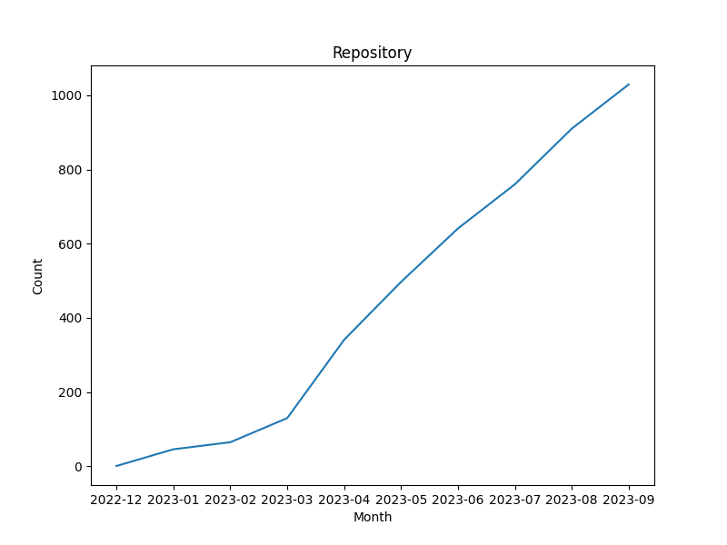

# AIGC进展

已有的以Awesome为代表的集锦仓库先分类再找仓库，这种方式不能刻画出仓库的全部能力，也不方便跟踪AIGC领域快速涌现的新仓库。本仓库每天将以仓库为第一维度，通过打Tag的方式对它们进行更加全面的刻画，您可以通过时间线看到最新进展，也可以通过Tag方便地找到AIGC相关的新模型、新数据集、新框架、新应用等。

Existing curated repositories, represented by Awesome, typically classify repositories first and then locate them. This approach fails to capture the full capabilities of the repositories and makes it inconvenient to track the rapid emergence of new repositories in the AIGC field. In this repository, we prioritize repositories as the primary dimension and provide a more comprehensive description of them through tagging. You can follow the timeline to see the latest developments and easily find new models, datasets, frameworks, applications, and more related to AIGC through the tags.

## Tag介绍（Tag Introduction）:

* [文本（Txt）](tags/文本.md)、[图像（Img）](tags/图像.md)、[语音（Voice）](tags/语.md)、[视频（Video）](tags/视频.md): 输入或输出存在文本、图像、语音、视频（Input or Output is Txt/Img/Voice/Video）。

* [数据（Data）](tags/数据.md)、[通用模型（General Model）](tags/通用模型.md)、[定制模型（Custom Model）](tags/定制模型.md)：提供了相关资源，定制模型包含法律、医学等垂类模型以及代码生成、SQL生成等模型（Related resources are provided. Custom model include domain-specific models such as legal and medical models, as well as models for code generation and SQL generation.）

* [预训练（Pre-training）](tags/预训练.md)、[训练（training）](tags/训练.md)、[强化（reinforcement, like RLHF）](tags/强化.md)、[压缩（compression）](tags/压缩.md)、[推理（inference）](tags/推理.md)：提供了相关代码 （Related code is provided.）

* [交互（Interaction）](tags/交互.md)：提供更好的界面或者API去使用模型。（Provides a better interface or API to use the model.）

* [插件（Plugin）](tags/插件.md)：增强模型的某个功能。（Enhances a specific functionality of the model.）

* [工具（Tool）](tags/工具.md): 使用模型去完成某件任务。（Utilizes the model to accomplish some task.）

* [文档（Document）](tags/文档.md):教程、集锦等。（Tutorials, compilations, and more.）

* [智能体（Agent）](tags/智能体.md)

* [可商用 (Commercial Use)](tags/可商用.md)

* [中文（Chinese）](tags/中文.md)：中文模型或中文数据集。（Chinese Model or Chinese Dataset）

* [其它 (others)](tags/其它.md)

点击上面Tag可以跳转到相应Tag的markdown文档。Clicking on the above tags will redirect you to the corresponding markdown document.

## Repositories

| Date | Repository | Stars | tags |  Description  |
|------------|---------|-------|-------------|-------------|
| 2023-05-19 | [funnyzak/ChatMate-GPT](https://github.com/funnyzak/ChatMate-GPT) |  | `文本`,`交互` | ChatMate是一个基于Open AI GPT-3的聊天应用。你可以和它聊天，它会根据你的内容提供智能回复和实用服务。|
| 2023-05-19 | [YuanGongND/ltu](https://github.com/YuanGongND/ltu) |  | `文本`,`语音`,`训练(TD)` | Github Repo for Paper "Listen, Think, and Understand".|
| 2023-05-18 | [OpenGVLab/VisionLLM](https://github.com/OpenGVLab/VisionLLM) |  | `图像`,`通用模型(TD)`,`训练(TD)` | VisionLLM: Large Language Model is also an Open-Ended Decoder for Vision-Centric Tasks|
| 2023-05-18 | [OFA-Sys/ONE-PEACE](https://github.com/OFA-Sys/ONE-PEACE) |  | `图像`,`通用模型`,`预训练`,`训练` | A general representation modal across vision, audio, language modalities.|
| 2023-05-18 | [marcocastignoli/GPTSOA](https://github.com/marcocastignoli/GPTSOA) |  | `文本`,`插件` | A simple ChatGPT Plugin framework in Typescript|
| 2023-05-18 | [cuishuang/explain-source-code-by-chatgpt](https://github.com/cuishuang/explain-source-code-by-chatgpt) |  | `文本`,`文档` | 👂🻠chatgpt讲解Go核心æºç ä¸­æ¯ä¸ªæ–‡ä»¶ï¼Œå˜é‡ï¼Œç»“æ„体，方法的作用|
| 2023-05-18 | [TBD54566975/web5-chatgpt-plugin](https://github.com/TBD54566975/web5-chatgpt-plugin) |  | `文本`,`插件` | A chatGPT plugin that adds web5 code assistance and knowledge to ChatGPT|
| 2023-05-17 | [ray-project/llm-numbers](https://github.com/ray-project/llm-numbers) |  | `文本`,`文档` | Numbers every LLM developer should know|
| 2023-05-17 | [samsonhoi/Prompts-Robin-ChatGPT-Aiprm](https://github.com/samsonhoi/Prompts-Robin-ChatGPT-Aiprm) |  | `文本`,`文档` | Collection of ChatGPT 3K+ Prompts from AIPRM, also provide i18n versions (Translate via ChatGPT 3.5). 包含 ChatGPT 3000 个以上的 Prompt 提示词 ，为所有开发者提供CSV和JSON数据格式|
| 2023-05-17 | [nickm980/smallville](https://github.com/nickm980/smallville) |  | `文本`,`智能体` | Create Generative Agents for video games and simulations in a web browser. Attempt of recreating Generative Agents: Interactive Simulacra of Human Behavior|
| 2023-05-17 | [mit-han-lab/fastcomposer](https://github.com/mit-han-lab/fastcomposer) |  | `图像`,`数据(TD)`,`通用模型`,`训练(TD)` | |
| 2023-05-17 | [Anil-matcha/Chat-Youtube](https://github.com/Anil-matcha/Chat-Youtube) |  | `文本`,`工具` | Chat with any Youtube video. Easily input the video url you'd like to chat with. Instant answers. Ask questions, extract information, and summarize documents with AI. Sources included.|
| 2023-05-17 | [simoninithomas/awesome-ai-tools-for-game-dev](https://github.com/simoninithomas/awesome-ai-tools-for-game-dev) |  | `文本`,`图像`,`语音`,`视频`,`文档` | A curated list of awesome AI tools for game developers|
| 2023-05-17 | [ysymyth/tree-of-thought-llm](https://github.com/ysymyth/tree-of-thought-llm) |  | `文本`,`训练(TD)` | |
| 2023-05-16 | [JBoRu/StructGPT](https://github.com/JBoRu/StructGPT) |  | `文本`,`工具` | The code and data for "StructGPT: A general framework for Large Language Model to Reason on Structured Data"|
| 2023-05-15 | [PKU-Alignment/safe-rlhf](https://github.com/PKU-Alignment/safe-rlhf) |  | `文本`,`数据`,`通用模型`,`训练`,`强化` | Safe-RLHF: Constrained Value Alignment via Safe Reinforcement Learning from Human Feedback|
| 2023-05-15 | [smol-ai/menubar](https://github.com/smol-ai/menubar) |  | `文本`,`交互` | a menubar with Zero latency access to ChatGPT/Bard/Claude! A/B test them, or use them in the background. I use this 20 times a day.|
| 2023-05-14 | [e-johnstonn/BriefGPT](https://github.com/e-johnstonn/BriefGPT) |  | `文本`,`工具` | Locally hosted tool that connects documents to LLMs for summarization and querying, with a simple GUI.|
| 2023-05-12 | [r2d4/react-llm](https://github.com/r2d4/react-llm) |  | `文本`,`交互` | Easy-to-use headless React Hooks to run LLMs in the browser with WebGPU. Just useLLM().|
| 2023-05-11 | [dsdanielpark/Bard-API](https://github.com/dsdanielpark/Bard-API) |  | `文本`,`交互` | The python package that returns response of Google Bard through API.|
| 2023-05-11 | [kuleshov-group/llmtune](https://github.com/kuleshov-group/llmtune) |  | `文本`,`训练` | 4-Bit Finetuning of Large Language Models on One Consumer GPU|
| 2023-05-10 | [jtsang4/claude-to-chatgpt](https://github.com/jtsang4/claude-to-chatgpt) |  | `文本`,`交互` | This project converts the API of Anthropic's Claude model to the OpenAI Chat API format.|
| 2023-05-10 | [ricklamers/gpt-code-ui](https://github.com/ricklamers/gpt-code-ui) |  | `文本`,`交互` | An open source implementation of OpenAI's ChatGPT Code interpreter|
| 2023-05-10 | [homanp/superagent](https://github.com/homanp/superagent) |  | `文本`,`智能体` | 🥷 SuperAgent - Deploy LLM Agents to production|
| 2023-05-08 | [OpenGVLab/InternGPT](https://github.com/OpenGVLab/InternGPT) |  | `文本`,`交互` | InternGPT / InternChat allows you to interact with ChatGPT by clicking, dragging and drawing using a pointing device.|
| 2023-05-08 | [OptimalScale/DetGPT](https://github.com/OptimalScale/DetGPT) |  | `文本`,`图像`,`工具` | DetGPT locates target objects, not just describing images.|
| 2023-05-08 | [r2d4/openlm](https://github.com/r2d4/openlm) |  | `文本`,`交互` | OpenAI-compatible Python client that can call any LLM|
| 2023-05-07 | [conceptofmind/PaLM](https://github.com/conceptofmind/PaLM) |  | `文本`,`通用模型`,`训练` | An open-source implementation of Google's PaLM models|
| 2023-05-06 | [yzfly/LangGPT](https://github.com/yzfly/LangGPT) |  | `文本`,`工具` | LangGPT: Empowering everyone to become a prompt expert!🚀  Structured Prompt，结构化提示词。|
| 2023-05-05 | [eugeneyan/open-llms](https://github.com/eugeneyan/open-llms) |  | `文本`,`文档`,`可商用` | 🤖 A list of open LLMs available for commercial use.|
| 2023-05-05 | [SCUTlihaoyu/open-chat-video-editor](https://github.com/SCUTlihaoyu/open-chat-video-editor) |  | `文本`,`视频`,`工具` | Open source short video automatic generation tool|
| 2023-05-05 | [SamurAIGPT/ChatGPT-Developer-Plugins](https://github.com/SamurAIGPT/ChatGPT-Developer-Plugins) |  | `文本`,`插件` | Run ChatGPT plugins for free without having access to Plus subscription|
| 2023-05-04 | [xiangsx/gpt4free-ts](https://github.com/xiangsx/gpt4free-ts) |  | `文本`,`其它` | This is a replication project for the typescript version of xtekky/gpt4free|
| 2023-05-03 | [IBM/Dromedary](https://github.com/IBM/Dromedary) |  | `文本`,`通用模型`,`训练` | Dromedary: towards helpful, ethical and reliable LLMs.|
| 2023-05-03 | [piercefreeman/gpt-json](https://github.com/piercefreeman/gpt-json) |  | `文本`,`插件` | Structured and typehinted GPT responses in Python|
| 2023-05-03 | [melodysdreamj/WizardVicunaLM](https://github.com/melodysdreamj/WizardVicunaLM) |  | `文本`,`通用模型` | LLM that combines the principles of wizardLM and vicunaLM|
| 2023-05-02 | [imartinez/privateGPT](https://github.com/imartinez/privateGPT) |  | `文本`,`工具` | Interact privately with your documents using the power of GPT, 100% privately, no data leaks|
| 2023-04-30 | [alejandro-ao/langchain-ask-pdf](https://github.com/alejandro-ao/langchain-ask-pdf) |  | `文本`,`工具` | An AI-app that allows you to upload a PDF and ask questions about it. It uses OpenAI's LLMs to generate a response.|
| 2023-04-29 | [1rgs/jsonformer](https://github.com/1rgs/jsonformer) |  | `文本`,`工具` | A Bulletproof Way to Generate Structured JSON from Language Models|
| 2023-04-29 | [mlc-ai/mlc-llm](https://github.com/mlc-ai/mlc-llm) |  | `文本`,`推理` | Enable everyone to develop, optimize and deploy AI models natively on everyone's devices.|
| 2023-04-29 | [mishalhossin/Discord-AI-Chatbot](https://github.com/mishalhossin/Discord-AI-Chatbot) |  | `图像`,`工具` | This is a Discord Chatbot with image detection, OCR, internet access and DALL-E image generation  for free|
| 2023-04-28 | [cloudflare/chatgpt-plugin](https://github.com/cloudflare/chatgpt-plugin) |  | `文本`,`插件` | Build ChatGPT plugins with Cloudflare's Developer Platform 🤖|
| 2023-04-28 | [openlm-research/open_llama](https://github.com/openlm-research/open_llama) |  | `文本`,`通用模型`,`可商用` | In this repo, we release a permissively licensed open source reproduction of Meta AI's LLaMA large language model.|
| 2023-04-28 | [datawhalechina/prompt-engineering-for-developers](https://github.com/datawhalechina/prompt-engineering-for-developers) |  | `文本`,`文档` | 吴恩达《ChatGPT Prompt Engineering for Developers》课程中文版，视频地址：https://www.bilibili.com/video/BV1Bo4y1A7FU|
| 2023-04-28 | [mosaicml/llm-foundry](https://github.com/mosaicml/llm-foundry) |  | `文本`,`通用模型`,`训练` | LLM training code for MosaicML foundation models|
| 2023-04-28 | [replit/ReplitLM](https://github.com/replit/ReplitLM) |  | `文本`,`数据`,`通用模型` | Inference code and configs for the ReplitLM model family|
| 2023-04-28 | [webwhiz-ai/webwhiz](https://github.com/webwhiz-ai/webwhiz) |  | `文本`,`工具` | WebWhiz allows you to create an AI chatbot that knows everything about your product and can instantly respond to your customer's queries.|
| 2023-04-28 | [dandelionsllm/pandallm](https://github.com/dandelionsllm/pandallm) |  | `文本`,`数据`,`通用模型`,`中文` | Panda: 海外中文开源大语言模型，基于 Llama-7B, -13B, -33B, -65B 进行中文领域上的持续预训练。|
| 2023-04-28 | [mlfoundations/datacomp](https://github.com/mlfoundations/datacomp) |  | `文本`,`图像`,`数据` | DataComp: In search of the next generation of multimodal datasets|
| 2023-04-27 | [cirediatpl/FigmaChain](https://github.com/cirediatpl/FigmaChain) |  | `文本`,`工具` | FigmaChain is a set of Python scripts that generate HTML/CSS code based on Figma designs. Using OpenAI's GPT-3 model, FigmaChain enables developers to quickly generate HTML/CSS code from a Figma design input. It also includes a Streamlit-based chatbot interface for interactive code generation.|
| 2023-04-26 | [AprilNEA/ChatGPT-Admin-Web](https://github.com/AprilNEA/ChatGPT-Admin-Web) |  | `文本`,`交互` | 带有用户管理和后台管理系统的 ChatGPT WebUI|
| 2023-04-26 | [open-mmlab/Multimodal-GPT](https://github.com/open-mmlab/Multimodal-GPT) |  | `文本`,`图像`,`数据`,`通用模型` | Multimodal-GPT|
| 2023-04-26 | [Bing-su/adetailer](https://github.com/Bing-su/adetailer) |  | `图像`,`插件` | Auto detecting, masking and inpainting with detection model.|
| 2023-04-26 | [mosaicml/diffusion](https://github.com/mosaicml/diffusion) |  | `图像`,`训练` | This repo contains code used to train your own Stable Diffusion model on your own data.|
| 2023-04-26 | [vijishmadhavan/UnpromptedControl](https://github.com/vijishmadhavan/UnpromptedControl) |  | `文本`,`图像`,`工具` | Remove unwanted objects and restore images without prompts, powered by ControlNet.|
| 2023-04-26 | [Chanzhaoyu/chatgpt-web-plus](https://github.com/Chanzhaoyu/chatgpt-web-plus) |  | `文本`,`交互` | chatgpt-web-plus|
| 2023-04-26 | [anse-app/anse](https://github.com/anse-app/anse) |  | `文本`,`交互` | Supercharged experience for ChatGPT, DALL-E and Stable Diffusion.|
| 2023-04-25 | [paulpierre/RasaGPT](https://github.com/paulpierre/RasaGPT) |  | `文本`,`工具` | 💬 RasaGPT is the first headless LLM chatbot platform built on top of Rasa and Langchain. Built w/ Rasa, FastAPI, Langchain, LlamaIndex, SQLModel, pgvector, ngrok, telegram|
| 2023-04-25 | [richardyc/Chrome-GPT](https://github.com/richardyc/Chrome-GPT) |  | `文本`,`智能体` | An AutoGPT agent that controls Chrome on your desktop|
| 2023-04-25 | [X-PLUG/mPLUG-Owl](https://github.com/X-PLUG/mPLUG-Owl) |  | `文本`,`图像`,`数据`,`通用模型`,`训练` | mPLUG-Owl🦉: Modularization Empowers Large Language Models with Multimodality|
| 2023-04-24 | [Kuingsmile/word-GPT-Plus](https://github.com/Kuingsmile/word-GPT-Plus) |  | `文本`,`工具` | Word GPT Plus is a word add-in which integrates the chatGPT model into Microsoft Word. Both official and web api is supported.|
| 2023-04-24 | [bigcode-project/starcoder](https://github.com/bigcode-project/starcoder) |  | `文本`,`数据`,`定制模型`,`训练` | Home of StarCoder: fine-tuning & inference!|
| 2023-04-24 | [yzfly/wonderful-prompts](https://github.com/yzfly/wonderful-prompts) |  | `文本`,`文档` | 🔥中文 prompt 精选🔥，ChatGPT 使用指南，提升 ChatGPT 可玩性和可用性！🚀|
| 2023-04-24 | [novicezk/midjourney-proxy](https://github.com/novicezk/midjourney-proxy) |  | `图像`,`交互` | 代理 MidJourney 的discord频道，实现api形式调用AI绘图|
| 2023-04-24 | [erictik/midjourney-api](https://github.com/erictik/midjourney-api) |  | `图像`,`交互` | Node.js client for the unofficial MidJourney API.|
| 2023-04-24 | [stassius/StableHoudini](https://github.com/stassius/StableHoudini) |  | `图像`,`插件` | Stable Diffusion Houdini Toolset|
| 2023-04-23 | [THUDM/VisualGLM-6B](https://github.com/THUDM/VisualGLM-6B) |  | `文本`,`图像`,`数据`,`通用模型`,`训练`,`压缩`,`中文` | Chinese and English multimodal conversational language model \| 多模态中英双语对话语言模型|
| 2023-04-23 | [Mooler0410/LLMsPracticalGuide](https://github.com/Mooler0410/LLMsPracticalGuide) |  | `文本`,`文档` | A curated list of practical guide resources of LLMs (LLMs Tree, Examples, Papers)|
| 2023-04-23 | [nlpxucan/WizardLM](https://github.com/nlpxucan/WizardLM) |  | `文本`,`数据`,`通用模型`,`训练` | WizardLM: Empowering Large Pre-Trained Language Models to Follow Complex Instructions|
| 2023-04-23 | [mbzuai-nlp/LaMini-LM](https://github.com/mbzuai-nlp/LaMini-LM) |  | `文本`,`数据`,`通用模型` | LaMini-LM: A Diverse Herd of Distilled Models from Large-Scale Instructions|
| 2023-04-23 | [Ryan-yang125/ChatLLM-Web](https://github.com/Ryan-yang125/ChatLLM-Web) |  | `文本`,`交互` | 🗣️ Chat with LLM like Vicuna totally in your browser with WebGPU, safely, privately, and with no server.Powered by web llm|
| 2023-04-23 | [LearnPrompt/LearnPrompt](https://github.com/LearnPrompt/LearnPrompt) |  | `文本`,`文档` | |
| 2023-04-23 | [minosvasilias/godot-dodo](https://github.com/minosvasilias/godot-dodo) |  | `文本`,`定制模型`,`训练` | Finetuning large language models for GDScript generation.|
| 2023-04-23 | [StevenGrove/GPT4Tools](https://github.com/StevenGrove/GPT4Tools) |  | `文本`,`图像`,`数据`,`通用模型`,`训练` | GPT4Tools is an intelligent system that can automatically decide, control, and utilize different visual foundation models, allowing the user to interact with images during a conversation.|
| 2023-04-22 | [LemonQu-GIT/ChatGLM-6B-Engineering](https://github.com/LemonQu-GIT/ChatGLM-6B-Engineering) |  | `文本`,`图像`,`交互` | ChatGLM-6B Prompt Engineering Project|
| 2023-04-21 | [pixiv/ChatVRM](https://github.com/pixiv/ChatVRM) |  | `文本`,`语音`,`工具` | |
| 2023-04-21 | [peterw/Gumroad-Landing-Page-Generator](https://github.com/peterw/Gumroad-Landing-Page-Generator) |  | `文本`,`工具` | This project is a Python script that scrapes data from a Gumroad site, generates a colorful and well-designed HTML page using OpenAI's GPT-4 model, and deploys the generated page to Vercel.|
| 2023-04-21 | [brexhq/prompt-engineering](https://github.com/brexhq/prompt-engineering) |  | `文本`,`文档` | Tips and tricks for working with Large Language Models like OpenAI's GPT-4.|
| 2023-04-21 | [lvwzhen/law-cn-ai](https://github.com/lvwzhen/law-cn-ai) |  | `文本`,`数据`,`工具`,`中文` | ⚖️ AI 法律助手|
| 2023-04-21 | [voidful/awesome-chatgpt-dataset](https://github.com/voidful/awesome-chatgpt-dataset) |  | `文本`,`数据`,`文档` | Unlock the Power of LLM: Explore These Datasets to Train Your Own ChatGPT!|
| 2023-04-21 | [itamargol/openai](https://github.com/itamargol/openai) |  | `文本`,`插件` | LLMs Best Tricks|
| 2023-04-20 | [pengxiao-song/LaWGPT](https://github.com/pengxiao-song/LaWGPT) |  | `文本`,`数据`,`定制模型`,`训练`,`中文` |  🉠Repo for LaWGPT, Chinese-Llama tuned with Chinese Legal knowledge. 基äºä¸­æ–‡æ³•å¾‹çŸ¥è¯†çš„大语言模å‹|
| 2023-04-20 | [ninehills/chatglm-openai-api](https://github.com/ninehills/chatglm-openai-api) |  | `文本`,`交互` | Provide OpenAI style API for  ChatGLM-6B and Chinese Embeddings Model|
| 2023-04-20 | [showlab/VLog](https://github.com/showlab/VLog) |  | `文本`,`视频`,`工具` | Transform Video as a Document with ChatGPT, CLIP, BLIP2, GRIT, Whisper, LangChain.|
| 2023-04-19 | [IntelligenzaArtificiale/Free-Auto-GPT](https://github.com/IntelligenzaArtificiale/Free-Auto-GPT) |  | `文本`,`其它` | Free Auto GPT with NO paids API is a repository that offers a simple version of Auto GPT, an autonomous AI agent capable of performing tasks independently. Unlike other versions, our implementation does not rely on any paid OpenAI API, making it accessible to anyone. |
| 2023-04-19 | [danielgross/LlamaAcademy](https://github.com/danielgross/LlamaAcademy) |  | `文本`,`工具` | A school for camelids|
| 2023-04-19 | [lupantech/chameleon-llm](https://github.com/lupantech/chameleon-llm) |  | `文本`,`图像`,`工具` | Codes for "Chameleon: Plug-and-Play Compositional Reasoning with Large Language Models".|
| 2023-04-19 | [RiseInRose/MiniGPT-4-ZH](https://github.com/RiseInRose/MiniGPT-4-ZH) |  | `文本`,`图像`,`通用模型`,`训练`,`压缩` | MiniGPT-4 中文部署翻译 完善部署细节|
| 2023-04-17 | [houseofsecrets/SdPaint](https://github.com/houseofsecrets/SdPaint) |  | `图像`,`插件` | Stable Diffusion Painting|
| 2023-04-17 | [h2oai/h2o-llmstudio](https://github.com/h2oai/h2o-llmstudio) |  | `文本`,`数据`,`通用模型`,`训练`,`可商用` | H2O LLM Studio - a framework and no-code GUI for fine-tuning LLMs|
| 2023-04-15 | [Vision-CAIR/MiniGPT-4](https://github.com/Vision-CAIR/MiniGPT-4) |  | `文本`,`图像`,`通用模型`,`预训练`,`训练` | MiniGPT-4: Enhancing Vision-language Understanding with Advanced Large Language Models|
| 2023-04-13 | [mlc-ai/web-llm](https://github.com/mlc-ai/web-llm) |  | `文本`,`推理` | Bringing large-language models and chat to web browsers. Everything runs inside the browser with no server support.|
| 2023-04-13 | [csunny/DB-GPT](https://github.com/csunny/DB-GPT) |  | `文本`,`工具` | Interact your data and environment using the local GPT,  no data leaks, 100% privately, 100% security|
| 2023-04-11 | [datawhalechina/hugging-llm](https://github.com/datawhalechina/hugging-llm) |  | `文本`,`文档` | HuggingLLM, Hugging Future.|
| 2023-04-10 | [declare-lab/tango](https://github.com/declare-lab/tango) |  | `文本`,`语音`,`通用模型`,`训练` | Codes and Model of the paper "Text-to-Audio Generation using Instruction Tuned LLM and Latent Diffusion Model"|
| 2023-04-10 | [eumemic/ai-legion](https://github.com/eumemic/ai-legion) |  | `文本`,`智能体` | An LLM-powered autonomous agent platform|
| 2023-04-10 | [thomas-yanxin/LangChain-ChatGLM-Webui](https://github.com/thomas-yanxin/LangChain-ChatGLM-Webui) |  | `文本`,`交互` | 基于LangChain和ChatGLM-6B等系列LLM的针对本地知识库的自动问答|
| 2023-04-08 | [sunner/ChatALL](https://github.com/sunner/ChatALL) |  | `文本`,`交互` |  Concurrently chat with ChatGPT, Bing Chat, bard, Alpaca, Vincuna, Claude, ChatGLM, MOSS, iFlytek Spark, ERNIE and more, discover the best answers|
| 2023-04-08 | [hiyouga/ChatGLM-Efficient-Tuning](https://github.com/hiyouga/ChatGLM-Efficient-Tuning) |  | `文本`,`数据`,`训练`,`强化`,`中文` | Fine-tuning ChatGLM-6B with PEFT \| 基于 PEFT 的高效 ChatGLM 微调|
| 2023-04-06 | [Instruction-Tuning-with-GPT-4/GPT-4-LLM](https://github.com/Instruction-Tuning-with-GPT-4/GPT-4-LLM) |  | `文本`,`数据`,`训练` | Instruction Tuning with GPT-4|
| 2023-04-06 | [nomic-ai/gpt4all-ui](https://github.com/nomic-ai/gpt4all-ui) |  | `文本`,`交互` | gpt4all chatbot ui|
| 2023-04-06 | [liucongg/ChatGLM-Finetuning](https://github.com/liucongg/ChatGLM-Finetuning) |  | `文本`,`训练`,`中文` | 基于ChatGLM-6B模型，进行下游具体任务微调，涉及Freeze、Lora、P-tuning等|
| 2023-04-04 | [soulteary/docker-prompt-generator](https://github.com/soulteary/docker-prompt-generator) |  | `文本`,`图像`,`工具` | Using a Model to generate prompts for Model applications. / 使用模型来生成作图咒语的偷懒工具，支持 MidJourney、Stable Diffusion 等。|
| 2023-04-04 | [zabirauf/AutoGPT.js](https://github.com/zabirauf/AutoGPT.js) |  | `文本`,`交互`,`智能体` | Auto-GPT on the browser|
| 2023-04-03 | [101dotxyz/GPTeam](https://github.com/101dotxyz/GPTeam) |  | `文本`,`智能体` | GPTeam: An open-source multi-agent simulation|
| 2023-04-02 | [SkalskiP/courses](https://github.com/SkalskiP/courses) |  | `文本`,`文档` | This repository is a curated collection of links to various courses and resources about Artificial Intelligence (AI)|
| 2023-04-02 | [Jittor/JittorLLMs](https://github.com/Jittor/JittorLLMs) |  | `文本`,`推理` | 计图大模型推理库，具有高性能、配置要求低、中文支持好、可移植等特点|
| 2023-04-01 | [FreedomIntelligence/LLMZoo](https://github.com/FreedomIntelligence/LLMZoo) |  | `文本`,`数据`,`通用模型`,`训练`,`压缩`,`文档` | ⚡LLM Zoo is a project that provides data, models, and evaluation benchmark for large language models.⚡|
| 2023-04-01 | [unit-mesh/unit-minions](https://github.com/unit-mesh/unit-minions) |  | `文本`,`文档` | 《AI 研发提效研究：自己动手训练 LoRA》，包含 Llama  （Alpaca LoRA）模型、ChatGLM （ChatGLM Tuning）相关 Lora 的训练。训练内容：用户故事生成、测试代码生成、代码辅助生成、文本转 SQL、文本生成代码……|
| 2023-03-31 | [imClumsyPanda/langchain-ChatGLM](https://github.com/imClumsyPanda/langchain-ChatGLM) |  | `文本`,`工具`,`中文` | langchain-ChatGLM, local knowledge based ChatGLM with langchain ｜ 基于本地知识库的 ChatGLM 问答|
| 2023-03-31 | [SCIR-HI/Huatuo-Llama-Med-Chinese](https://github.com/SCIR-HI/Huatuo-Llama-Med-Chinese) |  | `文本`,`数据`,`定制模型`,`训练`,`中文` | Repo for BenTsao [original name: HuaTuo (华驼)], Llama-7B tuned with Chinese medical knowledge. 本草（原名：华驼）模型仓库，基于中文医学知识的LLaMA模型指令微调|
| 2023-03-31 | [project-baize/baize-chatbot](https://github.com/project-baize/baize-chatbot) |  | `文本`,`数据`,`通用模型`,`训练` | Let ChatGPT teach your own chatbot in hours with a single GPU!|
| 2023-03-31 | [LC1332/Chinese-alpaca-lora](https://github.com/LC1332/Chinese-alpaca-lora) |  | `文本`,`数据`,`通用模型`,`中文` | 骆驼:A Chinese finetuned instruction LLaMA. Developed by 陈启源 @ 华中师范大学 & 李鲁鲁 @ 商汤科技 & 冷子昂 @ 商汤科技|
| 2023-03-30 | [saharNooby/rwkv.cpp](https://github.com/saharNooby/rwkv.cpp) |  | `文本`,`推理` | INT4 and FP16 inference on CPU for RWKV language model|
| 2023-03-29 | [AGI-Edgerunners/LLM-Adapters](https://github.com/AGI-Edgerunners/LLM-Adapters) |  | `文本`,`数据`,`通用模型`,`训练` | LLM-Adapters: An Adapter Family for Parameter-Efficient Fine-Tuning of Large Language Models|
| 2023-03-28 | [WangRongsheng/ChatGenTitle](https://github.com/WangRongsheng/ChatGenTitle) |  | `文本`,`定制模型`,`训练` | 🌟 ChatGenTitle：使用百万arXiv论文信息在LLaMA模型上进行微调的论文题目生成模型|
| 2023-03-27 | [OptimalScale/LMFlow](https://github.com/OptimalScale/LMFlow) |  | `文本`,`数据`,`通用模型`,`训练`,`强化` | An Extensible Toolkit for Finetuning and Inference of Large Foundation Models. Large Model for All.|
| 2023-03-27 | [osanseviero/ml_timeline](https://github.com/osanseviero/ml_timeline) |  | `文本`,`文档` | |
| 2023-03-26 | [visual-openllm/visual-openllm](https://github.com/visual-openllm/visual-openllm) |  | `文本`,`图像`,`交互` | something like visual-chatgpt, 文心一言的开源版|
| 2023-03-25 | [wenda-LLM/wenda](https://github.com/wenda-LLM/wenda) |  | `文本`,`工具` | 闻达：一个LLM调用平台。为小模型外挂知识库查找和设计自动执行动作，实现不亚于于大模型的生成能力|
| 2023-03-24 | [sobelio/llm-chain](https://github.com/sobelio/llm-chain) |  | `文本`,`工具` | `llm-chain` is a powerful rust crate for building chains in large language models allowing you to summarise text and complete complex tasks|
| 2023-03-24 | [zilliztech/GPTCache](https://github.com/zilliztech/GPTCache) |  | `文本`,`工具` | GPTCache is a semantic cache library for LLM models and multi-models, which seamlessly integrates with 🦜ï¸ğŸ”—LangChain and 🦙llama_index, making it accessible to 🌠developers working in any language.|
| 2023-03-24 | [PhoebusSi/Alpaca-CoT](https://github.com/PhoebusSi/Alpaca-CoT) |  | `文本`,`数据`,`训练` | We unified the interfaces of instruction-tuning data (e.g., CoT data), multiple LLMs and parameter-efficient methods (e.g., lora, p-tuning) together for easy use. Meanwhile, we created a new branch to build a Tabular LLM.（我们分别统一了丰富的IFT数据（如CoT数据，目前仍不断扩充）、多种训练效率方法（如lora，p-tuning）以及多种LLMs，三个层面上的接口，打造方便研究人员上手的LLM-IFT研究平台。同时tabular_llm分支构建了面向表格智能任务的LLM。|
| 2023-03-24 | [h2oai/h2ogpt](https://github.com/h2oai/h2ogpt) |  | `文本`,`通用模型`,`训练`,`可商用` | Come join the movement to make the world's best open source GPT led by H2O.ai - 100% private chat and document search, no data leaks, Apache 2.0|
| 2023-03-23 | [openai/chatgpt-retrieval-plugin](https://github.com/openai/chatgpt-retrieval-plugin) |  | `文本`,`工具` | The ChatGPT Retrieval Plugin lets you easily find personal or work documents by asking questions in natural language.|
| 2023-03-23 | [Facico/Chinese-Vicuna](https://github.com/Facico/Chinese-Vicuna) |  | `文本`,`通用模型`,`训练`,`压缩`,`中文` | Chinese-Vicuna: A Chinese Instruction-following LLaMA-based Model —— 一个中文低资源的llama+lora方案，结构参考alpaca|
| 2023-03-22 | [Lightning-AI/lit-llama](https://github.com/Lightning-AI/lit-llama) |  | `文本`,`通用模型`,`预训练`,`训练`,`压缩`,`可商用` | Implementation of the LLaMA language model based on nanoGPT. Supports flash attention, Int8 and GPTQ 4bit quantization, LoRA and LLaMA-Adapter fine-tuning, pre-training. Apache 2.0-licensed.|
| 2023-03-22 | [lxe/simple-llm-finetuner](https://github.com/lxe/simple-llm-finetuner) |  | `文本`,`交互` | Simple UI for LLM Model Finetuning|
| 2023-03-22 | [acheong08/Bard](https://github.com/acheong08/Bard) |  | `文本`,`交互` | Python SDK/API for reverse engineered Google Bard|
| 2023-03-21 | [Kent0n-Li/ChatDoctor](https://github.com/Kent0n-Li/ChatDoctor) |  | `文本`,`数据`,`定制模型`,`训练` | |
| 2023-03-21 | [yzfly/awesome-chatgpt-zh](https://github.com/yzfly/awesome-chatgpt-zh) |  | `文本`,`文档`,`中文` | ChatGPT 中文指南🔥，ChatGPT 中文调教指南，指令指南，精选资源清单，更好的使用 chatGPT 让你的生产力 up up up! 🚀|
| 2023-03-21 | [LC1332/Luotuo-Chinese-LLM](https://github.com/LC1332/Luotuo-Chinese-LLM) |  | `文本`,`数据`,`通用模型`,`中文` | 骆驼(Luotuo): Open Sourced Chinese Language Models. Developed by 陈启源 @ 华中师范大学 & 李鲁鲁 @ 商汤科技 & 冷子昂 @ 商汤科技|
| 2023-03-21 | [CVI-SZU/Linly](https://github.com/CVI-SZU/Linly) |  | `文本`,`数据`,`通用模型`,`预训练`,`训练`,`强化(TD)`,`压缩`,`推理`,`可商用`,`中文` | Chinese-LLaMA基础模型；ChatFlow中文对话模型；中文OpenLLaMA模型；NLP预训练/指令微调数据集|
| 2023-03-21 | [ohmplatform/FreedomGPT](https://github.com/ohmplatform/FreedomGPT) |  | `文本`,`交互` | This codebase is for a React and Electron-based app that executes the FreedomGPT LLM locally (offline and private) on Mac and Windows using a chat-based interface (based on Alpaca Lora)|
| 2023-03-20 | [binary-husky/gpt_academic](https://github.com/binary-husky/gpt_academic) |  | `文本`,`交互` | 为GPT/GLM提供图形交互界面，特别优化论文阅读润色体验，模块化设计支持自定义快捷按钮&函数插件，支持代码块表格显示，Tex公式双显示，新增Python和C++项目剖析&自译解功能，PDF/LaTex论文翻译&总结功能，支持并行问询多种LLM模型，支持清华chatglm等本地模型。兼容复旦MOSS, llama, rwkv, 盘古等。|
| 2023-03-19 | [lm-sys/FastChat](https://github.com/lm-sys/FastChat) |  | `文本`,`通用模型`,`训练`,`可商用` | An open platform for training, serving, and evaluating large languages. Release repo for Vicuna and FastChat-T5.|
| 2023-03-19 | [nsarrazin/serge](https://github.com/nsarrazin/serge) |  | `文本`,`交互` | A web interface for chatting with Alpaca through llama.cpp. Fully dockerized, with an easy to use API.|
| 2023-03-19 | [stochasticai/xturing](https://github.com/stochasticai/xturing) |  | `文本`,`训练` | Easily build, customize and control your own LLMs|
| 2023-03-19 | [gotzmann/llama.go](https://github.com/gotzmann/llama.go) |  | `文本`,`推理` | llama.go is like llama.cpp in pure Golang!|
| 2023-03-18 | [go-skynet/LocalAI](https://github.com/go-skynet/LocalAI) |  | `文本`,`图像`,`推理` | :robot: Self-hosted, community-driven, local OpenAI-compatible API. Drop-in replacement for OpenAI running LLMs on consumer-grade hardware. No GPU required. LocalAI is a RESTful API to run ggml compatible models: llama.cpp, alpaca.cpp, gpt4all.cpp, rwkv.cpp, whisper.cpp, vicuna, koala, gpt4all-j, cerebras and many others!|
| 2023-03-18 | [nichtdax/awesome-totally-open-chatgpt](https://github.com/nichtdax/awesome-totally-open-chatgpt) |  | `文本`,`文档` | A list of totally open alternatives to ChatGPT|
| 2023-03-17 | [lightaime/camel](https://github.com/lightaime/camel) |  | `文本`,`智能体` | 🫠CAMEL: Communicative Agents for “Mind†Exploration of Large Scale Language Model Society|
| 2023-03-17 | [LianjiaTech/BELLE](https://github.com/LianjiaTech/BELLE) |  | `文本`,`数据`,`通用模型`,`训练`,`压缩`,`中文` | BELLE: Be Everyone's Large Language model Engine（开源中文对话大模型）|
| 2023-03-17 | [hikariming/alpaca_chinese_dataset](https://github.com/hikariming/alpaca_chinese_dataset) |  | `文本`,`数据`,`训练`,`中文` | 人工精调的中文对话数据集和一段chatglm的微调代码|
| 2023-03-16 | [Significant-Gravitas/Auto-GPT](https://github.com/Significant-Gravitas/Auto-GPT) |  | `文本`,`图像`,`语音`,`智能体` | An experimental open-source attempt to make GPT-4 fully autonomous.|
| 2023-03-16 | [mymusise/ChatGLM-Tuning](https://github.com/mymusise/ChatGLM-Tuning) |  | `文本`,`训练`,`中文` | 一种平价的chatgpt实现方案,  基于ChatGLM-6B + LoRA|
| 2023-03-15 | [ymcui/Chinese-LLaMA-Alpaca](https://github.com/ymcui/Chinese-LLaMA-Alpaca) |  | `文本`,`预训练`,`训练`,`压缩`,`推理`,`中文` | 中文LLaMA&Alpaca大语言模型+本地CPU/GPU部署 (Chinese LLaMA & Alpaca LLMs)|
| 2023-03-15 | [josStorer/chatGPTBox](https://github.com/josStorer/chatGPTBox) |  | `文本`,`交互` | Integrating ChatGPT into your browser deeply, everything you need is here|
| 2023-03-14 | [RUCAIBox/LLMSurvey](https://github.com/RUCAIBox/LLMSurvey) |  | `文本`,`文档` | The official GitHub page for the survey paper "A Survey of Large Language Models".|
| 2023-03-14 | [Akegarasu/ChatGLM-webui](https://github.com/Akegarasu/ChatGLM-webui) |  | `文本`,`交互` | A WebUI for ChatGLM-6B|
| 2023-03-14 | [ssbuild/chatglm_finetuning](https://github.com/ssbuild/chatglm_finetuning) |  | `文本`,`训练`,`中文` | chatglm 6b finetuning and alpaca finetuning|
| 2023-03-13 | [THUDM/ChatGLM-6B](https://github.com/THUDM/ChatGLM-6B) |  | `文本`,`通用模型`,`训练`,`压缩`,`中文` | ChatGLM-6B: An Open Bilingual Dialogue Language Model \| 开源双语对话语言模型|
| 2023-03-13 | [tloen/alpaca-lora](https://github.com/tloen/alpaca-lora) |  | `文本`,`通用模型`,`训练` | Instruct-tune LLaMA on consumer hardware|
| 2023-03-13 | [rustformers/llm](https://github.com/rustformers/llm) |  | `文本`,`推理` | An ecosystem of Rust libraries for working with large language models|
| 2023-03-12 | [cocktailpeanut/dalai](https://github.com/cocktailpeanut/dalai) |  | `文本`,`交互` | The simplest way to run LLaMA on your local machine|
| 2023-03-11 | [mckaywrigley/chatbot-ui](https://github.com/mckaywrigley/chatbot-ui) |  | `文本`,`交互` | An open source ChatGPT UI.|
| 2023-03-10 | [ggerganov/llama.cpp](https://github.com/ggerganov/llama.cpp) |  | `文本`,`压缩`,`推理` | Port of Facebook's LLaMA model in C/C++|
| 2023-03-10 | [Yidadaa/ChatGPT-Next-Web](https://github.com/Yidadaa/ChatGPT-Next-Web) |  | `文本`,`交互` | One-Click to deploy well-designed ChatGPT web UI on Vercel. 一键拥有你自己的 ChatGPT 网页服务。|
| 2023-03-10 | [svc-develop-team/so-vits-svc](https://github.com/svc-develop-team/so-vits-svc) |  | `语音`,`通用模型`,`训练` | SoftVC VITS Singing Voice Conversion|
| 2023-03-10 | [202252197/ChatGPT_JCM](https://github.com/202252197/ChatGPT_JCM) |  | `文本`,`交互` | OpenAI管理界面，聚合了OpenAI的所有接口进行界面操作(所有模型、图片、音频、微调、文件)等，支持Markdown格式(公式、图表，表格)等，GPT4接口官方只是在申请阶段，后期会一点一点的将OpenAI接口进行接入大家支持一下，微信群号在下方，右上角点个Star，我会一直更新下去，大家一起学习，一起加油，一起努力，一起成长。|
| 2023-03-10 | [FranxYao/chain-of-thought-hub](https://github.com/FranxYao/chain-of-thought-hub) |  | `文本`,`文档` | Benchmarking large language models' complex reasoning ability with chain-of-thought prompting|
| 2023-03-06 | [mlc-ai/web-stable-diffusion](https://github.com/mlc-ai/web-stable-diffusion) |  | `图像`,`推理` | Bringing stable diffusion models to web browsers. Everything runs inside the browser with no server support. |
| 2023-03-05 | [shawwn/llama-dl](https://github.com/shawwn/llama-dl) |  | `文本`,`其它` | High-speed download of LLaMA, Facebook's 65B parameter GPT model|
| 2023-03-04 | [chathub-dev/chathub](https://github.com/chathub-dev/chathub) |  | `文本`,`交互` | All-in-one chatbot client|
| 2023-03-02 | [yihong0618/bilingual_book_maker](https://github.com/yihong0618/bilingual_book_maker) |  | `文本`,`工具` | Make bilingual epub books Using AI translate|
| 2023-03-02 | [circlestarzero/EX-chatGPT](https://github.com/circlestarzero/EX-chatGPT) |  | `文本`,`交互` | Let ChatGPT truly learn how to go online and call APIs! 'EX-ChatGPT' can rival and even surpass NewBing|
| 2023-03-02 | [GaiZhenbiao/ChuanhuChatGPT](https://github.com/GaiZhenbiao/ChuanhuChatGPT) |  | `文本`,`交互` | GUI for ChatGPT API and many LLMs|
| 2023-03-02 | [anse-app/chatgpt-demo](https://github.com/anse-app/chatgpt-demo) |  | `文本`,`交互` | Minimal web UI for ChatGPT. |
| 2023-02-27 | [deep-diver/LLM-As-Chatbot](https://github.com/deep-diver/LLM-As-Chatbot) |  | `文本`,`交互` | LLM as a Chatbot Service|
| 2023-02-27 | [juncongmoo/chatllama](https://github.com/juncongmoo/chatllama) |  | `文本`,`强化` | ChatLLaMA 📢 Open source implementation for LLaMA-based ChatGPT runnable in a single GPU. 15x faster training process than ChatGPT|
| 2023-02-27 | [KohakuBlueleaf/LyCORIS](https://github.com/KohakuBlueleaf/LyCORIS) |  | `图像`,`文档` | Lora beYond Conventional methods, Other Rank adaptation Implementations for Stable diffusion.|
| 2023-02-26 | [nat/openplayground](https://github.com/nat/openplayground) |  | `文本`,`交互` | An LLM playground you can run on your laptop|
| 2023-02-23 | [kale5195/chilloutai](https://github.com/kale5195/chilloutai) |  | `图像`,`文档` | AI 图片生成|
| 2023-02-19 | [greshake/llm-security](https://github.com/greshake/llm-security) |  | `文本`,`文档` | New ways of breaking app-integrated LLMs |

如果您发现存在某些仓库的缺漏或者存在Tag打错了的情况，欢迎提交issues或PR。If you find any missing repositories or incorrectly tagged repositories, please feel free to submit issues or pull requests.

此外，你可以通过RSS或者微信公众号获取本仓库每天更新的内容：

由于优先整理tag，计划5.27前恢复推送。
